# Design Document: Customer Platform

## Overview

The Janine Customer Platform is a comprehensive customer identity and loyalty system that positions Janine as the primary owner of customer relationships. The architecture uses Janine as the identity provider with Shopify Multipass for seamless single sign-on to checkout, ensuring customers maintain a unified account experience while Janine retains full control over customer data and CRM capabilities.

The system is designed to be phone-native and frictionless, leveraging wallet passes and QR codes to minimize app download requirements while still offering a full-featured mobile app for customers who want deeper engagement. Receipt scanning with OCR and Clover POS integration enables automated loyalty tracking without requiring staff intervention at checkout.

### Key Design Principles

1. **Janine-First Identity**: Janine owns customer accounts; Shopify is a commerce backend accessed via Multipass SSO
2. **Frictionless Loyalty**: Wallet passes and QR codes work without app downloads; mobile app enhances but isn't required
3. **Automated Tracking**: Receipt scanning with OCR eliminates manual loyalty recording for most transactions
4. **Unified Customer View**: All customer data (loyalty, purchases, events, ratings) lives in Janine database
5. **Privacy-Conscious**: Minimal data collection, customer control over data, secure handling of receipt images
6. **Fraud-Resistant**: Receipt code validation, duplicate detection, rate limiting, and pattern analysis

## Architecture

### System Architecture Diagram

```mermaid
graph TB
    subgraph "Customer Touchpoints"
        WebApp[Web Application]
        MobileApp[Mobile App iOS/Android]
        WalletPass[Wallet Pass Apple/Google]
        StaffScanner[Staff Loyalty Scanner]
    end
    
    subgraph "Janine Platform"
        NextJS[Next.js Application]
        AuthService[Janine Auth Service]
        API[API Routes]
        
        subgraph "Core Services"
            LoyaltyService[Loyalty Service]
            MembershipService[Membership Service]
            EventService[Event Service]
            ReferralService[Referral Service]
            RatingService[Rating Service]
            MessagingService[Messaging Service]
            WalletService[Wallet Pass Service]
        end
        
        subgraph "Receipt Processing"
            ReceiptScanner[Receipt Scanner]
            OCRService[OCR Service]
            ReceiptParser[Receipt Parser]
            ReceiptValidator[Receipt Validator]
        end
        
        subgraph "Integration Services"
            MultipassService[Multipass Service]
            ShopifyIntegration[Shopify Integration]
            CloverIntegration[Clover Integration]
        end
        
        Database[(PostgreSQL Database)]
        BlobStorage[(Vercel Blob Storage)]
        KVStore[(Vercel KV Cache)]
    end
    
    subgraph "External Systems"
        Shopify[Shopify Storefront API]
        ShopifyWebhooks[Shopify Webhooks]
        CloverPOS[Clover POS]
        CloverAPI[Clover REST API]
        AppleWallet[Apple Wallet Push]
        GoogleWallet[Google Wallet API]
        EmailSMS[Email/SMS Providers]
    end
    
    WebApp --> NextJS
    MobileApp --> API
    WalletPass --> WalletService
    StaffScanner --> API
    
    NextJS --> AuthService
    NextJS --> API
    API --> LoyaltyService
    API --> MembershipService
    API --> EventService
    API --> ReferralService
    API --> RatingService
    API --> MessagingService
    API --> WalletService
    API --> ReceiptScanner
    API --> MultipassService
    API --> ShopifyIntegration
    API --> CloverIntegration
    
    ReceiptScanner --> OCRService
    OCRService --> ReceiptParser
    ReceiptParser --> ReceiptValidator
    ReceiptValidator --> CloverIntegration
    ReceiptValidator --> LoyaltyService
    
    LoyaltyService --> Database
    MembershipService --> Database
    EventService --> Database
    ReferralService --> Database
    RatingService --> Database
    AuthService --> Database
    
    ReceiptScanner --> BlobStorage
    WalletService --> KVStore
    
    MultipassService --> Shopify
    ShopifyIntegration --> Shopify
    ShopifyWebhooks --> ShopifyIntegration
    CloverIntegration --> CloverAPI
    CloverPOS --> CloverAPI
    
    WalletService --> AppleWallet
    WalletService --> GoogleWallet
    MessagingService --> EmailSMS
```



### Component Responsibilities

**Janine Auth Service**: Handles customer authentication (email/password, magic link, OTP), session management, JWT token generation for mobile app

**Loyalty Service**: Manages stamps, points, rewards, eligibility rules, redemption, fraud detection

**Membership Service**: Manages membership tiers, perks, tier progression, member-only drops

**Event Service**: Manages event creation, invitations, RSVPs, check-ins, attendance tracking

**Referral Service**: Generates referral links, tracks referrals, awards referral rewards, prevents abuse

**Rating Service**: Manages flavour ratings, reviews, average calculations

**Messaging Service**: Sends notifications via email, SMS, push notifications; respects customer preferences

**Wallet Pass Service**: Generates and updates Apple Wallet and Google Wallet passes; pushes real-time updates

**Receipt Scanner**: Handles receipt image upload, coordinates OCR processing, manages offline queue

**OCR Service**: Extracts text from receipt images using third-party OCR API (e.g., Google Cloud Vision, AWS Textract)

**Receipt Parser**: Parses OCR text to extract receipt code, date, amount, line items, location

**Receipt Validator**: Validates receipt codes against Clover records, prevents duplicates, detects fraud patterns

**Multipass Service**: Generates cryptographically signed Shopify Multipass tokens for SSO to checkout

**Shopify Integration**: Handles Multipass token generation, webhook processing for order sync, customer record updates

**Clover Integration**: Retrieves transaction data via Clover REST API, validates receipt codes, stores transaction records

### Technology Stack

**Backend**: Next.js 14.2 API Routes, Node.js with ES modules, TypeScript 5.9

**Database**: PostgreSQL (via Vercel Postgres or similar managed service)

**Cache/Session**: Vercel KV (Redis-compatible)

**Storage**: Vercel Blob for receipt images

**Authentication**: NextAuth with JWT sessions, custom Janine auth provider

**Mobile App**: React Native (cross-platform) or native Swift/Kotlin

**OCR**: Google Cloud Vision API or AWS Textract

**Wallet Passes**: PassKit for Apple Wallet, Google Wallet REST API

**Messaging**: SendGrid (email), Twilio (SMS), Firebase Cloud Messaging (push)

**Deployment**: Vercel for Next.js, App Store and Google Play for mobile apps

## Components and Interfaces

### API Endpoints

#### Authentication Endpoints

```
POST /api/auth/register
  Body: { email, password?, phone?, name, preferredStore, marketingConsent }
  Response: { customerId, token }

POST /api/auth/login
  Body: { email, password }
  Response: { token, customer }

POST /api/auth/magic-link
  Body: { email }
  Response: { success: true }

POST /api/auth/otp/send
  Body: { phone }
  Response: { success: true }

POST /api/auth/otp/verify
  Body: { phone, code }
  Response: { token, customer }

POST /api/auth/refresh
  Body: { refreshToken }
  Response: { token }
```

#### Customer Account Endpoints

```
GET /api/customer/profile
  Headers: Authorization: Bearer <token>
  Response: { customer, loyaltyProfile, membershipTier }

PUT /api/customer/profile
  Headers: Authorization: Bearer <token>
  Body: { name?, email?, phone?, preferredStore?, marketingConsent? }
  Response: { customer }

GET /api/customer/dashboard
  Headers: Authorization: Bearer <token>
  Response: { 
    loyaltyBalance, 
    availableRewards, 
    upcomingEvents, 
    purchaseHistory, 
    flavourRatings,
    membershipStatus 
  }

DELETE /api/customer/account
  Headers: Authorization: Bearer <token>
  Response: { success: true }
```

#### Loyalty Endpoints

```
GET /api/loyalty/profile
  Headers: Authorization: Bearer <token>
  Response: { stamps, points, rewards, transactions }

POST /api/loyalty/scan
  Headers: Authorization: Bearer <token> (staff token)
  Body: { qrCode }
  Response: { customer, loyaltyProfile, availableRewards }

POST /api/loyalty/add-stamp
  Headers: Authorization: Bearer <token> (staff token)
  Body: { customerId, location, staffId }
  Response: { newBalance, rewardsUnlocked }

POST /api/loyalty/add-points
  Headers: Authorization: Bearer <token> (staff token)
  Body: { customerId, points, reason, location, staffId }
  Response: { newBalance, rewardsUnlocked }

POST /api/loyalty/redeem-reward
  Headers: Authorization: Bearer <token> (staff token)
  Body: { customerId, rewardId, location, staffId }
  Response: { success: true, newBalance }

GET /api/loyalty/rewards
  Response: { rewards[] }
```

#### Wallet Pass Endpoints

```
GET /api/wallet/pass/apple/:customerId
  Response: application/vnd.apple.pkpass (binary pass file)

GET /api/wallet/pass/google/:customerId
  Response: { saveUrl: string }

POST /api/wallet/pass/update
  Body: { customerId, updateType }
  Response: { success: true }

POST /api/wallet/register
  Body: { deviceLibraryIdentifier, passTypeIdentifier, serialNumber, pushToken }
  Response: { success: true }
```

#### Receipt Scanning Endpoints

```
POST /api/receipt/scan
  Headers: Authorization: Bearer <token>
  Body: multipart/form-data { image: File }
  Response: { 
    receiptCode, 
    transactionDate, 
    amount, 
    lineItems[], 
    stampsEarned, 
    pointsEarned,
    newBalance 
  }

POST /api/receipt/validate-code
  Headers: Authorization: Bearer <token>
  Body: { receiptCode }
  Response: { 
    valid: boolean, 
    transaction?, 
    stampsEarned?, 
    pointsEarned?,
    newBalance? 
  }

GET /api/receipt/history
  Headers: Authorization: Bearer <token>
  Response: { receipts[] }
```

#### Shopify Integration Endpoints

```
GET /api/shopify/multipass
  Headers: Authorization: Bearer <token>
  Response: { redirectUrl: string }

POST /api/shopify/webhooks/orders/create
  Headers: X-Shopify-Hmac-SHA256: <signature>
  Body: { order object from Shopify }
  Response: { success: true }

POST /api/shopify/webhooks/orders/updated
  Headers: X-Shopify-Hmac-SHA256: <signature>
  Body: { order object from Shopify }
  Response: { success: true }
```

#### Event Endpoints

```
GET /api/events
  Query: ?upcoming=true&eligible=true
  Headers: Authorization: Bearer <token>
  Response: { events[] }

POST /api/events
  Headers: Authorization: Bearer <token> (admin)
  Body: { name, description, date, time, location, capacity, eligibilityTier }
  Response: { event }

POST /api/events/:eventId/rsvp
  Headers: Authorization: Bearer <token>
  Body: { response: 'yes' | 'no' }
  Response: { success: true, qrCode? }

POST /api/events/:eventId/checkin
  Headers: Authorization: Bearer <token> (staff)
  Body: { qrCode }
  Response: { customer, success: true }
```

#### Referral Endpoints

```
GET /api/referral/link
  Headers: Authorization: Bearer <token>
  Response: { referralCode, referralUrl }

GET /api/referral/history
  Headers: Authorization: Bearer <token>
  Response: { referrals[], totalRewards }

POST /api/referral/track
  Body: { referralCode }
  Response: { success: true }
```

#### Rating Endpoints

```
POST /api/ratings
  Headers: Authorization: Bearer <token>
  Body: { flavourId, rating, review? }
  Response: { rating, pointsEarned? }

GET /api/ratings/customer
  Headers: Authorization: Bearer <token>
  Response: { ratings[] }

GET /api/ratings/flavour/:flavourId
  Response: { averageRating, totalRatings, reviews[] }
```

#### CRM Endpoints

```
GET /api/crm/customers
  Headers: Authorization: Bearer <token> (staff)
  Query: ?segment=<segmentId>&search=<query>
  Response: { customers[], total }

GET /api/crm/customers/:customerId
  Headers: Authorization: Bearer <token> (staff)
  Response: { customer, loyaltyProfile, purchaseHistory, events, ratings }

POST /api/crm/customers/:customerId/notes
  Headers: Authorization: Bearer <token> (staff)
  Body: { note }
  Response: { success: true }

GET /api/crm/segments
  Headers: Authorization: Bearer <token> (admin)
  Response: { segments[] }

POST /api/crm/segments
  Headers: Authorization: Bearer <token> (admin)
  Body: { name, criteria }
  Response: { segment }

GET /api/crm/analytics
  Headers: Authorization: Bearer <token> (admin)
  Query: ?dateRange=<range>&location=<location>
  Response: { metrics, trends }
```

#### Messaging Endpoints

```
POST /api/messaging/send
  Headers: Authorization: Bearer <token> (admin)
  Body: { 
    segmentId, 
    channels: ['email', 'sms', 'push'], 
    subject, 
    message,
    scheduledAt? 
  }
  Response: { messageId, recipientCount }

GET /api/messaging/history
  Headers: Authorization: Bearer <token> (admin)
  Response: { messages[], deliveryStats }
```

### Mobile App Architecture

The mobile app is built using React Native for cross-platform development (or native Swift/Kotlin if performance requirements demand it).

**Authentication Flow**:
1. User enters email/password or requests magic link/OTP
2. App calls Janine Auth Service API
3. Receives JWT token, stores in secure keychain/keystore
4. Includes token in Authorization header for all subsequent requests

**Key Screens**:
- Login/Register
- Dashboard (loyalty balance, rewards, events)
- Receipt Scanner (camera interface)
- Wallet Pass (embedded view or link to native wallet)
- Purchase History
- Flavour Ratings
- Account Settings
- Event Details and RSVP

**Offline Support**:
- Queue receipt images locally when offline
- Sync when connectivity restored
- Cache dashboard data for offline viewing

**Push Notifications**:
- Firebase Cloud Messaging for both iOS and Android
- Register device token with Janine backend
- Handle notification taps to deep link to relevant screens

## Data Models

### Customer

```typescript
interface Customer {
  id: string; // UUID
  email: string; // unique
  phone?: string; // unique if provided
  passwordHash?: string; // null for passwordless accounts
  name: string;
  preferredStore?: string;
  marketingConsent: boolean;
  birthday?: Date;
  createdAt: Date;
  updatedAt: Date;
  shopifyCustomerId?: string; // linked Shopify customer ID
  deletedAt?: Date; // soft delete for GDPR
}
```

### LoyaltyProfile

```typescript
interface LoyaltyProfile {
  id: string; // UUID
  customerId: string; // FK to Customer
  qrCode: string; // unique identifier for scanning
  stamps: number;
  points: number;
  membershipTier: 'free' | 'regular' | 'super_taster' | 'founders_club';
  tierSince: Date;
  lastVisit?: Date;
  visitCount: number;
  totalSpent: number;
  createdAt: Date;
  updatedAt: Date;
}
```

### LoyaltyTransaction

```typescript
interface LoyaltyTransaction {
  id: string; // UUID
  loyaltyProfileId: string; // FK to LoyaltyProfile
  type: 'stamp_earned' | 'points_earned' | 'reward_redeemed' | 'points_redeemed';
  amount: number; // stamps or points
  reason: string; // e.g., "Visit", "Merch purchase", "Birthday bonus"
  source: 'staff_scan' | 'receipt_scan' | 'shopify_order' | 'event_checkin' | 'referral' | 'rating' | 'system';
  staffId?: string; // FK to Staff if source is staff_scan
  location?: string;
  metadata?: Record<string, any>; // additional context
  createdAt: Date;
}
```

### Reward

```typescript
interface Reward {
  id: string; // UUID
  name: string;
  description: string;
  type: 'free_scoop' | 'topping' | 'discount' | 'merch_discount' | 'event_access' | 'early_drop';
  requiredStamps?: number;
  requiredPoints?: number;
  discountAmount?: number; // for discount types
  discountPercent?: number; // for discount types
  inventory?: number; // null for unlimited
  expirationDays?: number; // days until reward expires after unlock
  active: boolean;
  createdAt: Date;
  updatedAt: Date;
}
```

### CustomerReward

```typescript
interface CustomerReward {
  id: string; // UUID
  loyaltyProfileId: string; // FK to LoyaltyProfile
  rewardId: string; // FK to Reward
  status: 'available' | 'redeemed' | 'expired';
  unlockedAt: Date;
  redeemedAt?: Date;
  expiresAt?: Date;
  redeemedBy?: string; // FK to Staff
  redeemedLocation?: string;
}
```

### WalletPass

```typescript
interface WalletPass {
  id: string; // UUID
  loyaltyProfileId: string; // FK to LoyaltyProfile
  platform: 'apple' | 'google';
  serialNumber: string; // unique per pass
  passTypeIdentifier: string; // Apple Wallet pass type
  deviceLibraryIdentifier?: string; // Apple device ID
  pushToken?: string; // for push updates
  lastUpdated: Date;
  createdAt: Date;
}
```

### Receipt

```typescript
interface Receipt {
  id: string; // UUID
  customerId: string; // FK to Customer
  receiptCode: string; // unique code from Clover
  cloverTransactionId: string;
  transactionDate: Date;
  totalAmount: number;
  lineItems: LineItem[];
  location: string;
  imageUrl?: string; // Blob storage URL
  ocrText?: string; // raw OCR output
  scannedAt: Date;
  validatedAt?: Date;
  status: 'pending' | 'validated' | 'rejected';
  rejectionReason?: string;
  stampsEarned?: number;
  pointsEarned?: number;
}

interface LineItem {
  name: string;
  quantity: number;
  unitPrice: number;
  lineTotal: number;
}
```

### CloverTransaction

```typescript
interface CloverTransaction {
  id: string; // UUID
  cloverTransactionId: string; // unique from Clover
  receiptCode: string; // unique code printed on receipt
  transactionDate: Date;
  totalAmount: number;
  lineItems: LineItem[];
  location: string;
  usedByCustomerId?: string; // FK to Customer when receipt is scanned
  usedAt?: Date;
  createdAt: Date;
}
```

### ShopifyOrder

```typescript
interface ShopifyOrder {
  id: string; // UUID
  customerId: string; // FK to Customer
  shopifyOrderId: string; // unique from Shopify
  orderNumber: string; // human-readable order number
  orderDate: Date;
  totalAmount: number;
  lineItems: LineItem[];
  fulfillmentStatus: 'unfulfilled' | 'partial' | 'fulfilled';
  financialStatus: 'pending' | 'paid' | 'refunded';
  stampsEarned?: number;
  pointsEarned?: number;
  createdAt: Date;
  updatedAt: Date;
}
```

### Event

```typescript
interface Event {
  id: string; // UUID
  name: string;
  description: string;
  type: 'tasting' | 'launch' | 'member_only';
  date: Date;
  time: string;
  location: string;
  capacity: number;
  eligibilityTier?: 'free' | 'regular' | 'super_taster' | 'founders_club';
  bonusPoints?: number; // points awarded for attendance
  imageUrl?: string;
  createdBy: string; // FK to Staff
  createdAt: Date;
  updatedAt: Date;
}
```

### EventRSVP

```typescript
interface EventRSVP {
  id: string; // UUID
  eventId: string; // FK to Event
  customerId: string; // FK to Customer
  response: 'yes' | 'no';
  checkedIn: boolean;
  checkinQrCode?: string; // unique QR for this RSVP
  checkedInAt?: Date;
  checkedInBy?: string; // FK to Staff
  rsvpAt: Date;
}
```

### Referral

```typescript
interface Referral {
  id: string; // UUID
  referrerId: string; // FK to Customer (person who referred)
  referredId: string; // FK to Customer (person who was referred)
  referralCode: string; // unique code
  status: 'pending' | 'completed' | 'rewarded';
  referrerReward?: number; // points awarded to referrer
  referredReward?: number; // points awarded to referred
  completedAt?: Date; // when referred customer made first purchase
  rewardedAt?: Date;
  createdAt: Date;
}
```

### FlavourRating

```typescript
interface FlavourRating {
  id: string; // UUID
  customerId: string; // FK to Customer
  flavourId: string; // FK to Flavour (from CMS)
  rating: number; // 1-5
  review?: string;
  pointsEarned?: number;
  createdAt: Date;
  updatedAt: Date;
}
```

### CustomerSegment

```typescript
interface CustomerSegment {
  id: string; // UUID
  name: string;
  description: string;
  criteria: SegmentCriteria;
  customerCount: number; // cached count
  createdBy: string; // FK to Staff
  createdAt: Date;
  updatedAt: Date;
}

interface SegmentCriteria {
  membershipTiers?: string[];
  minVisits?: number;
  maxVisits?: number;
  minPoints?: number;
  minStamps?: number;
  lastVisitDays?: number; // visited within last N days
  hasRatedFlavours?: boolean;
  hasReferrals?: boolean;
  attendedEvents?: boolean;
}
```

### Message

```typescript
interface Message {
  id: string; // UUID
  segmentId?: string; // FK to CustomerSegment
  recipientIds?: string[]; // FK to Customer (if not using segment)
  subject: string;
  body: string;
  channels: ('email' | 'sms' | 'push')[];
  scheduledAt?: Date;
  sentAt?: Date;
  deliveryStats: {
    sent: number;
    delivered: number;
    opened: number;
    clicked: number;
    failed: number;
  };
  createdBy: string; // FK to Staff
  createdAt: Date;
}
```

### Staff

```typescript
interface Staff {
  id: string; // UUID
  email: string; // unique
  passwordHash: string;
  name: string;
  role: 'admin' | 'manager' | 'staff';
  location?: string;
  active: boolean;
  createdAt: Date;
  updatedAt: Date;
}
```

### AuditLog

```typescript
interface AuditLog {
  id: string; // UUID
  staffId: string; // FK to Staff
  action: string; // e.g., "add_stamp", "redeem_reward", "view_customer"
  resourceType: string; // e.g., "customer", "loyalty_profile"
  resourceId: string;
  metadata?: Record<string, any>;
  ipAddress: string;
  createdAt: Date;
}
```

### Database Schema Relationships

```
Customer 1:1 LoyaltyProfile
Customer 1:N LoyaltyTransaction (via LoyaltyProfile)
Customer 1:N CustomerReward (via LoyaltyProfile)
Customer 1:N WalletPass (via LoyaltyProfile)
Customer 1:N Receipt
Customer 1:N ShopifyOrder
Customer 1:N EventRSVP
Customer 1:N Referral (as referrer)
Customer 1:N Referral (as referred)
Customer 1:N FlavourRating

LoyaltyProfile 1:N LoyaltyTransaction
LoyaltyProfile 1:N CustomerReward
LoyaltyProfile 1:N WalletPass

Reward 1:N CustomerReward

Event 1:N EventRSVP

CustomerSegment 1:N Message

Staff 1:N AuditLog
Staff 1:N LoyaltyTransaction (as staff member)
Staff 1:N CustomerReward (as redeemer)
Staff 1:N Event (as creator)
```


## Correctness Properties

*A property is a characteristic or behavior that should hold true across all valid executions of a system—essentially, a formal statement about what the system should do. Properties serve as the bridge between human-readable specifications and machine-verifiable correctness guarantees.*

### Property Reflection

Before defining properties, I've analyzed the acceptance criteria to eliminate redundancy:

**Redundancies Identified:**
- Properties 32.1 and 32.2 both test that receipt codes can only be used once - these can be combined
- Properties 1.6 and 1.7 test cascading creation (account → loyalty profile → wallet pass) - can be combined into one comprehensive property
- Properties 2.1, 2.2, 2.3 all test dashboard display - can be combined into one property about dashboard completeness
- Properties 3.2 and 3.3 test that Apple and Google passes contain the same information - can be combined
- Properties 7.2, 7.3, 7.4 all test that available rewards are displayed in different places - can be combined
- Properties 22.1.4 and 33.2 both test that purchase records contain specific fields - can be combined
- Properties 33.4 and 33.5 both test that eligible purchases earn rewards - can be combined

**Properties Retained:**
After reflection, I've identified the unique, non-redundant properties that provide comprehensive coverage of the system's correctness requirements.

### Property 1: Account Creation with Email/Password

*For any* valid email and password combination, creating an account should result in a customer record in the database with all required fields (customer ID, email, password hash, name, creation date)

**Validates: Requirements 1.2, 1.4, 1.5**

### Property 2: Account Creation with OTP

*For any* valid phone number or email, the OTP authentication flow should successfully create an account when the correct OTP is provided

**Validates: Requirements 1.3**

### Property 3: Account Creation Cascades to Loyalty and Wallet

*For any* newly created customer account, the system should automatically create a linked loyalty profile with a unique QR code and generate a wallet pass

**Validates: Requirements 1.6, 1.7**

### Property 4: Customer Profile Updates Persist

*For any* customer and any valid updates to name, email, phone, preferred store, or marketing consent, the updates should persist and be retrievable from the database

**Validates: Requirements 2.4, 2.5**

### Property 5: Dashboard Displays Complete Customer Information

*For any* customer, the dashboard should display all required information: loyalty balance, available rewards, upcoming events, purchase history, flavour ratings, membership status, visit history, transaction history, and referral history

**Validates: Requirements 2.1, 2.2, 2.3**

### Property 6: Loyalty Profile QR Codes Are Unique

*For any* two different loyalty profiles, their customer IDs and QR codes should be distinct

**Validates: Requirements 3.1**

### Property 7: Wallet Passes Contain Required Fields

*For any* generated wallet pass (Apple or Google), it should contain: customer name or member ID, QR code, stamp or points count, next reward progress, and membership tier

**Validates: Requirements 3.2, 3.3**

### Property 8: Wallet Passes Update on Balance Changes

*For any* loyalty balance change (stamps or points), the customer's wallet pass should be updated to reflect the new balance

**Validates: Requirements 3.5**

### Property 9: QR Code Scanning Retrieves Correct Profile

*For any* loyalty QR code, scanning it should retrieve the associated loyalty profile with correct customer information

**Validates: Requirements 4.3, 4.4**

### Property 10: Recording Visit Increments Stamps by One

*For any* loyalty profile, recording a visit should increase the stamp count by exactly 1

**Validates: Requirements 5.1**

### Property 11: Stamp Transactions Include Metadata

*For any* stamp transaction, it should include: timestamp, staff member ID, and location

**Validates: Requirements 5.4**

### Property 12: Points Transactions Include Metadata

*For any* points transaction, it should include: amount, reason, timestamp, and source

**Validates: Requirements 6.3**

### Property 13: Points Balance Equals Sum of Transactions

*For any* loyalty profile, the total points balance should equal the sum of all points earned minus all points redeemed

**Validates: Requirements 6.4**

### Property 14: Sufficient Balance Unlocks Rewards

*For any* customer with stamps or points equal to or exceeding a reward's requirement, that reward should be marked as available

**Validates: Requirements 7.1**

### Property 15: Available Rewards Display Everywhere

*For any* customer with available rewards, those rewards should be visible in: the customer dashboard, the wallet pass, and the staff loyalty scanner

**Validates: Requirements 7.2, 7.3, 7.4**

### Property 16: Reward Redemption Records Metadata

*For any* reward redemption, it should record: timestamp, staff member ID, and location

**Validates: Requirements 7.5**

### Property 17: Reward Redemption Deducts Balance

*For any* reward redemption, the customer's stamp or points balance should decrease by the reward's required amount

**Validates: Requirements 7.6**

### Property 18: Limited Reward Inventory Decreases on Redemption

*For any* limited-quantity reward, redeeming it should decrease the available inventory by 1

**Validates: Requirements 8.3**

### Property 19: Expired or Out-of-Stock Rewards Cannot Be Redeemed

*For any* reward that is expired or has zero inventory, attempting to redeem it should fail with an appropriate error

**Validates: Requirements 8.4**

### Property 20: Reward Configuration Persists

*For any* valid reward configuration (name, description, required stamps/points, expiration rules), it should be stored and retrievable

**Validates: Requirements 8.2**

### Property 21: Tier Requirements Trigger Automatic Upgrades

*For any* customer who meets the requirements for a higher membership tier, their tier should automatically upgrade

**Validates: Requirements 9.3**

### Property 22: Tier Changes Record Metadata

*For any* membership tier change, it should record: timestamp and reason

**Validates: Requirements 9.4**

### Property 23: Tier Upgrades Trigger Notifications

*For any* customer who receives a tier upgrade, a notification about unlocked perks should be sent

**Validates: Requirements 10.2**

### Property 24: Perks Apply Automatically

*For any* customer with applicable perks (discounts, bonus points), those benefits should be automatically applied to eligible transactions

**Validates: Requirements 10.4**

### Property 25: Multipass Tokens Contain Required Fields

*For any* customer initiating Shopify checkout, the generated Multipass token should contain: customer email, name, and Janine customer ID

**Validates: Requirements 22.1**

### Property 26: Multipass Tokens Are Cryptographically Signed

*For any* generated Multipass token, it should be verifiable using the Shopify Multipass secret key

**Validates: Requirements 22.2**

### Property 27: Multipass Tokens Expire After 10 Seconds

*For any* Multipass token, attempting to use it more than 10 seconds after generation should fail

**Validates: Requirements 22.9**

### Property 28: Shopify Orders Sync to Janine

*For any* Shopify order webhook received, the order data should be synced to Janine and linked to the correct customer's loyalty profile

**Validates: Requirements 22.6, 22.1.3**

### Property 29: Shopify Order Webhooks Extract Required Fields

*For any* Shopify order webhook, the system should extract: order ID, customer email, order date, line items, total amount, and fulfillment status

**Validates: Requirements 22.1.1**

### Property 30: Shopify Orders Match to Janine Customers

*For any* Shopify order, it should be matched to a Janine customer using either Shopify customer ID or email address

**Validates: Requirements 22.1.2**

### Property 31: Purchase Records Contain Required Fields

*For any* purchase record (from Shopify or receipt scan), it should include: transaction ID, date, line items, total amount, fulfillment/validation status, and link to loyalty profile

**Validates: Requirements 22.1.4, 33.2**

### Property 32: Eligible Purchases Award Loyalty Rewards

*For any* purchase that meets eligibility criteria, the system should award stamps or points to the customer's loyalty profile

**Validates: Requirements 22.1.5, 33.4, 33.5**

### Property 33: Fulfillment Status Changes Sync to Janine

*For any* Shopify order fulfillment status change, the corresponding purchase record in Janine should be updated

**Validates: Requirements 22.1.7**

### Property 34: Customer Info Changes Sync to Shopify on Next Login

*For any* customer whose contact information changes in Janine, the next Multipass login should sync those changes to the Shopify customer record

**Validates: Requirements 22.8**

### Property 35: Receipt Codes Are Unique and Properly Formatted

*For any* generated receipt code, it should be a unique 12-character alphanumeric code in the format "XXXX-XXXX-XXXX"

**Validates: Requirements 29.2**

### Property 36: Receipt Codes Are Cryptographically Secure

*For any* set of generated receipt codes, they should not exhibit predictable patterns that would allow guessing valid codes

**Validates: Requirements 29.6**

### Property 37: Clover Transactions Store Required Fields

*For any* Clover transaction, the system should store: transaction ID, receipt code, timestamp, total amount, line items, and location

**Validates: Requirements 29.4**

### Property 38: Receipt Parser Extracts Required Fields

*For any* valid OCR text from a receipt, the parser should extract: receipt code, transaction date and time, total amount, line items, and store location

**Validates: Requirements 30.1, 30.5**

### Property 39: Receipt Parser Identifies Code by Label

*For any* OCR text containing "Loyalty Code:" label, the parser should correctly extract the receipt code following the label

**Validates: Requirements 30.2**

### Property 40: Receipt Parser Handles Multiple Date Formats

*For any* common date format (MM/DD/YYYY, DD/MM/YYYY, ISO 8601), the parser should correctly parse the transaction date

**Validates: Requirements 30.3**

### Property 41: Receipt Parser Handles Currency Amounts

*For any* currency amount in OCR text, the parser should correctly parse it with decimal precision

**Validates: Requirements 30.4**

### Property 42: Invalid Receipt Codes Are Rejected

*For any* receipt code that does not exist in Clover records, validation should fail with error message "Invalid receipt code"

**Validates: Requirements 31.2**

### Property 43: Receipt Codes Can Only Be Used Once

*For any* receipt code that has already been scanned by any customer, subsequent scan attempts should fail with error message "Receipt already used"

**Validates: Requirements 31.3, 32.1, 32.2**

### Property 44: Receipt Amount Validation Within Tolerance

*For any* receipt, the parsed total amount should match the Clover transaction amount within $0.50 tolerance

**Validates: Requirements 31.4**

### Property 45: Receipt Date Validation

*For any* receipt, the parsed transaction date should match the Clover transaction date

**Validates: Requirements 31.5**

### Property 46: Validation Failures Are Logged

*For any* receipt validation failure, the system should log: customer ID, receipt code, failure reason, and timestamp

**Validates: Requirements 31.6**

### Property 47: Successful Validation Marks Code as Used

*For any* successfully validated receipt, the receipt code should be marked as used and associated with the customer ID

**Validates: Requirements 31.7**

### Property 48: Suspicious Patterns Are Detected

*For any* customer exhibiting suspicious patterns (multiple receipts within 5 minutes, receipts from different locations consecutively, future-dated receipts), the system should flag the activity

**Validates: Requirements 32.3, 32.4**

### Property 49: Receipt Scanning Is Rate Limited

*For any* customer, attempting to scan more than 10 receipts in a single day should be rejected

**Validates: Requirements 32.5**

### Property 50: Old Receipts Are Rejected

*For any* receipt with a transaction date more than 7 days before the scan date, validation should fail

**Validates: Requirements 32.6**

### Property 51: Fraud Detection Disables Scanning

*For any* customer with detected suspicious activity, receipt scanning should be temporarily disabled pending review

**Validates: Requirements 32.7**

### Property 52: Validated Receipts Create Purchase Records

*For any* successfully validated receipt, a purchase record should be created and linked to the customer's loyalty profile

**Validates: Requirements 33.1**

### Property 53: Eligibility Rules Are Evaluated Before Rewards

*For any* receipt validation, all configured eligibility rules should be evaluated before awarding loyalty rewards

**Validates: Requirements 37.3**

### Property 54: Ineligible Purchases Display Explanation

*For any* purchase that does not meet eligibility criteria, the mobile app should display an explanation message

**Validates: Requirements 37.5**

### Property 55: Eligibility Evaluations Are Logged

*For any* eligibility evaluation, the system should log: receipt code, rules applied, and outcome

**Validates: Requirements 37.6**

## Error Handling

### Authentication Errors

**Invalid Credentials**: Return 401 Unauthorized with message "Invalid email or password"

**Expired Token**: Return 401 Unauthorized with message "Session expired, please log in again"

**Invalid OTP**: Return 400 Bad Request with message "Invalid verification code"

**OTP Expired**: Return 400 Bad Request with message "Verification code expired, please request a new one"

**Rate Limiting**: Return 429 Too Many Requests with message "Too many attempts, please try again later"

### Account Management Errors

**Duplicate Email**: Return 409 Conflict with message "An account with this email already exists"

**Duplicate Phone**: Return 409 Conflict with message "An account with this phone number already exists"

**Invalid Email Format**: Return 400 Bad Request with message "Please provide a valid email address"

**Weak Password**: Return 400 Bad Request with message "Password must be at least 8 characters with uppercase, lowercase, and numbers"

**Account Not Found**: Return 404 Not Found with message "Account not found"

**Account Deleted**: Return 410 Gone with message "This account has been deleted"

### Loyalty Errors

**QR Code Not Found**: Return 404 Not Found with message "Invalid loyalty card"

**Insufficient Balance**: Return 400 Bad Request with message "Insufficient stamps/points for this reward"

**Reward Expired**: Return 400 Bad Request with message "This reward has expired"

**Reward Out of Stock**: Return 400 Bad Request with message "This reward is no longer available"

**Reward Already Redeemed**: Return 400 Bad Request with message "This reward has already been redeemed"

### Receipt Scanning Errors

**Invalid Receipt Code**: Return 400 Bad Request with message "Invalid receipt code"

**Receipt Already Used**: Return 409 Conflict with message "Receipt already used"

**Receipt Too Old**: Return 400 Bad Request with message "Receipt is older than 7 days and cannot be scanned"

**Amount Mismatch**: Return 400 Bad Request with message "Receipt amount does not match transaction record"

**Date Mismatch**: Return 400 Bad Request with message "Receipt date does not match transaction record"

**OCR Failed**: Return 400 Bad Request with message "Could not read receipt, please try again or enter code manually"

**Parse Failed**: Return 400 Bad Request with message "Could not extract receipt information, please enter code manually"

**Rate Limit Exceeded**: Return 429 Too Many Requests with message "Daily receipt scanning limit reached"

**Account Suspended**: Return 403 Forbidden with message "Receipt scanning temporarily disabled, please contact support"

### Shopify Integration Errors

**Multipass Generation Failed**: Return 500 Internal Server Error with message "Unable to generate checkout link, please try again"

**Multipass Token Expired**: Return 400 Bad Request with message "Checkout link expired, please try again"

**Webhook Signature Invalid**: Return 401 Unauthorized with message "Invalid webhook signature" (logged, not shown to user)

**Order Not Found**: Return 404 Not Found with message "Order not found"

**Customer Matching Failed**: Return 500 Internal Server Error with message "Unable to link order to account" (logged, support notified)

### Clover Integration Errors

**Transaction Not Found**: Return 404 Not Found with message "Transaction not found in POS records"

**Clover API Unavailable**: Return 503 Service Unavailable with message "POS system temporarily unavailable, please try again later"

**Clover API Rate Limit**: Return 429 Too Many Requests with message "System busy, please try again in a moment"

### Event Errors

**Event Full**: Return 400 Bad Request with message "This event is at capacity"

**Event Passed**: Return 400 Bad Request with message "This event has already occurred"

**Not Eligible**: Return 403 Forbidden with message "Your membership tier does not have access to this event"

**Already RSVP'd**: Return 409 Conflict with message "You have already RSVP'd to this event"

**Check-in QR Invalid**: Return 400 Bad Request with message "Invalid check-in code"

### Wallet Pass Errors

**Pass Generation Failed**: Return 500 Internal Server Error with message "Unable to generate wallet pass, please try again"

**Pass Update Failed**: Return 500 Internal Server Error with message "Unable to update wallet pass" (logged, retry automatically)

**Platform Not Supported**: Return 400 Bad Request with message "Wallet passes not supported on this device"

### General Error Handling Principles

1. **User-Friendly Messages**: All error messages should be clear and actionable for customers
2. **Detailed Logging**: All errors should be logged with full context for debugging (customer ID, request ID, stack trace)
3. **Graceful Degradation**: When external services fail (Shopify, Clover, OCR), provide fallback options
4. **Retry Logic**: Implement exponential backoff for transient failures (API rate limits, network issues)
5. **Circuit Breakers**: Prevent cascading failures by temporarily disabling failing external service calls
6. **Monitoring**: Alert on error rate thresholds for critical flows (authentication, receipt scanning, Multipass)
7. **Data Integrity**: Use database transactions to ensure consistency (e.g., reward redemption must deduct balance atomically)

## Testing Strategy

### Dual Testing Approach

The customer platform requires both unit testing and property-based testing for comprehensive coverage:

**Unit Tests** focus on:
- Specific examples of authentication flows (email/password, magic link, OTP)
- Edge cases (empty inputs, malformed data, boundary conditions)
- Error conditions (invalid credentials, expired tokens, duplicate accounts)
- Integration points (Shopify webhooks, Clover API responses, OCR service)
- UI component rendering and user interactions

**Property-Based Tests** focus on:
- Universal properties that hold for all inputs (account creation, loyalty calculations, receipt validation)
- Comprehensive input coverage through randomization (random emails, amounts, dates, QR codes)
- Invariants that must always hold (balance consistency, uniqueness constraints, cascading creates)
- Round-trip properties (Multipass token generation/validation, receipt parsing)

Together, unit tests catch concrete bugs in specific scenarios, while property tests verify general correctness across all possible inputs.

### Property-Based Testing Configuration

**Library**: Use `fast-check` for TypeScript/JavaScript property-based testing

**Configuration**:
- Minimum 100 iterations per property test (due to randomization)
- Seed-based reproducibility for failed test cases
- Shrinking enabled to find minimal failing examples

**Test Tagging**: Each property test must reference its design document property:

```typescript
// Feature: customer-platform, Property 1: Account Creation with Email/Password
test('account creation with email/password creates complete customer record', async () => {
  await fc.assert(
    fc.asyncProperty(
      fc.emailAddress(),
      fc.string({ minLength: 8 }),
      fc.string({ minLength: 1 }),
      async (email, password, name) => {
        const customer = await createAccount({ email, password, name });
        expect(customer).toHaveProperty('id');
        expect(customer).toHaveProperty('email', email);
        expect(customer).toHaveProperty('passwordHash');
        expect(customer).toHaveProperty('name', name);
        expect(customer).toHaveProperty('createdAt');
      }
    ),
    { numRuns: 100 }
  );
});
```

### Test Coverage Requirements

**Critical Paths** (must have both unit and property tests):
- Authentication flows (login, registration, OTP, magic link)
- Loyalty calculations (stamps, points, rewards, tier progression)
- Receipt scanning and validation (OCR, parsing, fraud detection)
- Shopify integration (Multipass, webhooks, order sync)
- Wallet pass generation and updates

**Integration Tests**:
- End-to-end flows (account creation → loyalty profile → wallet pass)
- Webhook processing (Shopify order → purchase record → loyalty rewards)
- Receipt scanning flow (image upload → OCR → parse → validate → rewards)
- Multipass flow (Janine → Shopify → order → webhook → Janine)

**Performance Tests**:
- QR code scanning response time (< 2 seconds)
- Receipt OCR processing time (< 5 seconds)
- Wallet pass updates (< 5 seconds)
- API endpoint response times (< 500ms for p95)

**Security Tests**:
- Authentication bypass attempts
- Token expiration and reuse
- Receipt code guessing and brute force
- SQL injection and XSS prevention
- Rate limiting effectiveness

### Mobile App Testing

**Unit Tests**: React Native components, navigation, state management

**Integration Tests**: API communication, offline queue, push notifications

**E2E Tests**: Use Detox or Appium for full user flows on iOS and Android

**Device Testing**: Test on multiple iOS and Android versions and screen sizes

### Continuous Integration

- Run all tests on every pull request
- Property tests run with fixed seed for reproducibility
- Integration tests run against staging environment
- Mobile app tests run on emulators and real devices
- Performance tests run nightly
- Security scans run weekly


## Security Considerations

### Authentication Security

**Password Storage**:
- Use bcrypt with cost factor 12 for password hashing
- Never store plaintext passwords
- Implement password strength requirements (min 8 chars, uppercase, lowercase, numbers)

**Session Management**:
- Use JWT tokens with short expiration (15 minutes for access tokens, 7 days for refresh tokens)
- Store refresh tokens in httpOnly, secure, sameSite cookies
- Implement token rotation on refresh
- Invalidate all tokens on password change or logout

**OTP Security**:
- Generate cryptographically random 6-digit codes
- Expire OTP codes after 5 minutes
- Rate limit OTP requests (max 3 per phone number per hour)
- Implement exponential backoff on failed verification attempts

**Magic Link Security**:
- Generate cryptographically random tokens (32 bytes)
- Expire magic links after 15 minutes
- Single-use tokens (invalidate after first use)
- Rate limit magic link requests (max 3 per email per hour)

### API Security

**Authentication**:
- Require Bearer token authentication for all protected endpoints
- Validate token signature and expiration on every request
- Implement role-based access control (customer, staff, manager, admin)

**Rate Limiting**:
- Global: 100 requests per minute per IP
- Authentication: 5 login attempts per 15 minutes per IP
- Receipt scanning: 10 scans per day per customer
- OTP: 3 requests per hour per phone number
- API endpoints: 60 requests per minute per authenticated user

**Input Validation**:
- Validate all inputs against expected types and formats
- Sanitize inputs to prevent SQL injection and XSS
- Use parameterized queries for all database operations
- Validate file uploads (type, size, content)

**CORS**:
- Restrict CORS to known origins (Janine web app, mobile app)
- Do not allow wildcard origins in production
- Include credentials in CORS configuration for cookie-based auth

### Data Security

**Encryption at Rest**:
- Database encryption enabled for all customer data
- Receipt images encrypted in Vercel Blob storage
- Encryption keys managed by cloud provider KMS

**Encryption in Transit**:
- TLS 1.3 for all API communication
- Certificate pinning in mobile app
- HTTPS-only cookies

**PII Protection**:
- Minimize PII collection (only what's necessary)
- Redact payment card numbers from receipt images
- Anonymize data for analytics
- Implement data retention policies (delete old receipts after 30 days)

**GDPR Compliance**:
- Allow customers to view all stored data
- Implement data export functionality
- Support account deletion with 30-day processing time
- Anonymize loyalty and analytics data after deletion
- Maintain audit logs of data access and modifications

### Shopify Integration Security

**Multipass Security**:
- Store Shopify Multipass secret in environment variables (never in code)
- Rotate Multipass secret quarterly
- Set token expiration to 10 seconds
- Use AES-128-CBC encryption for token payload
- Sign tokens with HMAC-SHA256

**Webhook Security**:
- Verify webhook signatures using HMAC-SHA256
- Reject webhooks with invalid signatures
- Implement replay attack prevention (check timestamp)
- Use HTTPS endpoints for webhook delivery
- Rate limit webhook processing

### Clover Integration Security

**API Authentication**:
- Store Clover API tokens in environment variables
- Use OAuth 2.0 for Clover authentication
- Rotate API tokens every 90 days
- Implement least-privilege access (only required permissions)

**Receipt Code Security**:
- Generate codes using cryptographically secure random number generator
- Use 12-character alphanumeric codes (62^12 = 3.2 trillion combinations)
- Implement rate limiting on code validation
- Detect and block brute force attempts

### Receipt Scanning Security

**Image Security**:
- Validate image file types (JPEG, PNG only)
- Limit image file size (max 10MB)
- Scan images for malware before processing
- Delete images after 30 days
- Redact payment card numbers before storage

**OCR Service Security**:
- Use reputable OCR provider (Google Cloud Vision, AWS Textract)
- Encrypt images in transit to OCR service
- Do not store images with OCR provider
- Implement fallback if OCR service is compromised

**Fraud Prevention**:
- Track receipt code usage to prevent duplicates
- Detect suspicious patterns (rapid scanning, location hopping)
- Implement daily scanning limits per customer
- Temporarily disable scanning for flagged accounts
- Alert administrators of fraud attempts

### Mobile App Security

**Code Security**:
- Obfuscate mobile app code
- Implement certificate pinning for API calls
- Detect jailbroken/rooted devices
- Prevent debugging in production builds

**Data Storage**:
- Store JWT tokens in iOS Keychain / Android Keystore
- Encrypt local database (SQLite)
- Clear sensitive data on logout
- Implement biometric authentication option

**Network Security**:
- Use TLS 1.3 for all API communication
- Implement certificate pinning
- Validate SSL certificates
- Detect and warn on man-in-the-middle attacks

### Monitoring and Incident Response

**Security Monitoring**:
- Log all authentication attempts (success and failure)
- Alert on suspicious patterns (brute force, credential stuffing)
- Monitor API error rates and anomalies
- Track failed receipt validations
- Alert on Shopify/Clover integration failures

**Incident Response**:
- Maintain incident response playbook
- Implement automated alerts for security events
- Rotate compromised credentials immediately
- Notify affected customers within 72 hours of breach
- Maintain audit logs for forensic analysis

**Audit Logging**:
- Log all staff actions in CRM (view customer, add stamps, redeem rewards)
- Log all administrative actions (create rewards, configure rules, send messages)
- Log all authentication events (login, logout, password change)
- Retain audit logs for 2 years
- Implement tamper-proof logging (append-only)

## Deployment Architecture

### Infrastructure

**Hosting**: Vercel for Next.js application (serverless functions for API routes)

**Database**: Vercel Postgres (managed PostgreSQL) or Supabase

**Cache**: Vercel KV (Redis-compatible) for session storage and rate limiting

**Storage**: Vercel Blob for receipt images

**CDN**: Vercel Edge Network for static assets and API routes

**Mobile Apps**: 
- iOS: App Store distribution
- Android: Google Play Store distribution

### Environment Configuration

**Development**:
- Local PostgreSQL database
- Local file storage for receipts
- Mock Shopify/Clover APIs
- Test Multipass secret
- Development OCR API keys

**Staging**:
- Vercel Postgres (staging instance)
- Vercel Blob (staging bucket)
- Shopify development store
- Clover sandbox environment
- Production OCR API with test keys

**Production**:
- Vercel Postgres (production instance)
- Vercel Blob (production bucket)
- Shopify production store
- Clover production environment
- Production OCR API keys
- Production Multipass secret

### Environment Variables

```bash
# Database
DATABASE_URL=postgresql://...
DATABASE_POOL_MAX=20

# Authentication
JWT_SECRET=...
JWT_ACCESS_EXPIRATION=15m
JWT_REFRESH_EXPIRATION=7d
NEXTAUTH_SECRET=...
NEXTAUTH_URL=https://janine.com

# Shopify
SHOPIFY_STORE_DOMAIN=janine.myshopify.com
SHOPIFY_STOREFRONT_ACCESS_TOKEN=...
SHOPIFY_ADMIN_ACCESS_TOKEN=...
SHOPIFY_MULTIPASS_SECRET=...
SHOPIFY_WEBHOOK_SECRET=...

# Clover
CLOVER_API_URL=https://api.clover.com
CLOVER_API_TOKEN=...
CLOVER_MERCHANT_ID=...

# OCR Service
OCR_PROVIDER=google # or 'aws'
GOOGLE_CLOUD_VISION_API_KEY=...
# or
AWS_TEXTRACT_ACCESS_KEY=...
AWS_TEXTRACT_SECRET_KEY=...

# Messaging
SENDGRID_API_KEY=...
TWILIO_ACCOUNT_SID=...
TWILIO_AUTH_TOKEN=...
TWILIO_PHONE_NUMBER=...
FIREBASE_SERVER_KEY=... # for push notifications

# Wallet Passes
APPLE_WALLET_TEAM_ID=...
APPLE_WALLET_PASS_TYPE_ID=...
APPLE_WALLET_CERTIFICATE=... # base64 encoded
APPLE_WALLET_PRIVATE_KEY=... # base64 encoded
GOOGLE_WALLET_ISSUER_ID=...
GOOGLE_WALLET_SERVICE_ACCOUNT=... # JSON key

# Storage
BLOB_READ_WRITE_TOKEN=...

# Cache
KV_REST_API_URL=...
KV_REST_API_TOKEN=...

# Monitoring
SENTRY_DSN=... # error tracking
LOGTAIL_SOURCE_TOKEN=... # logging

# Rate Limiting
RATE_LIMIT_GLOBAL=100 # requests per minute per IP
RATE_LIMIT_AUTH=5 # login attempts per 15 min
RATE_LIMIT_RECEIPT=10 # scans per day per customer
```

### Database Migrations

**Migration Strategy**:
- Use Prisma or Drizzle ORM for schema management
- Version control all migrations
- Test migrations on staging before production
- Implement rollback procedures
- Zero-downtime migrations (additive changes first, then remove old columns)

**Backup Strategy**:
- Automated daily backups
- Point-in-time recovery enabled
- Backup retention: 30 days
- Test restore procedures monthly

### Deployment Pipeline

**CI/CD Workflow**:
1. Developer pushes code to GitHub
2. GitHub Actions runs tests (unit, integration, property-based)
3. On success, deploy to staging environment
4. Run E2E tests on staging
5. Manual approval for production deployment
6. Deploy to production (Vercel automatic deployment)
7. Run smoke tests on production
8. Monitor error rates and performance

**Deployment Frequency**:
- Staging: On every commit to main branch
- Production: Daily or on-demand (after manual approval)

**Rollback Procedure**:
- Vercel instant rollback to previous deployment
- Database rollback via migration down scripts
- Feature flags for gradual rollout and quick disable

### Monitoring and Observability

**Application Monitoring**:
- Vercel Analytics for performance metrics
- Sentry for error tracking and alerting
- Logtail or Datadog for centralized logging
- Custom dashboards for business metrics (signups, loyalty activity, receipt scans)

**Alerts**:
- Error rate > 1% for 5 minutes
- API response time p95 > 1 second
- Database connection pool exhausted
- Shopify/Clover integration failures
- Receipt scanning success rate < 90%
- Authentication failure rate spike

**Health Checks**:
- `/api/health` endpoint for uptime monitoring
- Database connectivity check
- External service connectivity (Shopify, Clover, OCR)
- Cache connectivity check

### Scaling Considerations

**Horizontal Scaling**:
- Vercel serverless functions auto-scale
- Database connection pooling (max 20 connections per function)
- Read replicas for analytics queries

**Caching Strategy**:
- Cache customer profiles in Redis (5 minute TTL)
- Cache loyalty balances (invalidate on update)
- Cache reward configurations (1 hour TTL)
- Cache Shopify product data (15 minute TTL)

**Performance Optimization**:
- Database indexes on frequently queried fields (customer email, QR code, receipt code)
- Lazy loading for dashboard data
- Pagination for large lists (purchase history, transactions)
- Image optimization for receipt storage (compress, resize)

### Mobile App Deployment

**iOS**:
- TestFlight for beta testing
- App Store review process (1-2 days)
- Phased rollout (10% → 50% → 100% over 7 days)
- Over-the-air updates for React Native code (CodePush)

**Android**:
- Google Play Internal Testing
- Google Play Beta track
- Staged rollout (10% → 50% → 100% over 7 days)
- Over-the-air updates for React Native code (CodePush)

**App Store Optimization**:
- Screenshots showcasing key features
- App preview videos
- Localized descriptions
- Regular updates for bug fixes and features

### Disaster Recovery

**Backup and Recovery**:
- Database: Daily automated backups, 30-day retention
- Code: Version controlled in GitHub
- Configuration: Environment variables backed up securely
- Recovery Time Objective (RTO): 4 hours
- Recovery Point Objective (RPO): 24 hours

**Incident Response**:
- On-call rotation for critical issues
- Incident response playbook
- Post-mortem process for major incidents
- Regular disaster recovery drills

### Cost Optimization

**Vercel**:
- Pro plan for production ($20/month per member)
- Serverless function execution costs (pay per invocation)
- Bandwidth costs (pay per GB)

**Database**:
- Vercel Postgres or Supabase ($25-100/month depending on size)
- Connection pooling to minimize connections

**Storage**:
- Vercel Blob ($0.15/GB/month)
- Automatic deletion of old receipts to minimize costs

**External Services**:
- OCR: Google Cloud Vision ($1.50 per 1000 images) or AWS Textract ($1.50 per 1000 pages)
- Messaging: SendGrid (free tier up to 100 emails/day), Twilio ($0.0075 per SMS)
- Push Notifications: Firebase Cloud Messaging (free)

**Estimated Monthly Costs** (for 10,000 active customers):
- Vercel hosting: $100
- Database: $50
- Storage: $20
- OCR: $150 (assuming 100,000 receipt scans/month)
- Messaging: $200 (SMS + email)
- Total: ~$520/month

