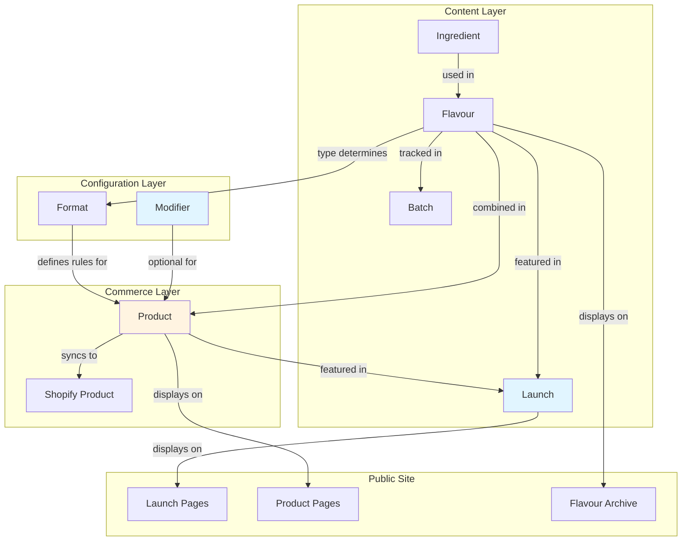
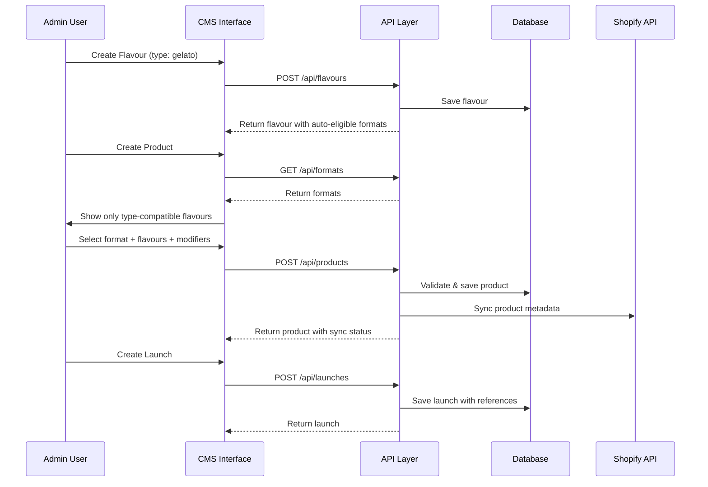

# Design Document: Launch-First CMS Model

## Overview

This design transforms the Janine CMS from an "offerings-first" to a "launch-first" data model. The current architecture treats individual offerings as the primary organizational unit, creating complexity when managing real-world product launches that involve multiple flavours and serving formats. The new model introduces Launch as a first-class editorial object and simplifies relationships between ingredients, flavours, formats, modifiers, and product products.

### Design Goals

1. **Launch-Centric Editorial**: Make launches the primary storytelling unit, grouping related flavours and products into cohesive narratives
2. **Automatic Format Eligibility**: Eliminate manual format selection by deriving eligibility from flavour type
3. **Simplified Shopify Integration**: Move all e-commerce integration to the Product level, removing Shopify fields from Flavours
4. **Non-Destructive Migration**: Preserve all existing data while transitioning to the new model
5. **Clear Separation of Concerns**: Organize objects into logical layers (content, configuration, commerce)

### Key Changes from Current Model

- **Rename**: Offering → Product (more descriptive of its purpose)
- **New Object**: Launch (first-class editorial entity)
- **New Object**: Modifier (extracted from topping references)
- **Automatic Logic**: Flavour type determines format eligibility
- **Shopify Integration**: Moved from Flavour to Product only
- **Navigation**: Reordered to reflect launch-first approach

### System Context

The Janine platform is built on Next.js 14.2 with TypeScript, using:
- **Frontend**: React 18.3, Tailwind CSS, Framer Motion
- **Backend**: Next.js API Routes, NextAuth
- **Data Storage**: JSON files (dev), Vercel KV (production)
- **E-commerce**: Shopify Storefront API
- **Image Storage**: Local files (dev), Vercel Blob (production)

## Architecture

### System Architecture Diagram



### Data Flow Architecture



### Migration Architecture

The migration follows a dual-mode operation strategy to ensure zero data loss:

```mermaid
graph LR
    subgraph "Phase 1: Preparation"
        A1[Create new tables] --> A2[Add new fields]
        A2 --> A3[Backup existing data]
    end
    
    subgraph "Phase 2: Migration"
        B1[Extract modifiers] --> B2[Create Products from Offerings]
        B2 --> B3[Move Shopify fields]
        B3 --> B4[Validate data integrity]
    end
    
    subgraph "Phase 3: Transition"
        C1[Dual API support] --> C2[Legacy endpoint mapping]
        C2 --> C3[Migration dashboard]
    end
    
    subgraph "Phase 4: Completion"
        D1[Deprecation warnings] --> D2[Remove legacy endpoints]
        D2 --> D3[Archive old tables]
    end
    
    A3 --> B1
    B4 --> C1
    C3 --> D1
```



## Components and Interfaces

### Core Components

#### 1. CMS Admin Interface (`app/admin/`)

**Purpose**: Provide admin users with tools to manage all content, configuration, and commerce objects.

**Key Sub-Components**:
- **LaunchManager**: Create and edit launches with content blocks
- **ProductManager**: Create menu items with format-based validation
- **FlavourManager**: Manage flavours with automatic format eligibility
- **ModifierManager**: Manage toppings, sauces, and add-ons
- **MigrationDashboard**: Monitor migration progress and status

#### 2. API Layer (`app/api/`)

**Purpose**: Handle all data operations with validation and business logic.

**Endpoints**:
- `/api/launches` - CRUD for Launch objects
- `/api/products` - CRUD for Product objects (replaces offerings)
- `/api/flavours` - CRUD for Flavour objects (updated)
- `/api/ingredients` - CRUD for Ingredient objects
- `/api/formats` - CRUD for Format objects
- `/api/modifiers` - CRUD for Modifier objects
- `/api/batches` - CRUD for Batch objects
- `/api/offerings` - Legacy endpoint (transition period only)
- `/api/migration` - Migration tools and status

#### 3. Database Adapter (`lib/db.js`)

**Purpose**: Abstract storage backend (JSON files, Vercel KV, Redis).

**New Functions**:
```typescript
// Launches
export async function getLaunches()
export async function saveLaunches(launches)

// Modifiers
export async function getModifiers()
export async function saveModifiers(modifiers)

// Products (replaces offerings)
export async function getProducts()
export async function saveProducts(products)

// Migration
export async function getMigrationStatus()
export async function saveMigrationStatus(status)
```

#### 4. Validation Engine

**Purpose**: Enforce format rules and type compatibility.

**Key Functions**:
- `validateFlavourFormatCompatibility(flavour, format)` - Check type eligibility
- `validateProductComposition(product)` - Validate flavour counts and types
- `validateModifierAvailability(modifier, format)` - Check modifier compatibility
- `generateProductName(product)` - Auto-generate descriptive names

#### 5. Migration Tool

**Purpose**: Transform existing data to new model without loss.

**Components**:
- **DataExtractor**: Read existing data structures
- **ModifierExtractor**: Extract modifiers from offering toppings
- **ShopifyFieldMigrator**: Move Shopify fields from Flavour to Product
- **ValidationEngine**: Verify data integrity
- **RollbackGenerator**: Create rollback scripts

### Interface Specifications

#### Admin Navigation Structure

```typescript
interface AdminNavigation {
  sections: [
    { id: 'launches', label: 'Launches', path: '/admin/launches', icon: 'rocket' },
    { id: 'menu-items', label: 'Menu Items', path: '/admin/products', icon: 'shopping-bag' },
    { id: 'flavours', label: 'Flavours', path: '/admin/flavours', icon: 'ice-cream' },
    { id: 'ingredients', label: 'Ingredients', path: '/admin/ingredients', icon: 'leaf' },
    { id: 'formats', label: 'Formats', path: '/admin/formats', icon: 'layout' },
    { id: 'modifiers', label: 'Modifiers', path: '/admin/modifiers', icon: 'plus-circle' },
    { id: 'batches', label: 'Batches', path: '/admin/batches', icon: 'beaker' }
  ]
}
```

#### Launch Creation Workflow

```typescript
interface LaunchCreationWorkflow {
  steps: [
    {
      id: 'basic-info',
      fields: ['title', 'slug', 'status', 'heroImage', 'activeStart', 'activeEnd']
    },
    {
      id: 'story',
      fields: ['story', 'description']
    },
    {
      id: 'featured-content',
      fields: ['featuredFlavourIds', 'featuredProductIds']
    },
    {
      id: 'content-blocks',
      fields: ['contentBlocks'] // Flexible block editor
    },
    {
      id: 'relationships',
      fields: ['relatedEventIds', 'relatedMembershipDropIds']
    }
  ]
}
```

#### Product Creation Workflow

```typescript
interface ProductCreationWorkflow {
  steps: [
    {
      id: 'format-selection',
      fields: ['formatId'],
      validation: 'Required - determines available flavours'
    },
    {
      id: 'flavour-selection',
      fields: ['primaryFlavourIds', 'secondaryFlavourIds', 'componentIds'],
      validation: 'Type-filtered based on format, min/max count enforced'
    },
    {
      id: 'modifiers',
      fields: ['toppingIds'],
      validation: 'Only shown if format allows modifiers'
    },
    {
      id: 'details',
      fields: ['internalName', 'publicName', 'description', 'shortCardCopy', 'image']
    },
    {
      id: 'pricing',
      fields: ['price', 'compareAtPrice']
    },
    {
      id: 'availability',
      fields: ['status', 'availabilityStart', 'availabilityEnd', 'location', 'onlineOrderable', 'pickupOnly']
    },
    {
      id: 'shopify',
      fields: ['shopifyProductId', 'shopifyProductHandle', 'shopifySKU', 'posMapping']
    }
  ]
}
```


## Data Models

### TypeScript Interfaces

#### Ingredient

```typescript
interface Ingredient {
  // Identity
  id: string                    // Unique identifier
  name: string                  // Display name (e.g., "White Peach")
  latinName?: string            // Scientific name (e.g., "Prunus persica")
  slug?: string                 // URL-friendly identifier
  
  // Classification
  category: IngredientCategory  // Fruit, Dairy, Herb, etc.
  roles: IngredientRole[]       // Base, Primary Flavour, Supporting, etc.
  descriptors: string[]         // Fresh, Seasonal, Grilled, etc.
  
  // Sourcing
  origin?: string               // Geographic origin
  supplier?: string             // Supplier name
  seasonal: boolean             // Is this seasonal?
  availableMonths?: number[]    // Months available (1-12)
  
  // Dietary & Allergens
  allergens: Allergen[]         // Dairy, Nuts, Gluten, etc.
  dietaryFlags: DietaryFlag[]   // Vegan, Vegetarian, Gluten-Free, etc.
  
  // Content
  description?: string          // Full description
  story?: string                // Provenance story
  tastingNotes?: string[]       // Flavor descriptors
  
  // Media
  image?: string                // Primary image URL
  imageAlt?: string             // Image alt text
  
  // Metadata
  createdAt: string             // ISO 8601 timestamp
  updatedAt: string             // ISO 8601 timestamp
}

type IngredientCategory = 
  | 'fruit' | 'dairy' | 'herb' | 'spice' | 'nut' 
  | 'grain' | 'vegetable' | 'botanical' | 'aromatic' 
  | 'sweetener' | 'fat' | 'salt' | 'condiment' | 'sauce'

type IngredientRole = 
  | 'base' | 'primary-flavour' | 'supporting-flavour' 
  | 'garnish' | 'topping' | 'optional-addon'

type Allergen = 
  | 'dairy' | 'eggs' | 'tree-nuts' | 'peanuts' 
  | 'gluten' | 'soy' | 'sesame' | 'shellfish'

type DietaryFlag = 
  | 'vegan' | 'vegetarian' | 'gluten-free' 
  | 'dairy-free' | 'nut-free' | 'organic'
```

#### Flavour

```typescript
interface Flavour {
  // Identity
  id: string                    // Unique identifier
  name: string                  // Display name (e.g., "Grilled Corn")
  slug: string                  // URL-friendly identifier
  
  // Classification
  type: FlavourType             // Determines format eligibility
  baseStyle?: string            // Gelato, Sorbet, etc. (descriptive)
  
  // Ingredients
  ingredients: FlavourIngredient[] // Linked ingredients with roles
  keyNotes: string[]            // Primary flavor notes
  
  // Content
  description?: string          // Full description
  shortDescription?: string     // Brief summary
  story?: string                // Creation story
  tastingNotes?: string[]       // Tasting descriptors
  
  // Auto-Calculated (from ingredients)
  allergens: Allergen[]         // Aggregated from ingredients
  dietaryTags: DietaryFlag[]    // Aggregated from ingredients
  
  // Presentation
  colour?: string               // Hex color code
  image?: string                // Primary image URL
  
  // Seasonality & Status
  season?: Season               // Spring, Summer, Fall, Winter, Year-round
  status: FlavourStatus         // Active, Archived, In Development, Seasonal
  
  // Display
  sortOrder?: number            // Manual sort order
  featured: boolean             // Featured on homepage
  
  // Metadata
  createdAt: string             // ISO 8601 timestamp
  updatedAt: string             // ISO 8601 timestamp
}

interface FlavourIngredient {
  ingredientId: string          // Reference to Ingredient
  role: IngredientRole          // How this ingredient is used
  usage?: string                // Optional usage notes
}

type FlavourType = 
  | 'gelato'           // Eligible for: scoop, pint, twist, sandwich filling
  | 'sorbet'           // Eligible for: scoop, pint, twist
  | 'soft-serve-base'  // Eligible for: soft serve only
  | 'cookie'           // Eligible for: sandwich components
  | 'topping'          // Eligible as: modifier
  | 'sauce'            // Eligible as: modifier

type Season = 'spring' | 'summer' | 'fall' | 'winter' | 'year-round'

type FlavourStatus = 'active' | 'archived' | 'in-development' | 'seasonal'
```

#### Format

```typescript
interface Format {
  // Identity
  id: string                    // Unique identifier
  name: string                  // Display name (e.g., "Cup", "Pint")
  slug: string                  // URL-friendly identifier
  category: FormatCategory      // Scoop, Take-Home, Sandwich, etc.
  
  // Description
  description?: string          // Format description
  
  // Flavour Rules
  requiresFlavours: boolean     // Does this format need flavours?
  minFlavours: number           // Minimum flavour count (e.g., 1)
  maxFlavours: number           // Maximum flavour count (e.g., 3)
  allowMixedTypes: boolean      // Can mix gelato + sorbet?
  
  // Modifier Rules
  canIncludeAddOns: boolean     // Can add modifiers?
  allowedModifierTypes?: ModifierType[] // Which modifier types allowed
  
  // Configuration
  defaultSizes?: string[]       // Available sizes (e.g., ["small", "medium", "large"])
  servingStyle?: string         // In-store, Take-home, Both
  menuSection?: string          // Where to display on menu
  
  // Media
  image?: string                // Format image
  icon?: string                 // Icon identifier
  
  // Metadata
  createdAt: string             // ISO 8601 timestamp
  updatedAt: string             // ISO 8601 timestamp
}

type FormatCategory = 
  | 'scoop'        // Single or multiple scoops
  | 'take-home'    // Pints, quarts
  | 'sandwich'     // Ice cream sandwiches
  | 'twist'        // Soft-serve twists
  | 'soft-serve'   // Soft serve cones/cups
  | 'special'      // Custom formats
```

#### Modifier

```typescript
interface Modifier {
  // Identity
  id: string                    // Unique identifier
  name: string                  // Display name (e.g., "Hot Fudge", "Sprinkles")
  slug: string                  // URL-friendly identifier
  type: ModifierType            // Topping, Sauce, etc.
  
  // Description
  description?: string          // Modifier description
  
  // Media
  image?: string                // Modifier image
  
  // Pricing
  price: number                 // Price in cents (e.g., 150 = $1.50)
  
  // Dietary & Allergens
  allergens: Allergen[]         // Allergen information
  dietaryFlags: DietaryFlag[]   // Dietary flags
  
  // Availability
  availableForFormatIds: string[] // Which formats can use this modifier
  status: ModifierStatus        // Active, Archived
  
  // Display
  sortOrder?: number            // Manual sort order
  
  // Metadata
  createdAt: string             // ISO 8601 timestamp
  updatedAt: string             // ISO 8601 timestamp
}

type ModifierType = 
  | 'topping'        // Sprinkles, nuts, etc.
  | 'sauce'          // Hot fudge, caramel, etc.
  | 'crunch'         // Cookie crumbles, etc.
  | 'drizzle'        // Chocolate, caramel drizzle
  | 'premium-addon'  // Premium toppings with higher price
  | 'pack-in'        // Mixed-in ingredients

type ModifierStatus = 'active' | 'archived'
```

#### Product

```typescript
interface Product {
  // Identity
  id: string                    // Unique identifier
  internalName: string          // Internal reference name
  publicName: string            // Customer-facing name
  slug: string                  // URL-friendly identifier
  status: ProductStatus        // Draft, Active, Archived
  
  // Composition
  formatId: string              // Reference to Format
  primaryFlavourIds: string[]   // Main flavours (e.g., scoop flavours)
  secondaryFlavourIds?: string[] // Secondary flavours (e.g., twist second flavour)
  componentIds?: string[]       // Components (e.g., cookie for sandwich)
  toppingIds?: string[]         // Selected modifiers
  
  // Content
  description?: string          // Full description
  shortCardCopy?: string        // Brief card description
  image?: string                // Product image
  
  // Pricing
  price: number                 // Base price in cents
  compareAtPrice?: number       // Original price (for sales)
  
  // Availability
  availabilityStart?: string    // ISO 8601 timestamp
  availabilityEnd?: string      // ISO 8601 timestamp
  location?: string[]           // Store locations
  tags?: string[]               // Searchable tags
  
  // Shopify Integration
  shopifyProductId?: string     // Shopify product ID
  shopifyProductHandle?: string // Shopify product handle
  shopifySKU?: string           // Shopify SKU
  posMapping?: string           // POS system mapping
  syncStatus?: SyncStatus       // Sync status
  lastSyncedAt?: string         // Last sync timestamp
  syncError?: string            // Last sync error message
  
  // Inventory
  inventoryTracked: boolean     // Track inventory?
  inventoryQuantity?: number    // Current quantity
  batchCode?: string            // Batch reference
  restockDate?: string          // Expected restock date
  shelfLifeNotes?: string       // Shelf life information
  
  // Ordering
  onlineOrderable: boolean      // Available for online orders?
  pickupOnly: boolean           // Pickup only (no delivery)?
  
  // Metadata
  createdAt: string             // ISO 8601 timestamp
  updatedAt: string             // ISO 8601 timestamp
}

type ProductStatus = 'draft' | 'active' | 'archived' | 'out-of-stock'

type SyncStatus = 'pending' | 'synced' | 'error' | 'not-synced'
```

#### Launch

```typescript
interface Launch {
  // Identity
  id: string                    // Unique identifier
  title: string                 // Launch title (e.g., "Corn + Tomato Launch")
  slug: string                  // URL-friendly identifier
  status: LaunchStatus          // Upcoming, Active, Ended, Archived
  
  // Media
  heroImage?: string            // Hero image URL
  
  // Content
  story?: string                // Launch story/narrative
  description?: string          // Brief description
  
  // Scheduling
  activeStart?: string          // ISO 8601 timestamp
  activeEnd?: string            // ISO 8601 timestamp
  
  // Featured Content
  featuredFlavourIds: string[]  // Featured flavours in this launch
  featuredProductIds: string[] // Featured products in this launch
  
  // Content Blocks
  contentBlocks?: ContentBlock[] // Flexible content blocks
  
  // Relationships
  relatedEventIds?: string[]    // Related events/tastings
  relatedMembershipDropIds?: string[] // Related membership drops
  
  // Display
  sortOrder?: number            // Manual sort order
  featured: boolean             // Featured on homepage
  
  // Metadata
  createdAt: string             // ISO 8601 timestamp
  updatedAt: string             // ISO 8601 timestamp
}

interface ContentBlock {
  id: string                    // Block identifier
  type: ContentBlockType        // Block type
  order: number                 // Display order
  content: Record<string, any>  // Block-specific content
}

type ContentBlockType = 
  | 'text'              // Rich text content
  | 'image'             // Single image
  | 'image-gallery'     // Multiple images
  | 'flavour-showcase'  // Flavour grid/carousel
  | 'ingredient-spotlight' // Ingredient feature
  | 'video-embed'       // Video embed

type LaunchStatus = 'upcoming' | 'active' | 'ended' | 'archived'
```

#### Batch (Existing - Updated)

```typescript
interface Batch {
  // Identity
  id: string                    // Unique identifier
  batchNumber: string           // Batch number
  
  // Relationships
  flavourIds: string[]          // References to Flavour objects
  
  // Batch Details
  iterationNotes?: string       // Notes on this iteration
  recipeDetails?: string        // Recipe information
  processPhotos?: string[]      // Process photography URLs
  
  // Status
  status: BatchStatus           // In Progress, Complete, Archived
  
  // Metadata
  createdAt: string             // ISO 8601 timestamp
  updatedAt: string             // ISO 8601 timestamp
}

type BatchStatus = 'in-progress' | 'complete' | 'archived'
```

### Database Schema

#### File Structure (Development)

```
public/data/
├── ingredients.json          # Ingredient objects
├── flavours.json             # Flavour objects
├── formats.json              # Format objects
├── modifiers.json            # Modifier objects (NEW)
├── products.json            # Product objects (NEW)
├── launches.json             # Launch objects (NEW)
├── batches.json              # Batch objects
├── offerings.json            # Legacy - kept during transition
└── migration-status.json     # Migration tracking (NEW)
```

#### Vercel KV Keys (Production)

```
ingredients                   # Array of Ingredient objects
flavours                      # Array of Flavour objects
formats                       # Array of Format objects
modifiers                     # Array of Modifier objects (NEW)
products                     # Array of Product objects (NEW)
launches                      # Array of Launch objects (NEW)
batches                       # Array of Batch objects
offerings                     # Legacy - kept during transition
migration-status              # Migration tracking object (NEW)
```

### Relationship Mapping

#### Ingredient → Flavour (Many-to-Many)

```typescript
// Stored in Flavour.ingredients array
interface FlavourIngredient {
  ingredientId: string
  role: IngredientRole
  usage?: string
}
```

#### Flavour → Format (Automatic via Type)

```typescript
// Computed relationship based on Flavour.type
const formatEligibility: Record<FlavourType, FormatCategory[]> = {
  'gelato': ['scoop', 'take-home', 'twist', 'sandwich'],
  'sorbet': ['scoop', 'take-home', 'twist'],
  'soft-serve-base': ['soft-serve'],
  'cookie': ['sandwich'], // As component
  'topping': [], // Used as modifier
  'sauce': []    // Used as modifier
}
```

#### Flavour → Product (Many-to-Many)

```typescript
// Stored in Product
interface ProductComposition {
  formatId: string
  primaryFlavourIds: string[]
  secondaryFlavourIds?: string[]
  componentIds?: string[]
}
```

#### Modifier → Product (Many-to-Many)

```typescript
// Stored in Product.toppingIds array
toppingIds: string[] // References to Modifier objects
```

#### Launch → Flavour (Many-to-Many)

```typescript
// Stored in Launch
featuredFlavourIds: string[] // References to Flavour objects
```

#### Launch → Product (Many-to-Many)

```typescript
// Stored in Launch
featuredProductIds: string[] // References to Product objects
```

#### Product → Shopify (One-to-One)

```typescript
// Stored in Product
interface ShopifyIntegration {
  shopifyProductId?: string
  shopifyProductHandle?: string
  shopifySKU?: string
  syncStatus?: SyncStatus
  lastSyncedAt?: string
  syncError?: string
}
```

### Migration Mapping Tables

#### Offering → Product Migration

```typescript
interface OfferingMigrationMap {
  legacyOfferingId: string      // Original Offering ID
  newProductId: string          // New Product ID
  migrationDate: string          // When migrated
  changes: string[]              // List of changes made
  warnings: string[]             // Any warnings or issues
}
```

#### Flavour Shopify Field Migration

```typescript
interface FlavourShopifyMigration {
  flavourId: string              // Flavour ID
  hadShopifyFields: boolean      // Did it have Shopify fields?
  shopifyProductId?: string      // Original Shopify ID
  createdProductId?: string     // Created Product ID (if needed)
  movedToProductId?: string     // Existing Product ID (if found)
  migrationDate: string          // When migrated
}
```

#### Modifier Extraction Map

```typescript
interface ModifierExtractionMap {
  sourceOfferingId: string       // Offering that had topping
  extractedModifierId: string    // New Modifier ID
  modifierName: string           // Modifier name
  migrationDate: string          // When extracted
}
```


## Correctness Properties

*A property is a characteristic or behavior that should hold true across all valid executions of a system—essentially, a formal statement about what the system should do. Properties serve as the bridge between human-readable specifications and machine-verifiable correctness guarantees.*

### Property Reflection

After analyzing all acceptance criteria, I identified the following redundancies and consolidations:

**Redundancy Analysis:**

1. **Format Eligibility Properties (2.2-2.6)**: These can be consolidated into a single comprehensive property about type-based format eligibility rather than separate properties for each type.

2. **Data Preservation Properties (9.3-9.5)**: All three properties test the same concept (data preservation during migration) for different object types. These can be combined into one property.

3. **Referential Integrity Properties (10.1-10.4)**: All four properties test the same deletion prevention pattern. These can be combined into one comprehensive property.

4. **Format Validation Properties (14.1-14.4)**: These test specific format rules but can be consolidated into a more general property about format-flavour type compatibility.

5. **Min/Max Flavour Properties (14.5-14.6)**: These test the same boundary validation concept and can be combined.

**Consolidated Properties:**

The following properties provide comprehensive coverage without redundancy:

### Property 1: Non-Destructive Migration Preservation

*For any* database state before migration, running the migration process should preserve all original tables and records such that every record that existed before migration still exists after migration with identical data.

**Validates: Requirements 0.1, 9.2, 9.3, 9.4, 9.5**

### Property 2: Migration Backup Creation

*For any* migration execution, the system should create timestamped backup files for all affected tables before making any changes.

**Validates: Requirements 0.7**

### Property 3: Flavour Type Determines Format Eligibility

*For any* flavour with a given type, the set of eligible formats should match the type-based eligibility rules: gelato → {scoop, pint, twist, sandwich}, sorbet → {scoop, pint, twist}, soft-serve-base → {soft-serve}, cookie → {sandwich-component}, topping/sauce → {modifier}.

**Validates: Requirements 2.2, 2.3, 2.4, 2.5, 2.6**

### Property 4: Product Format Filtering

*For any* format selection in the product creation interface, only flavours whose type makes them eligible for that format should be displayed in the flavour selection list.

**Validates: Requirements 2.7**

### Property 5: Product Type Compatibility Validation

*For any* product creation or update request, if the selected flavours are not type-compatible with the selected format, the system should reject the request with a validation error.

**Validates: Requirements 3.4, 14.1, 14.2, 14.3, 14.4**

### Property 6: Twist Format Validation

*For any* product with a twist format, the system should validate that exactly two flavours are selected and both are either gelato or sorbet type.

**Validates: Requirements 3.5, 17.4**

### Property 7: Sandwich Format Validation

*For any* product with a sandwich format, the system should validate that exactly one filling flavour (gelato or sorbet type), exactly two cookie components (cookie type), and the filling is gelato or sorbet while components are cookie type.

**Validates: Requirements 3.6, 7.2, 7.3**

### Property 8: Modifier Format Restriction

*For any* format that disallows modifiers (canIncludeAddOns = false), attempting to create a product with that format and any modifiers should be rejected.

**Validates: Requirements 4.4**

### Property 9: Product Name Generation

*For any* product with valid composition, the system should generate a descriptive public name that includes the format and primary flavour names in a consistent pattern.

**Validates: Requirements 5.7**

### Property 10: Modifier Extraction During Migration

*For any* offering record that contains topping references, running the migration should create corresponding modifier records and link them to the new product.

**Validates: Requirements 9.6**

### Property 11: Shopify Field Migration

*For any* offering record with Shopify fields (shopifyProductId, shopifyProductHandle, shopifySKU), running the migration should move these fields to the corresponding product record.

**Validates: Requirements 9.7, 13.3**

### Property 12: Orphaned Shopify Link Preservation

*For any* flavour with Shopify fields but no corresponding offering/product, running the migration should create a default product to preserve the Shopify relationship.

**Validates: Requirements 13.4**

### Property 13: Referential Integrity on Deletion

*For any* object (Ingredient, Flavour, Format, Modifier) that is referenced by another object, attempting to delete it should be prevented and return an error listing the dependent objects.

**Validates: Requirements 10.1, 10.2, 10.3, 10.4, 20.5**

### Property 14: Flavour Count Boundaries

*For any* format with minFlavours and maxFlavours constraints, attempting to create a product with fewer than minFlavours or more than maxFlavours should be rejected.

**Validates: Requirements 14.5, 14.6**

### Property 15: API Validation Error Format

*For any* API request that violates format rules or validation constraints, the system should return a 400 status code with a response body containing detailed validation error messages.

**Validates: Requirements 11.6**

### Property 16: Launch Status Auto-Update

*For any* launch with an activeEnd date in the past and status not equal to "ended" or "archived", the system should automatically update the status to "ended".

**Validates: Requirements 18.4**

### Property 17: Public Flavour Filtering

*For any* public site request for flavours, only flavours with status "active" or (status "seasonal" and currently in season) should be included in the response.

**Validates: Requirements 18.5**

### Property 18: Legacy API Compatibility

*For any* request to legacy `/api/offerings` endpoints, the system should map the request to the new products data model and return a response in the legacy format that is structurally equivalent to the pre-migration response format.

**Validates: Requirements 21.2**

### Property 19: Schema Field Preservation

*For any* existing table, adding new fields during migration should not remove any existing fields from the schema.

**Validates: Requirements 0.3**

### Property 20: API Endpoint Continuity

*For any* API endpoint that existed before migration, that endpoint should continue to function and return valid responses during the transition period.

**Validates: Requirements 0.4**

## Error Handling

### Error Categories

#### 1. Validation Errors (400 Bad Request)

**Scenarios:**
- Flavour type incompatible with selected format
- Flavour count outside format min/max bounds
- Twist format without exactly 2 flavours
- Sandwich format without correct composition
- Modifiers added to format that disallows them
- Missing required fields
- Invalid field values

**Response Format:**
```typescript
interface ValidationError {
  status: 400
  error: 'ValidationError'
  message: string
  details: ValidationDetail[]
}

interface ValidationDetail {
  field: string
  constraint: string
  value: any
  expected: string
}
```

**Example:**
```json
{
  "status": 400,
  "error": "ValidationError",
  "message": "Product validation failed",
  "details": [
    {
      "field": "primaryFlavourIds",
      "constraint": "type-compatibility",
      "value": ["flavour-123"],
      "expected": "Flavour type 'cookie' is not compatible with format 'scoop'. Expected: gelato or sorbet"
    }
  ]
}
```

#### 2. Referential Integrity Errors (409 Conflict)

**Scenarios:**
- Attempting to delete referenced ingredient
- Attempting to delete referenced flavour
- Attempting to delete referenced format
- Attempting to delete referenced modifier

**Response Format:**
```typescript
interface ReferentialIntegrityError {
  status: 409
  error: 'ReferentialIntegrityError'
  message: string
  references: Reference[]
}

interface Reference {
  type: string
  id: string
  name: string
}
```

**Example:**
```json
{
  "status": 409,
  "error": "ReferentialIntegrityError",
  "message": "Cannot delete ingredient 'White Peach' because it is referenced by other objects",
  "references": [
    {
      "type": "flavour",
      "id": "flavour-456",
      "name": "White Peach Sorbet"
    },
    {
      "type": "flavour",
      "id": "flavour-789",
      "name": "Peach & Thyme"
    }
  ]
}
```

#### 3. Migration Errors (500 Internal Server Error)

**Scenarios:**
- Data integrity validation fails
- Backup creation fails
- Database write fails during migration
- Rollback required

**Response Format:**
```typescript
interface MigrationError {
  status: 500
  error: 'MigrationError'
  message: string
  phase: MigrationPhase
  affectedRecords: string[]
  rollbackAvailable: boolean
}

type MigrationPhase = 'backup' | 'validation' | 'transformation' | 'commit'
```

**Example:**
```json
{
  "status": 500,
  "error": "MigrationError",
  "message": "Migration validation failed: 3 offerings have invalid format references",
  "phase": "validation",
  "affectedRecords": ["offering-123", "offering-456", "offering-789"],
  "rollbackAvailable": true
}
```

#### 4. Shopify Sync Errors (502 Bad Gateway)

**Scenarios:**
- Shopify API unavailable
- Authentication failure
- Rate limit exceeded
- Invalid product data

**Response Format:**
```typescript
interface ShopifySyncError {
  status: 502
  error: 'ShopifySyncError'
  message: string
  productId: string
  shopifyError?: string
  retryable: boolean
}
```

**Example:**
```json
{
  "status": 502,
  "error": "ShopifySyncError",
  "message": "Failed to sync product to Shopify",
  "productId": "product-123",
  "shopifyError": "Rate limit exceeded. Retry after 60 seconds",
  "retryable": true
}
```

### Error Handling Strategy

#### Client-Side Error Handling

```typescript
// CMS Admin Interface
async function handleProductSubmit(data: ProductFormData) {
  try {
    const response = await fetch('/api/products', {
      method: 'POST',
      body: JSON.stringify(data)
    })
    
    if (!response.ok) {
      const error = await response.json()
      
      if (error.error === 'ValidationError') {
        // Display validation errors inline on form
        displayValidationErrors(error.details)
      } else if (error.error === 'ReferentialIntegrityError') {
        // Show modal with references
        showReferenceModal(error.references)
      } else {
        // Generic error toast
        showErrorToast(error.message)
      }
      
      return
    }
    
    // Success handling
    const product = await response.json()
    navigateToProduct(product.id)
    
  } catch (error) {
    // Network or unexpected errors
    showErrorToast('An unexpected error occurred. Please try again.')
  }
}
```

#### Server-Side Error Handling

```typescript
// API Route Handler
export async function POST(request: Request) {
  try {
    const data = await request.json()
    
    // Validate product composition
    const validation = validateProductComposition(data)
    if (!validation.valid) {
      return Response.json({
        status: 400,
        error: 'ValidationError',
        message: 'Product validation failed',
        details: validation.errors
      }, { status: 400 })
    }
    
    // Check referential integrity
    const integrityCheck = await checkReferences(data)
    if (!integrityCheck.valid) {
      return Response.json({
        status: 409,
        error: 'ReferentialIntegrityError',
        message: integrityCheck.message,
        references: integrityCheck.invalidReferences
      }, { status: 409 })
    }
    
    // Save product
    const product = await saveProduct(data)
    
    // Attempt Shopify sync (non-blocking)
    syncToShopify(product).catch(error => {
      // Log error but don't fail the request
      console.error('Shopify sync failed:', error)
      updateProductSyncStatus(product.id, 'error', error.message)
    })
    
    return Response.json(product, { status: 201 })
    
  } catch (error) {
    console.error('Product creation error:', error)
    return Response.json({
      status: 500,
      error: 'InternalServerError',
      message: 'An unexpected error occurred'
    }, { status: 500 })
  }
}
```

### Migration Error Recovery

#### Rollback Procedure

```typescript
interface MigrationRollback {
  backupTimestamp: string
  affectedTables: string[]
  steps: RollbackStep[]
}

interface RollbackStep {
  action: 'restore-table' | 'delete-table' | 'remove-fields'
  table: string
  backupFile?: string
  fields?: string[]
}

async function rollbackMigration(backupTimestamp: string) {
  const rollbackPlan = await generateRollbackPlan(backupTimestamp)
  
  for (const step of rollbackPlan.steps) {
    switch (step.action) {
      case 'restore-table':
        await restoreTableFromBackup(step.table, step.backupFile)
        break
      case 'delete-table':
        await deleteTable(step.table)
        break
      case 'remove-fields':
        await removeFieldsFromTable(step.table, step.fields)
        break
    }
  }
  
  // Verify rollback success
  await validateRollback(backupTimestamp)
}
```


## Testing Strategy

### Dual Testing Approach

This project requires both unit testing and property-based testing to ensure comprehensive coverage:

- **Unit tests**: Verify specific examples, edge cases, and error conditions
- **Property tests**: Verify universal properties across all inputs
- Both approaches are complementary and necessary for complete validation

### Property-Based Testing

#### Library Selection

**For TypeScript/JavaScript**: Use **fast-check** (already in dependencies)

```bash
npm install --save-dev fast-check
```

#### Configuration

Each property test must:
- Run minimum 100 iterations (due to randomization)
- Reference its design document property in a comment
- Use the tag format: `Feature: launch-first-cms-model, Property {number}: {property_text}`

#### Property Test Examples

**Property 3: Flavour Type Determines Format Eligibility**

```typescript
import fc from 'fast-check'
import { describe, it, expect } from 'vitest'
import { getEligibleFormats } from '@/lib/format-eligibility'

describe('Format Eligibility', () => {
  it('Property 3: Flavour type determines format eligibility', () => {
    // Feature: launch-first-cms-model, Property 3: For any flavour with a given type, 
    // the set of eligible formats should match the type-based eligibility rules
    
    fc.assert(
      fc.property(
        fc.constantFrom('gelato', 'sorbet', 'soft-serve-base', 'cookie', 'topping', 'sauce'),
        (flavourType) => {
          const eligibleFormats = getEligibleFormats(flavourType)
          
          const expectedFormats: Record<string, string[]> = {
            'gelato': ['scoop', 'pint', 'twist', 'sandwich'],
            'sorbet': ['scoop', 'pint', 'twist'],
            'soft-serve-base': ['soft-serve'],
            'cookie': ['sandwich-component'],
            'topping': ['modifier'],
            'sauce': ['modifier']
          }
          
          expect(eligibleFormats.sort()).toEqual(expectedFormats[flavourType].sort())
        }
      ),
      { numRuns: 100 }
    )
  })
})
```

**Property 5: Product Type Compatibility Validation**

```typescript
import fc from 'fast-check'
import { describe, it, expect } from 'vitest'
import { validateProductComposition } from '@/lib/validation'

// Generators
const flavourArb = fc.record({
  id: fc.uuid(),
  name: fc.string({ minLength: 1, maxLength: 50 }),
  type: fc.constantFrom('gelato', 'sorbet', 'soft-serve-base', 'cookie', 'topping', 'sauce')
})

const formatArb = fc.record({
  id: fc.uuid(),
  name: fc.string({ minLength: 1, maxLength: 30 }),
  category: fc.constantFrom('scoop', 'take-home', 'sandwich', 'twist', 'soft-serve')
})

describe('Product Validation', () => {
  it('Property 5: Product type compatibility validation', () => {
    // Feature: launch-first-cms-model, Property 5: For any product creation request,
    // if selected flavours are not type-compatible with format, system should reject
    
    fc.assert(
      fc.property(
        formatArb,
        fc.array(flavourArb, { minLength: 1, maxLength: 3 }),
        (format, flavours) => {
          const product = {
            formatId: format.id,
            primaryFlavourIds: flavours.map(f => f.id)
          }
          
          const validation = validateProductComposition(product, format, flavours)
          
          // Check if any flavour is incompatible
          const hasIncompatible = flavours.some(flavour => {
            const eligible = getEligibleFormats(flavour.type)
            return !eligible.includes(format.category)
          })
          
          if (hasIncompatible) {
            expect(validation.valid).toBe(false)
            expect(validation.errors).toContainEqual(
              expect.objectContaining({ constraint: 'type-compatibility' })
            )
          }
        }
      ),
      { numRuns: 100 }
    )
  })
})
```

**Property 13: Referential Integrity on Deletion**

```typescript
import fc from 'fast-check'
import { describe, it, expect } from 'vitest'
import { deleteIngredient, createFlavour } from '@/lib/db'

describe('Referential Integrity', () => {
  it('Property 13: Referential integrity on deletion', async () => {
    // Feature: launch-first-cms-model, Property 13: For any object referenced by another,
    // attempting to delete it should be prevented
    
    await fc.assert(
      fc.asyncProperty(
        fc.record({
          id: fc.uuid(),
          name: fc.string({ minLength: 1, maxLength: 50 }),
          category: fc.constantFrom('fruit', 'dairy', 'herb')
        }),
        fc.record({
          id: fc.uuid(),
          name: fc.string({ minLength: 1, maxLength: 50 }),
          type: fc.constantFrom('gelato', 'sorbet')
        }),
        async (ingredient, flavourData) => {
          // Create ingredient
          await createIngredient(ingredient)
          
          // Create flavour that references ingredient
          const flavour = {
            ...flavourData,
            ingredients: [{ ingredientId: ingredient.id, role: 'base' }]
          }
          await createFlavour(flavour)
          
          // Attempt to delete ingredient
          const result = await deleteIngredient(ingredient.id)
          
          // Should be prevented
          expect(result.success).toBe(false)
          expect(result.error).toBe('ReferentialIntegrityError')
          expect(result.references).toContainEqual(
            expect.objectContaining({ type: 'flavour', id: flavour.id })
          )
          
          // Cleanup
          await deleteFlavour(flavour.id)
          await deleteIngredient(ingredient.id)
        }
      ),
      { numRuns: 100 }
    )
  })
})
```

### Unit Testing

#### Focus Areas for Unit Tests

Unit tests should focus on:

1. **Specific Examples**: Concrete scenarios that demonstrate correct behavior
2. **Edge Cases**: Boundary conditions and special cases
3. **Error Conditions**: Specific error scenarios
4. **Integration Points**: Component interactions

#### Unit Test Examples

**Example: Twist Format Validation**

```typescript
import { describe, it, expect } from 'vitest'
import { validateTwistFormat } from '@/lib/validation'

describe('Twist Format Validation', () => {
  it('should accept twist with two gelato flavours', () => {
    const product = {
      formatId: 'twist-format',
      primaryFlavourIds: ['gelato-1', 'gelato-2']
    }
    
    const flavours = [
      { id: 'gelato-1', type: 'gelato', name: 'Vanilla' },
      { id: 'gelato-2', type: 'gelato', name: 'Chocolate' }
    ]
    
    const result = validateTwistFormat(product, flavours)
    expect(result.valid).toBe(true)
  })
  
  it('should accept twist with gelato and sorbet', () => {
    const product = {
      formatId: 'twist-format',
      primaryFlavourIds: ['gelato-1', 'sorbet-1']
    }
    
    const flavours = [
      { id: 'gelato-1', type: 'gelato', name: 'Vanilla' },
      { id: 'sorbet-1', type: 'sorbet', name: 'Lemon' }
    ]
    
    const result = validateTwistFormat(product, flavours)
    expect(result.valid).toBe(true)
  })
  
  it('should reject twist with only one flavour', () => {
    const product = {
      formatId: 'twist-format',
      primaryFlavourIds: ['gelato-1']
    }
    
    const flavours = [
      { id: 'gelato-1', type: 'gelato', name: 'Vanilla' }
    ]
    
    const result = validateTwistFormat(product, flavours)
    expect(result.valid).toBe(false)
    expect(result.errors[0].constraint).toBe('exact-count')
  })
  
  it('should reject twist with three flavours', () => {
    const product = {
      formatId: 'twist-format',
      primaryFlavourIds: ['gelato-1', 'gelato-2', 'gelato-3']
    }
    
    const flavours = [
      { id: 'gelato-1', type: 'gelato', name: 'Vanilla' },
      { id: 'gelato-2', type: 'gelato', name: 'Chocolate' },
      { id: 'gelato-3', type: 'gelato', name: 'Strawberry' }
    ]
    
    const result = validateTwistFormat(product, flavours)
    expect(result.valid).toBe(false)
    expect(result.errors[0].constraint).toBe('exact-count')
  })
  
  it('should reject twist with cookie type', () => {
    const product = {
      formatId: 'twist-format',
      primaryFlavourIds: ['gelato-1', 'cookie-1']
    }
    
    const flavours = [
      { id: 'gelato-1', type: 'gelato', name: 'Vanilla' },
      { id: 'cookie-1', type: 'cookie', name: 'Chocolate Chip' }
    ]
    
    const result = validateTwistFormat(product, flavours)
    expect(result.valid).toBe(false)
    expect(result.errors[0].constraint).toBe('type-compatibility')
  })
})
```

**Example: Migration Data Preservation**

```typescript
import { describe, it, expect, beforeEach } from 'vitest'
import { runMigration, getIngredients, getFlavours } from '@/lib/migration'

describe('Migration Data Preservation', () => {
  let originalIngredients: any[]
  let originalFlavours: any[]
  
  beforeEach(async () => {
    // Capture original data
    originalIngredients = await getIngredients()
    originalFlavours = await getFlavours()
  })
  
  it('should preserve all ingredient data after migration', async () => {
    await runMigration()
    
    const migratedIngredients = await getIngredients()
    
    // All original ingredients should still exist
    expect(migratedIngredients.length).toBeGreaterThanOrEqual(originalIngredients.length)
    
    // Each original ingredient should be unchanged
    for (const original of originalIngredients) {
      const migrated = migratedIngredients.find(i => i.id === original.id)
      expect(migrated).toBeDefined()
      expect(migrated).toEqual(original)
    }
  })
  
  it('should preserve all flavour data after migration', async () => {
    await runMigration()
    
    const migratedFlavours = await getFlavours()
    
    // All original flavours should still exist
    expect(migratedFlavours.length).toBeGreaterThanOrEqual(originalFlavours.length)
    
    // Each original flavour should be unchanged
    for (const original of originalFlavours) {
      const migrated = migratedFlavours.find(f => f.id === original.id)
      expect(migrated).toBeDefined()
      
      // Compare all fields except Shopify fields (which should be moved)
      const { shopifyProductId, shopifyProductHandle, ...originalData } = original
      const { shopifyProductId: _, shopifyProductHandle: __, ...migratedData } = migrated
      
      expect(migratedData).toEqual(originalData)
    }
  })
})
```

**Example: Product Name Generation**

```typescript
import { describe, it, expect } from 'vitest'
import { generateProductName } from '@/lib/product-names'

describe('Product Name Generation', () => {
  it('should generate name for single scoop', () => {
    const product = {
      formatId: 'scoop-format',
      primaryFlavourIds: ['vanilla']
    }
    
    const format = { name: 'Scoop', category: 'scoop' }
    const flavours = [{ id: 'vanilla', name: 'Vanilla' }]
    
    const name = generateProductName(product, format, flavours)
    expect(name).toBe('Vanilla Scoop')
  })
  
  it('should generate name for double scoop', () => {
    const product = {
      formatId: 'scoop-format',
      primaryFlavourIds: ['vanilla', 'chocolate']
    }
    
    const format = { name: 'Scoop', category: 'scoop' }
    const flavours = [
      { id: 'vanilla', name: 'Vanilla' },
      { id: 'chocolate', name: 'Chocolate' }
    ]
    
    const name = generateProductName(product, format, flavours)
    expect(name).toBe('Vanilla + Chocolate Scoop')
  })
  
  it('should generate name for twist', () => {
    const product = {
      formatId: 'twist-format',
      primaryFlavourIds: ['vanilla', 'chocolate']
    }
    
    const format = { name: 'Twist', category: 'twist' }
    const flavours = [
      { id: 'vanilla', name: 'Vanilla' },
      { id: 'chocolate', name: 'Chocolate' }
    ]
    
    const name = generateProductName(product, format, flavours)
    expect(name).toBe('Vanilla + Chocolate Twist')
  })
  
  it('should generate name for sandwich', () => {
    const product = {
      formatId: 'sandwich-format',
      primaryFlavourIds: ['vanilla'],
      componentIds: ['chocolate-chip', 'chocolate-chip']
    }
    
    const format = { name: 'Ice Cream Sandwich', category: 'sandwich' }
    const flavours = [{ id: 'vanilla', name: 'Vanilla' }]
    const components = [{ id: 'chocolate-chip', name: 'Chocolate Chip Cookie' }]
    
    const name = generateProductName(product, format, flavours, components)
    expect(name).toBe('Vanilla Ice Cream Sandwich with Chocolate Chip Cookie')
  })
  
  it('should generate name for pint', () => {
    const product = {
      formatId: 'pint-format',
      primaryFlavourIds: ['strawberry']
    }
    
    const format = { name: 'Pint', category: 'take-home' }
    const flavours = [{ id: 'strawberry', name: 'Strawberry' }]
    
    const name = generateProductName(product, format, flavours)
    expect(name).toBe('Strawberry Pint')
  })
})
```

### Test Coverage Goals

- **Unit Test Coverage**: Minimum 80% code coverage
- **Property Test Coverage**: All 20 correctness properties must have corresponding property tests
- **Integration Test Coverage**: All API endpoints must have integration tests
- **Migration Test Coverage**: All migration scenarios must be tested with real data samples

### Test Execution

```bash
# Run all tests
npm test

# Run unit tests only
npm run test:unit

# Run property tests only
npm run test:property

# Run with coverage
npm run test:coverage

# Run migration tests
npm run test:migration
```

### Continuous Integration

Tests should run on:
- Every commit (pre-commit hook)
- Every pull request
- Before deployment to production

## Migration Strategy

### Phase 1: Preparation (Non-Destructive)

**Objective**: Set up new structures without affecting existing data.

**Steps**:

1. **Create New Tables/Files**
   - Add `modifiers.json` to `public/data/`
   - Add `products.json` to `public/data/`
   - Add `launches.json` to `public/data/`
   - Add `migration-status.json` to track progress

2. **Add New Fields to Existing Tables**
   - Add `type` field to Flavour (default: 'gelato')
   - Keep all existing Flavour fields including Shopify fields
   - Keep all existing Offering fields

3. **Create Backup**
   ```typescript
   const backupTimestamp = new Date().toISOString()
   await createBackup('ingredients.json', backupTimestamp)
   await createBackup('flavours.json', backupTimestamp)
   await createBackup('formats.json', backupTimestamp)
   await createBackup('offerings.json', backupTimestamp)
   ```

4. **Update Database Adapter**
   - Add `getModifiers()` / `saveModifiers()`
   - Add `getProducts()` / `saveProducts()`
   - Add `getLaunches()` / `saveLaunches()`
   - Keep existing functions unchanged

**Validation**: Verify all existing data is still accessible and unchanged.

### Phase 2: Data Migration (Transformation)

**Objective**: Transform existing data to new model while preserving originals.

**Steps**:

1. **Extract Modifiers from Offerings**
   ```typescript
   async function extractModifiers() {
     const offerings = await getOfferings()
     const modifiers: Modifier[] = []
     const modifierMap = new Map<string, string>() // name -> id
     
     for (const offering of offerings) {
       if (offering.toppings && offering.toppings.length > 0) {
         for (const topping of offering.toppings) {
           if (!modifierMap.has(topping.name)) {
             const modifier: Modifier = {
               id: generateId(),
               name: topping.name,
               slug: slugify(topping.name),
               type: 'topping',
               price: topping.price || 0,
               allergens: topping.allergens || [],
               dietaryFlags: [],
               availableForFormatIds: [offering.formatId],
               status: 'active',
               sortOrder: modifiers.length,
               createdAt: new Date().toISOString(),
               updatedAt: new Date().toISOString()
             }
             modifiers.push(modifier)
             modifierMap.set(topping.name, modifier.id)
           }
         }
       }
     }
     
     await saveModifiers(modifiers)
     return modifierMap
   }
   ```

2. **Create Products from Offerings**
   ```typescript
   async function createProductsFromOfferings(modifierMap: Map<string, string>) {
     const offerings = await getOfferings()
     const products: Product[] = []
     const migrationMap: OfferingMigrationMap[] = []
     
     for (const offering of offerings) {
       const product: Product = {
         id: generateId(),
         internalName: offering.internalName || offering.name,
         publicName: offering.name,
         slug: offering.slug,
         status: offering.status as ProductStatus,
         formatId: offering.formatId,
         primaryFlavourIds: offering.flavourIds || [],
         secondaryFlavourIds: offering.secondaryFlavourIds || [],
         componentIds: offering.componentIds || [],
         toppingIds: offering.toppings?.map(t => modifierMap.get(t.name)!).filter(Boolean) || [],
         description: offering.description,
         shortCardCopy: offering.shortDescription,
         image: offering.image,
         price: offering.price,
         compareAtPrice: offering.compareAtPrice,
         availabilityStart: offering.availabilityStart,
         availabilityEnd: offering.availabilityEnd,
         location: offering.location,
         tags: offering.tags,
         shopifyProductId: offering.shopifyProductId,
         shopifyProductHandle: offering.shopifyProductHandle,
         shopifySKU: offering.shopifySKU,
         posMapping: offering.posMapping,
         syncStatus: offering.syncStatus,
         lastSyncedAt: offering.lastSyncedAt,
         syncError: offering.syncError,
         inventoryTracked: offering.inventoryTracked || false,
         inventoryQuantity: offering.inventoryQuantity,
         batchCode: offering.batchCode,
         restockDate: offering.restockDate,
         shelfLifeNotes: offering.shelfLifeNotes,
         onlineOrderable: offering.onlineOrderable !== false,
         pickupOnly: offering.pickupOnly || false,
         createdAt: offering.createdAt,
         updatedAt: new Date().toISOString()
       }
       
       products.push(product)
       
       migrationMap.push({
         legacyOfferingId: offering.id,
         newProductId: product.id,
         migrationDate: new Date().toISOString(),
         changes: ['Created from offering', 'Extracted modifiers'],
         warnings: []
       })
     }
     
     await saveProducts(products)
     return migrationMap
   }
   ```

3. **Move Shopify Fields from Flavours**
   ```typescript
   async function migrateShopifyFields() {
     const flavours = await getFlavours()
     const products = await getProducts()
     const migrationMap: FlavourShopifyMigration[] = []
     
     for (const flavour of flavours) {
       if (flavour.shopifyProductId) {
         // Find or create product for this flavour
         let product = products.find(s => 
           s.primaryFlavourIds.includes(flavour.id) && 
           s.primaryFlavourIds.length === 1
         )
         
         if (!product) {
           // Create default product
           product = await createDefaultProduct(flavour)
           products.push(product)
         }
         
         // Move Shopify fields
         product.shopifyProductId = flavour.shopifyProductId
         product.shopifyProductHandle = flavour.shopifyProductHandle
         product.shopifySKU = flavour.shopifySKU
         product.syncStatus = flavour.syncStatus
         product.lastSyncedAt = flavour.lastSyncedAt
         
         migrationMap.push({
           flavourId: flavour.id,
           hadShopifyFields: true,
           shopifyProductId: flavour.shopifyProductId,
           movedToProductId: product.id,
           migrationDate: new Date().toISOString()
         })
         
         // Note: We keep Shopify fields on Flavour during transition
         // They will be removed in Phase 4
       }
     }
     
     await saveProducts(products)
     return migrationMap
   }
   ```

4. **Validate Data Integrity**
   ```typescript
   async function validateMigration() {
     const errors: string[] = []
     
     // Check all offerings have corresponding products
     const offerings = await getOfferings()
     const products = await getProducts()
     const migrationMap = await getMigrationMap()
     
     for (const offering of offerings) {
       const mapped = migrationMap.find(m => m.legacyOfferingId === offering.id)
       if (!mapped) {
         errors.push(`Offering ${offering.id} has no migration mapping`)
       } else {
         const product = products.find(s => s.id === mapped.newProductId)
         if (!product) {
           errors.push(`Product ${mapped.newProductId} not found for offering ${offering.id}`)
         }
       }
     }
     
     // Check all modifiers are referenced
     const modifiers = await getModifiers()
     for (const modifier of modifiers) {
       const referenced = products.some(s => s.toppingIds?.includes(modifier.id))
       if (!referenced) {
         errors.push(`Modifier ${modifier.id} is not referenced by any product`)
       }
     }
     
     return { valid: errors.length === 0, errors }
   }
   ```

**Validation**: Run comprehensive validation suite before committing changes.

### Phase 3: Transition Period (Dual Support)

**Objective**: Support both legacy and new APIs while users transition.

**Duration**: 30-60 days

**Steps**:

1. **Deploy New API Endpoints**
   - `/api/launches` - Full CRUD
   - `/api/modifiers` - Full CRUD
   - `/api/products` - Full CRUD

2. **Maintain Legacy Endpoints**
   ```typescript
   // /api/offerings/route.ts
   export async function GET(request: Request) {
     // Map products to legacy offering format
     const products = await getProducts()
     const offerings = products.map(productToOffering)
     return Response.json(offerings)
   }
   
   function productToOffering(product: Product): LegacyOffering {
     return {
       id: product.id,
       name: product.publicName,
       slug: product.slug,
       status: product.status,
       formatId: product.formatId,
       flavourIds: product.primaryFlavourIds,
       // ... map all fields
     }
   }
   ```

3. **Add Migration Status Dashboard**
   - Show migration progress
   - List any issues requiring attention
   - Provide rollback option

4. **Update CMS Navigation**
   - Add "Launches" section (first)
   - Rename "Offerings" to "Menu Items"
   - Add "Modifiers" section
   - Keep legacy "Offerings" link with deprecation notice

**Validation**: Monitor API usage and error rates.

### Phase 4: Completion (Cleanup)

**Objective**: Remove legacy structures after successful transition.

**Steps**:

1. **Add Deprecation Warnings**
   ```typescript
   // /api/offerings/route.ts
   export async function GET(request: Request) {
     console.warn('DEPRECATED: /api/offerings is deprecated. Use /api/products instead.')
     // ... existing logic
   }
   ```

2. **Remove Shopify Fields from Flavours**
   ```typescript
   async function removeShopifyFieldsFromFlavours() {
     const flavours = await getFlavours()
     
     for (const flavour of flavours) {
       delete flavour.shopifyProductId
       delete flavour.shopifyProductHandle
       delete flavour.shopifySKU
       delete flavour.syncStatus
       delete flavour.lastSyncedAt
       delete flavour.syncError
     }
     
     await saveFlavours(flavours)
   }
   ```

3. **Archive Legacy Endpoints**
   - Remove `/api/offerings` endpoints
   - Update all internal references to use new endpoints

4. **Archive Legacy Data**
   - Move `offerings.json` to `public/data/archive/`
   - Keep for historical reference

**Validation**: Verify no broken links or API calls.

### Rollback Procedures

If issues are discovered during migration:

```typescript
async function rollbackToPhase(phase: number, backupTimestamp: string) {
  switch (phase) {
    case 1:
      // Rollback to pre-migration state
      await restoreFromBackup('ingredients.json', backupTimestamp)
      await restoreFromBackup('flavours.json', backupTimestamp)
      await restoreFromBackup('formats.json', backupTimestamp)
      await restoreFromBackup('offerings.json', backupTimestamp)
      await deleteFile('modifiers.json')
      await deleteFile('products.json')
      await deleteFile('launches.json')
      break
      
    case 2:
      // Keep new structures but clear migrated data
      await saveProducts([])
      await saveModifiers([])
      await saveLaunches([])
      break
      
    case 3:
      // Revert to legacy endpoints only
      await disableNewEndpoints()
      break
  }
}
```

### Migration Timeline

- **Week 1**: Phase 1 (Preparation)
- **Week 2**: Phase 2 (Migration) + Validation
- **Week 3-8**: Phase 3 (Transition Period)
- **Week 9**: Phase 4 (Cleanup)


## API Endpoint Specifications

### Launch Endpoints

#### GET /api/launches

Get all launches or filter by status.

**Query Parameters:**
- `status` (optional): Filter by status (upcoming, active, ended, archived)
- `featured` (optional): Filter by featured flag (true/false)

**Response:**
```typescript
{
  launches: Launch[]
}
```

#### GET /api/launches/[id]

Get a single launch by ID.

**Response:**
```typescript
{
  launch: Launch
}
```

#### POST /api/launches

Create a new launch.

**Request Body:**
```typescript
{
  title: string
  slug: string
  status: LaunchStatus
  heroImage?: string
  story?: string
  description?: string
  activeStart?: string
  activeEnd?: string
  featuredFlavourIds: string[]
  featuredProductIds: string[]
  contentBlocks?: ContentBlock[]
  relatedEventIds?: string[]
  relatedMembershipDropIds?: string[]
  sortOrder?: number
  featured: boolean
}
```

**Response:**
```typescript
{
  launch: Launch
}
```

#### PUT /api/launches/[id]

Update an existing launch.

**Request Body:** Same as POST

**Response:**
```typescript
{
  launch: Launch
}
```

#### DELETE /api/launches/[id]

Delete a launch.

**Response:**
```typescript
{
  success: boolean
}
```

### Modifier Endpoints

#### GET /api/modifiers

Get all modifiers or filter by type/status.

**Query Parameters:**
- `type` (optional): Filter by modifier type
- `status` (optional): Filter by status (active, archived)
- `formatId` (optional): Filter by available format

**Response:**
```typescript
{
  modifiers: Modifier[]
}
```

#### GET /api/modifiers/[id]

Get a single modifier by ID.

**Response:**
```typescript
{
  modifier: Modifier
}
```

#### POST /api/modifiers

Create a new modifier.

**Request Body:**
```typescript
{
  name: string
  slug: string
  type: ModifierType
  description?: string
  image?: string
  price: number
  allergens: Allergen[]
  dietaryFlags: DietaryFlag[]
  availableForFormatIds: string[]
  status: ModifierStatus
  sortOrder?: number
}
```

**Response:**
```typescript
{
  modifier: Modifier
}
```

#### PUT /api/modifiers/[id]

Update an existing modifier.

**Request Body:** Same as POST

**Response:**
```typescript
{
  modifier: Modifier
}
```

#### DELETE /api/modifiers/[id]

Delete a modifier (if not referenced).

**Response:**
```typescript
{
  success: boolean
}
```

**Error Response (409):**
```typescript
{
  status: 409,
  error: 'ReferentialIntegrityError',
  message: string,
  references: Reference[]
}
```

### Product Endpoints

#### GET /api/products

Get all products or filter by status/format.

**Query Parameters:**
- `status` (optional): Filter by status
- `formatId` (optional): Filter by format
- `onlineOrderable` (optional): Filter by online orderability

**Response:**
```typescript
{
  products: Product[]
}
```

#### GET /api/products/[id]

Get a single product by ID with expanded relationships.

**Response:**
```typescript
{
  product: Product,
  format: Format,
  flavours: Flavour[],
  modifiers: Modifier[]
}
```

#### POST /api/products

Create a new product with validation.

**Request Body:**
```typescript
{
  internalName: string
  publicName: string
  slug: string
  status: ProductStatus
  formatId: string
  primaryFlavourIds: string[]
  secondaryFlavourIds?: string[]
  componentIds?: string[]
  toppingIds?: string[]
  description?: string
  shortCardCopy?: string
  image?: string
  price: number
  compareAtPrice?: number
  availabilityStart?: string
  availabilityEnd?: string
  location?: string[]
  tags?: string[]
  shopifyProductId?: string
  shopifyProductHandle?: string
  shopifySKU?: string
  posMapping?: string
  inventoryTracked: boolean
  inventoryQuantity?: number
  batchCode?: string
  restockDate?: string
  shelfLifeNotes?: string
  onlineOrderable: boolean
  pickupOnly: boolean
}
```

**Response:**
```typescript
{
  product: Product
}
```

**Error Response (400):**
```typescript
{
  status: 400,
  error: 'ValidationError',
  message: string,
  details: ValidationDetail[]
}
```

#### PUT /api/products/[id]

Update an existing product.

**Request Body:** Same as POST

**Response:**
```typescript
{
  product: Product
}
```

#### DELETE /api/products/[id]

Delete a product (if not referenced by launches).

**Response:**
```typescript
{
  success: boolean
}
```

#### POST /api/products/[id]/sync

Sync product to Shopify.

**Response:**
```typescript
{
  success: boolean,
  syncStatus: SyncStatus,
  lastSyncedAt: string,
  syncError?: string
}
```

### Updated Flavour Endpoints

#### GET /api/flavours

Get all flavours with format eligibility.

**Query Parameters:**
- `type` (optional): Filter by flavour type
- `status` (optional): Filter by status
- `formatId` (optional): Filter by format eligibility

**Response:**
```typescript
{
  flavours: (Flavour & { eligibleFormats: string[] })[]
}
```

#### POST /api/flavours

Create a new flavour (type determines format eligibility).

**Request Body:**
```typescript
{
  name: string
  slug: string
  type: FlavourType  // Required - determines format eligibility
  baseStyle?: string
  ingredients: FlavourIngredient[]
  keyNotes: string[]
  description?: string
  shortDescription?: string
  story?: string
  tastingNotes?: string[]
  colour?: string
  image?: string
  season?: Season
  status: FlavourStatus
  sortOrder?: number
  featured: boolean
}
```

**Response:**
```typescript
{
  flavour: Flavour,
  eligibleFormats: string[]
}
```

### Format Endpoints

#### GET /api/formats

Get all formats.

**Response:**
```typescript
{
  formats: Format[]
}
```

#### GET /api/formats/[id]/eligible-flavours

Get flavours eligible for a specific format.

**Response:**
```typescript
{
  format: Format,
  eligibleFlavours: Flavour[]
}
```

### Migration Endpoints

#### GET /api/migration/status

Get migration status and progress.

**Response:**
```typescript
{
  phase: number,
  status: 'not-started' | 'in-progress' | 'completed' | 'failed',
  progress: {
    offeringsProcessed: number,
    offeringsTotal: number,
    modifiersExtracted: number,
    productsCreated: number,
    shopifyFieldsMigrated: number
  },
  errors: string[],
  warnings: string[],
  backupTimestamp?: string
}
```

#### POST /api/migration/run

Run the migration process.

**Request Body:**
```typescript
{
  phase: number,  // 1, 2, 3, or 4
  dryRun?: boolean  // Preview without committing
}
```

**Response:**
```typescript
{
  success: boolean,
  phase: number,
  changes: string[],
  warnings: string[],
  errors: string[],
  backupTimestamp: string
}
```

#### POST /api/migration/rollback

Rollback to a previous state.

**Request Body:**
```typescript
{
  backupTimestamp: string,
  targetPhase: number
}
```

**Response:**
```typescript
{
  success: boolean,
  message: string
}
```

### Legacy Endpoints (Transition Period Only)

#### GET /api/offerings

**Deprecated**: Use `/api/products` instead.

Maps products to legacy offering format for backward compatibility.

**Response:**
```typescript
{
  offerings: LegacyOffering[]
}
```

## Format Eligibility Logic

### Type-Based Eligibility Rules

```typescript
// lib/format-eligibility.ts

export type FlavourType = 
  | 'gelato' 
  | 'sorbet' 
  | 'soft-serve-base' 
  | 'cookie' 
  | 'topping' 
  | 'sauce'

export type FormatCategory = 
  | 'scoop' 
  | 'take-home' 
  | 'sandwich' 
  | 'twist' 
  | 'soft-serve' 
  | 'modifier'

const ELIGIBILITY_RULES: Record<FlavourType, FormatCategory[]> = {
  'gelato': ['scoop', 'take-home', 'twist', 'sandwich'],
  'sorbet': ['scoop', 'take-home', 'twist'],
  'soft-serve-base': ['soft-serve'],
  'cookie': ['sandwich'], // As component
  'topping': ['modifier'],
  'sauce': ['modifier']
}

export function getEligibleFormats(flavourType: FlavourType): FormatCategory[] {
  return ELIGIBILITY_RULES[flavourType] || []
}

export function isEligibleForFormat(
  flavourType: FlavourType, 
  formatCategory: FormatCategory
): boolean {
  const eligible = ELIGIBILITY_RULES[flavourType] || []
  return eligible.includes(formatCategory)
}

export function filterEligibleFlavours(
  flavours: Flavour[], 
  format: Format
): Flavour[] {
  return flavours.filter(flavour => 
    isEligibleForFormat(flavour.type, format.category)
  )
}
```

### Validation Logic

```typescript
// lib/validation.ts

export interface ValidationResult {
  valid: boolean
  errors: ValidationError[]
}

export interface ValidationError {
  field: string
  constraint: string
  value: any
  expected: string
}

export function validateProductComposition(
  product: Partial<Product>,
  format: Format,
  flavours: Flavour[],
  modifiers?: Modifier[]
): ValidationResult {
  const errors: ValidationError[] = []
  
  // Validate format exists
  if (!format) {
    errors.push({
      field: 'formatId',
      constraint: 'required',
      value: product.formatId,
      expected: 'Valid format ID'
    })
    return { valid: false, errors }
  }
  
  // Validate flavour count
  const flavourCount = (product.primaryFlavourIds?.length || 0) + 
                       (product.secondaryFlavourIds?.length || 0)
  
  if (flavourCount < format.minFlavours) {
    errors.push({
      field: 'primaryFlavourIds',
      constraint: 'min-count',
      value: flavourCount,
      expected: `At least ${format.minFlavours} flavours required`
    })
  }
  
  if (flavourCount > format.maxFlavours) {
    errors.push({
      field: 'primaryFlavourIds',
      constraint: 'max-count',
      value: flavourCount,
      expected: `At most ${format.maxFlavours} flavours allowed`
    })
  }
  
  // Validate type compatibility
  for (const flavour of flavours) {
    if (!isEligibleForFormat(flavour.type, format.category)) {
      errors.push({
        field: 'primaryFlavourIds',
        constraint: 'type-compatibility',
        value: flavour.id,
        expected: `Flavour type '${flavour.type}' is not compatible with format '${format.category}'`
      })
    }
  }
  
  // Validate twist format
  if (format.category === 'twist') {
    if (flavourCount !== 2) {
      errors.push({
        field: 'primaryFlavourIds',
        constraint: 'exact-count',
        value: flavourCount,
        expected: 'Twist format requires exactly 2 flavours'
      })
    }
    
    const invalidTypes = flavours.filter(f => 
      f.type !== 'gelato' && f.type !== 'sorbet'
    )
    if (invalidTypes.length > 0) {
      errors.push({
        field: 'primaryFlavourIds',
        constraint: 'type-compatibility',
        value: invalidTypes.map(f => f.id),
        expected: 'Twist format requires gelato or sorbet flavours only'
      })
    }
  }
  
  // Validate sandwich format
  if (format.category === 'sandwich') {
    const fillingCount = product.primaryFlavourIds?.length || 0
    const componentCount = product.componentIds?.length || 0
    
    if (fillingCount !== 1) {
      errors.push({
        field: 'primaryFlavourIds',
        constraint: 'exact-count',
        value: fillingCount,
        expected: 'Sandwich format requires exactly 1 filling flavour'
      })
    }
    
    if (componentCount !== 2) {
      errors.push({
        field: 'componentIds',
        constraint: 'exact-count',
        value: componentCount,
        expected: 'Sandwich format requires exactly 2 cookie components'
      })
    }
  }
  
  // Validate modifiers
  if (product.toppingIds && product.toppingIds.length > 0) {
    if (!format.canIncludeAddOns) {
      errors.push({
        field: 'toppingIds',
        constraint: 'not-allowed',
        value: product.toppingIds,
        expected: 'This format does not allow modifiers'
      })
    }
    
    if (modifiers && format.allowedModifierTypes) {
      const invalidModifiers = modifiers.filter(m => 
        !format.allowedModifierTypes!.includes(m.type)
      )
      if (invalidModifiers.length > 0) {
        errors.push({
          field: 'toppingIds',
          constraint: 'type-not-allowed',
          value: invalidModifiers.map(m => m.id),
          expected: `Only ${format.allowedModifierTypes.join(', ')} modifiers allowed for this format`
        })
      }
    }
  }
  
  return {
    valid: errors.length === 0,
    errors
  }
}
```

## UI/UX Design Specifications

### Admin Navigation Restructure

**New Navigation Order:**

```
┌─────────────────────────────────┐
│ Janine CMS                      │
├─────────────────────────────────┤
│ 🚀 Launches                     │  ← NEW (First)
│ 🛍️  Menu Items                  │  ← RENAMED (was "Offerings")
│ 🍦 Flavours                     │
│ 🌿 Ingredients                  │
│ 📐 Formats                      │
│ ➕ Modifiers                    │  ← NEW
│ 🧪 Batches                      │
│ ⚙️  Settings                    │
└─────────────────────────────────┘
```

### Launch Creation Interface

**Step 1: Basic Information**

```
┌─────────────────────────────────────────────────┐
│ Create New Launch                               │
├─────────────────────────────────────────────────┤
│                                                 │
│ Title *                                         │
│ ┌─────────────────────────────────────────────┐ │
│ │ Corn + Tomato Launch                        │ │
│ └─────────────────────────────────────────────┘ │
│                                                 │
│ Slug *                                          │
│ ┌─────────────────────────────────────────────┐ │
│ │ corn-tomato-launch                          │ │
│ └─────────────────────────────────────────────┘ │
│                                                 │
│ Status *                                        │
│ ┌─────────────────────────────────────────────┐ │
│ │ ▼ Upcoming                                  │ │
│ └─────────────────────────────────────────────┘ │
│                                                 │
│ Active Period                                   │
│ ┌──────────────────┐  ┌──────────────────────┐ │
│ │ Start Date       │  │ End Date             │ │
│ │ 2026-07-01       │  │ 2026-08-31           │ │
│ └──────────────────┘  └──────────────────────┘ │
│                                                 │
│ Hero Image                                      │
│ ┌─────────────────────────────────────────────┐ │
│ │ [Upload Image] or [Choose from Library]     │ │
│ └─────────────────────────────────────────────┘ │
│                                                 │
│ [ Cancel ]                    [ Next: Story → ]│
└─────────────────────────────────────────────────┘
```

**Step 2: Featured Content**

```
┌─────────────────────────────────────────────────┐
│ Featured Flavours & Products                    │
├─────────────────────────────────────────────────┤
│                                                 │
│ Featured Flavours *                             │
│ ┌─────────────────────────────────────────────┐ │
│ │ Search flavours...                          │ │
│ └─────────────────────────────────────────────┘ │
│                                                 │
│ Selected Flavours:                              │
│ ┌─────────────────────────────────────────────┐ │
│ │ 🍦 Grilled Corn                        [×]  │ │
│ │ 🍅 Garden Tomato Sorbet                [×]  │ │
│ └─────────────────────────────────────────────┘ │
│                                                 │
│ Featured Menu Items *                           │
│ ┌─────────────────────────────────────────────┐ │
│ │ Search menu items...                        │ │
│ └─────────────────────────────────────────────┘ │
│                                                 │
│ Selected Menu Items:                            │
│ ┌─────────────────────────────────────────────┐ │
│ │ 🛍️  Corn + Tomato Twist                [×]  │ │
│ │ 🛍️  Grilled Corn Pint                  [×]  │ │
│ └─────────────────────────────────────────────┘ │
│                                                 │
│ [ ← Back ]              [ Next: Content Blocks →]│
└─────────────────────────────────────────────────┘
```

### Product Creation Interface

**Format Selection with Type Filtering**

```
┌─────────────────────────────────────────────────┐
│ Create Menu Item                                │
├─────────────────────────────────────────────────┤
│                                                 │
│ Select Format *                                 │
│ ┌─────────────────────────────────────────────┐ │
│ │ ○ Cup (1-3 scoops)                          │ │
│ │ ● Twist (2 flavours)                        │ │
│ │ ○ Pint (1 flavour)                          │ │
│ │ ○ Ice Cream Sandwich                        │ │
│ │ ○ Soft Serve Cone                           │ │
│ └─────────────────────────────────────────────┘ │
│                                                 │
│ Format Rules:                                   │
│ • Requires exactly 2 flavours                   │
│ • Accepts gelato or sorbet types only           │
│ • Modifiers allowed: toppings, sauces           │
│                                                 │
│ Select Flavours *                               │
│ ┌─────────────────────────────────────────────┐ │
│ │ Search flavours...                          │ │
│ │                                             │ │
│ │ Showing only gelato & sorbet flavours       │ │
│ └─────────────────────────────────────────────┘ │
│                                                 │
│ Available Flavours:                             │
│ ┌─────────────────────────────────────────────┐ │
│ │ ☐ Vanilla (gelato)                          │ │
│ │ ☐ Chocolate (gelato)                        │ │
│ │ ☐ Strawberry (sorbet)                       │ │
│ │ ☐ Lemon (sorbet)                            │ │
│ │                                             │ │
│ │ ⚠️  Cookie flavours hidden (not compatible) │ │
│ └─────────────────────────────────────────────┘ │
│                                                 │
│ Selected: 0 / 2 required                        │
│                                                 │
│ [ Cancel ]                         [ Continue → ]│
└─────────────────────────────────────────────────┘
```

### Migration Dashboard

```
┌─────────────────────────────────────────────────┐
│ Migration Status Dashboard                      │
├─────────────────────────────────────────────────┤
│                                                 │
│ Current Phase: 3 - Transition Period            │
│ Status: ✓ Completed                             │
│                                                 │
│ Progress:                                       │
│ ┌─────────────────────────────────────────────┐ │
│ │ ████████████████████████████████████  100%  │ │
│ └─────────────────────────────────────────────┘ │
│                                                 │
│ Migration Summary:                              │
│ • Offerings processed: 47 / 47                  │
│ • Products created: 47                         │
│ • Modifiers extracted: 12                       │
│ • Shopify fields migrated: 23                   │
│                                                 │
│ Warnings: 2                                     │
│ ┌─────────────────────────────────────────────┐ │
│ │ ⚠️  3 offerings had no format reference     │ │
│ │ ⚠️  1 flavour had Shopify ID but no product│ │
│ └─────────────────────────────────────────────┘ │
│                                                 │
│ Backup Created: 2026-03-15T10:30:00Z            │
│                                                 │
│ [ View Details ] [ Download Report ] [ Rollback ]│
└─────────────────────────────────────────────────┘
```

## Implementation Checklist

### Phase 1: Data Model & Database

- [ ] Create TypeScript interfaces for all 6 core objects
- [ ] Update `lib/db.js` with new functions (getLaunches, getModifiers, getProducts)
- [ ] Create initial JSON files (modifiers.json, products.json, launches.json)
- [ ] Add `type` field to Flavour interface
- [ ] Create migration-status.json structure

### Phase 2: Format Eligibility Logic

- [ ] Implement `lib/format-eligibility.ts` with type-based rules
- [ ] Create `getEligibleFormats()` function
- [ ] Create `isEligibleForFormat()` function
- [ ] Create `filterEligibleFlavours()` function
- [ ] Write property tests for eligibility logic

### Phase 3: Validation Engine

- [ ] Implement `lib/validation.ts`
- [ ] Create `validateProductComposition()` function
- [ ] Create `validateTwistFormat()` function
- [ ] Create `validateSandwichFormat()` function
- [ ] Create `validateModifierAvailability()` function
- [ ] Write property tests for all validation functions

### Phase 4: API Endpoints

- [ ] Create `/api/launches/route.ts` (GET, POST)
- [ ] Create `/api/launches/[id]/route.ts` (GET, PUT, DELETE)
- [ ] Create `/api/modifiers/route.ts` (GET, POST)
- [ ] Create `/api/modifiers/[id]/route.ts` (GET, PUT, DELETE)
- [ ] Create `/api/products/route.ts` (GET, POST)
- [ ] Create `/api/products/[id]/route.ts` (GET, PUT, DELETE)
- [ ] Create `/api/products/[id]/sync/route.ts` (POST)
- [ ] Update `/api/flavours/route.ts` to include eligibleFormats
- [ ] Create `/api/formats/[id]/eligible-flavours/route.ts`
- [ ] Create `/api/migration/status/route.ts`
- [ ] Create `/api/migration/run/route.ts`
- [ ] Create `/api/migration/rollback/route.ts`
- [ ] Maintain legacy `/api/offerings` with deprecation warnings

### Phase 5: Migration Tool

- [ ] Create `lib/migration/extract-modifiers.ts`
- [ ] Create `lib/migration/create-products.ts`
- [ ] Create `lib/migration/migrate-shopify-fields.ts`
- [ ] Create `lib/migration/validate.ts`
- [ ] Create `lib/migration/backup.ts`
- [ ] Create `lib/migration/rollback.ts`
- [ ] Write unit tests for all migration functions

### Phase 6: CMS Admin UI

- [ ] Update `app/admin/layout.tsx` with new navigation
- [ ] Create `app/admin/launches/page.tsx` (list view)
- [ ] Create `app/admin/launches/new/page.tsx` (creation workflow)
- [ ] Create `app/admin/launches/[id]/page.tsx` (edit view)
- [ ] Create `app/admin/modifiers/page.tsx` (list view)
- [ ] Create `app/admin/modifiers/new/page.tsx` (creation form)
- [ ] Create `app/admin/modifiers/[id]/page.tsx` (edit form)
- [ ] Rename `app/admin/offerings` to `app/admin/products`
- [ ] Update product creation form with format-based filtering
- [ ] Create `app/admin/migration/page.tsx` (migration dashboard)
- [ ] Update flavour form to include type selection

### Phase 7: Testing

- [ ] Write 20 property tests (one per correctness property)
- [ ] Write unit tests for format eligibility
- [ ] Write unit tests for validation logic
- [ ] Write unit tests for migration functions
- [ ] Write integration tests for all API endpoints
- [ ] Write E2E tests for CMS workflows
- [ ] Achieve 80%+ code coverage

### Phase 8: Documentation

- [ ] Update API documentation
- [ ] Create migration guide for admins
- [ ] Create video walkthrough of new features
- [ ] Update README with new data model
- [ ] Document rollback procedures

### Phase 9: Deployment

- [ ] Run migration in staging environment
- [ ] Validate migration results
- [ ] Deploy to production
- [ ] Monitor error rates and API usage
- [ ] Provide support during transition period

### Phase 10: Cleanup

- [ ] Remove legacy `/api/offerings` endpoints
- [ ] Remove Shopify fields from Flavour schema
- [ ] Archive offerings.json
- [ ] Update all documentation
- [ ] Remove deprecation warnings

## Conclusion

This design provides a comprehensive transformation of the Janine CMS from an offerings-first to a launch-first data model. The approach prioritizes:

1. **Non-Destructive Migration**: All existing data is preserved throughout the process
2. **Automatic Format Eligibility**: Flavour type determines format compatibility, reducing manual configuration
3. **Clear Separation of Concerns**: Launch (editorial), Product (commerce), and Modifier (configuration) are distinct objects
4. **Backward Compatibility**: Legacy APIs remain functional during transition
5. **Comprehensive Testing**: Property-based tests ensure correctness across all inputs

The migration strategy follows a phased approach with validation at each step and rollback capabilities if issues arise. The new model simplifies product management while providing richer editorial capabilities through the Launch object.

