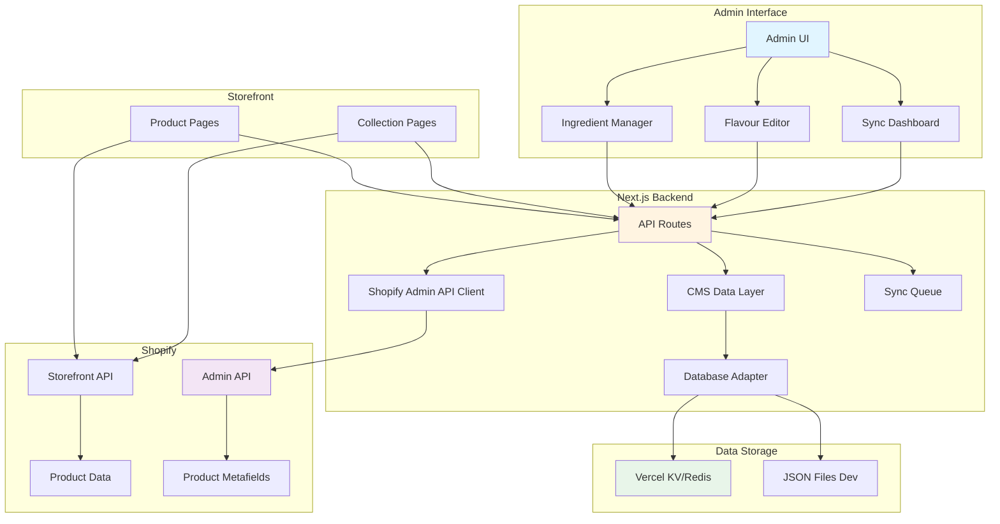
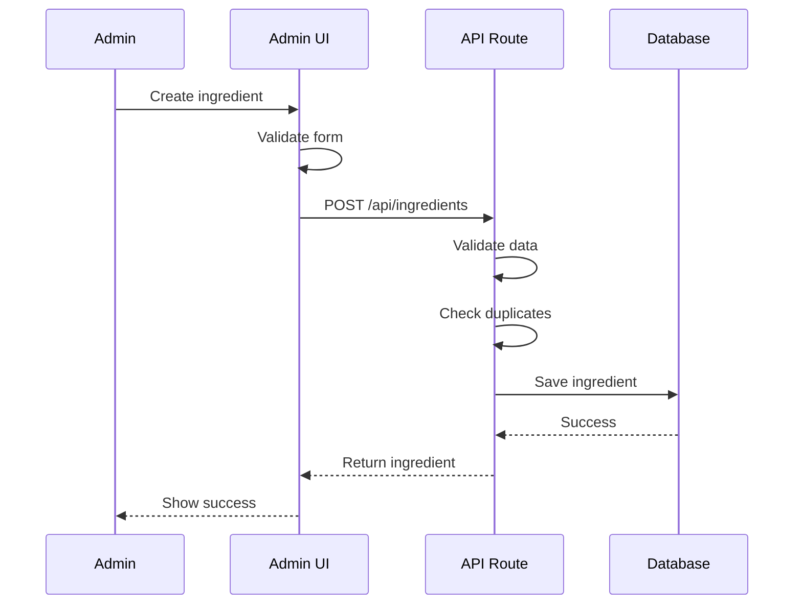
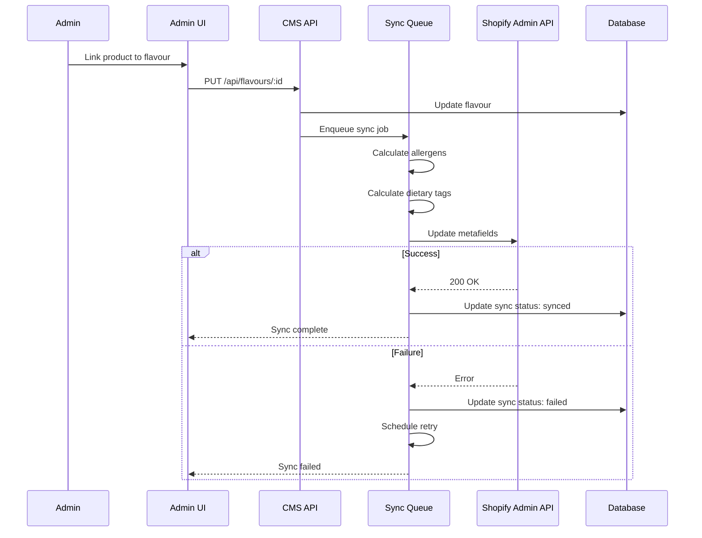
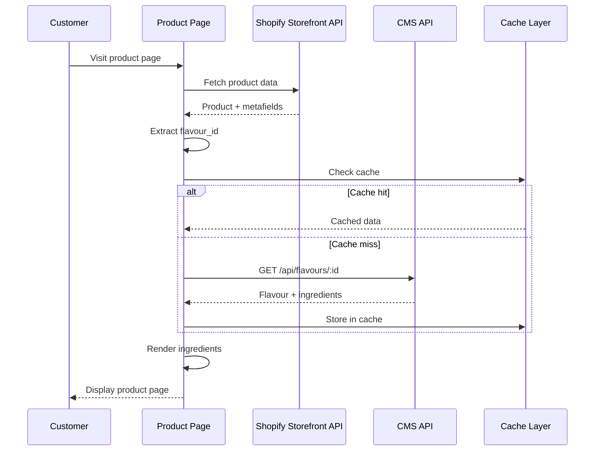
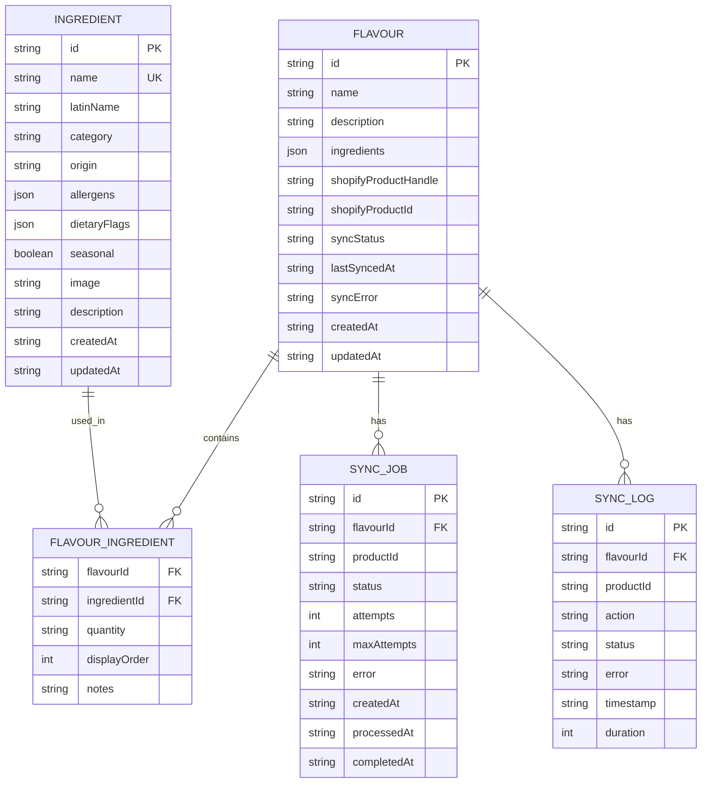

# Design: Shopify-CMS Integration Enhancement

## Overview

This design document outlines the architecture and implementation strategy for enhancing the integration between Shopify products and the CMS. The system enables bidirectional data syncing, ingredient display on product pages, and seamless content management for ice cream products.

### Goals

1. **Single Source of Truth** - Ingredients managed in CMS, linked to Shopify products via metafields
2. **Rich Product Pages** - Display ingredient details, allergens, and dietary information on storefront
3. **Efficient Management** - Easy linking between CMS flavours and Shopify products with sync status visibility
4. **Customer Transparency** - Clear ingredient and allergen information for informed purchasing decisions
5. **Scalability** - Support future expansion of product catalog (500+ ingredients, 100+ flavours)

### Key Features

- Ingredient library with categorization, allergens, and dietary flags
- Flavour-to-ingredient relationships with quantities and display order
- Shopify product linking with bidirectional metafield synchronization
- Sync queue with retry logic and error handling
- Admin UI for ingredient management and sync status monitoring
- Storefront components for ingredient display and dietary filtering

## Architecture

### System Overview



### Component Architecture

```mermaid
graph LR
    subgraph "Admin Components"
        A1[IngredientList]
        A2[IngredientForm]
        A3[FlavourIngredientSelector]
        A4[ShopifyProductPicker]
        A5[SyncStatusIndicator]
    end
    
    subgraph "Storefront Components"
        S1[IngredientDisplay]
        S2[AllergenWarning]
        S3[DietaryBadges]
        S4[DietaryFilter]
    end
    
    subgraph "API Layer"
        API1[/api/ingredients]
        API2[/api/flavours]
        API3[/api/shopify/products]
        API4[/api/shopify/sync]
    end
    
    A1 --> API1
    A2 --> API1
    A3 --> API1
    A3 --> API2
    A4 --> API3
    A5 --> API4
    
    S1 --> API1
    S1 --> API2
    S4 --> API2
```

### Data Flow

#### Ingredient Creation Flow



#### Flavour-Product Linking & Sync Flow



#### Storefront Ingredient Display Flow



## Components and Interfaces

### Core Components

#### 1. Ingredient Manager (Admin)

**Location:** `app/admin/ingredients/`

**Responsibilities:**
- Display paginated ingredient list with search and filters
- Create/edit/delete ingredients
- Upload ingredient images
- Validate ingredient data
- Show usage count (linked flavours)

**Key Features:**
- Search by name, category, allergen
- Filter by dietary flags, seasonal status
- Bulk import from CSV
- Duplicate detection
- Image upload with preview

**UI Components:**
```typescript
// IngredientList.tsx
interface IngredientListProps {
  initialIngredients: Ingredient[];
  categories: IngredientCategory[];
}

// IngredientForm.tsx
interface IngredientFormProps {
  ingredient?: Ingredient;
  onSave: (ingredient: Ingredient) => Promise<void>;
  onCancel: () => void;
}

// IngredientCard.tsx
interface IngredientCardProps {
  ingredient: Ingredient;
  onEdit: () => void;
  onDelete: () => void;
  usageCount: number;
}
```

#### 2. Flavour Ingredient Selector (Admin)

**Location:** `app/admin/flavours/components/`

**Responsibilities:**
- Search and select ingredients for a flavour
- Specify quantity/percentage for each ingredient
- Reorder ingredients (drag-and-drop)
- Auto-calculate allergens and dietary flags
- Show warnings for conflicting dietary information

**Key Features:**
- Multi-select with search
- Quantity input with validation
- Drag-and-drop reordering
- Real-time allergen calculation
- Dietary flag conflict detection

**UI Components:**
```typescript
// FlavourIngredientSelector.tsx
interface FlavourIngredientSelectorProps {
  selectedIngredients: FlavourIngredient[];
  onChange: (ingredients: FlavourIngredient[]) => void;
  availableIngredients: Ingredient[];
}

// IngredientSearchModal.tsx
interface IngredientSearchModalProps {
  onSelect: (ingredient: Ingredient) => void;
  excludeIds: string[];
}

// AllergenCalculator.tsx
interface AllergenCalculatorProps {
  ingredients: Ingredient[];
  onAllergensCalculated: (allergens: Allergen[]) => void;
}
```

#### 3. Shopify Product Picker (Admin)

**Location:** `app/admin/flavours/components/`

**Responsibilities:**
- Search Shopify products by name/handle
- Display product preview (image, title, price)
- Validate product exists in Shopify
- Handle product selection and unlinking

**Key Features:**
- Debounced search
- Product preview cards
- Validation before linking
- Clear unlink action

**UI Components:**
```typescript
// ShopifyProductPicker.tsx
interface ShopifyProductPickerProps {
  selectedProductHandle?: string;
  selectedProductId?: string;
  onSelect: (product: ShopifyProduct) => void;
  onUnlink: () => void;
}

// ProductSearchResults.tsx
interface ProductSearchResultsProps {
  products: ShopifyProduct[];
  onSelect: (product: ShopifyProduct) => void;
}
```

#### 4. Sync Status Dashboard (Admin)

**Location:** `app/admin/sync/`

**Responsibilities:**
- Display sync status for all linked flavours
- Show sync errors with details
- Provide manual re-sync trigger
- Display sync history and logs

**Key Features:**
- Status indicators (synced, pending, failed, not linked)
- Error detail modal
- Bulk re-sync action
- Sync history timeline
- Health metrics

**UI Components:**
```typescript
// SyncDashboard.tsx
interface SyncDashboardProps {
  flavours: FlavourWithSyncStatus[];
  onResync: (flavourId: string) => Promise<void>;
  onBulkResync: (flavourIds: string[]) => Promise<void>;
}

// SyncStatusIndicator.tsx
interface SyncStatusIndicatorProps {
  status: SyncStatus;
  lastSyncedAt?: string;
  error?: string;
}

// SyncHistoryLog.tsx
interface SyncHistoryLogProps {
  logs: SyncLog[];
  flavourId?: string;
}
```

#### 5. Ingredient Display (Storefront)

**Location:** `components/product/`

**Responsibilities:**
- Display ingredient list on product pages
- Show allergen warnings prominently
- Display dietary badges
- Render ingredient images and details
- Mobile-responsive layout

**Key Features:**
- Categorized ingredient display
- Prominent allergen section
- Dietary badge icons
- Seasonal ingredient indicators
- Expandable ingredient details

**UI Components:**
```typescript
// IngredientDisplay.tsx
interface IngredientDisplayProps {
  ingredients: IngredientWithDetails[];
  allergens: Allergen[];
  dietaryTags: DietaryFlag[];
}

// AllergenWarning.tsx
interface AllergenWarningProps {
  allergens: Allergen[];
  prominent?: boolean;
}

// DietaryBadges.tsx
interface DietaryBadgesProps {
  tags: DietaryFlag[];
  size?: 'sm' | 'md' | 'lg';
}

// IngredientCard.tsx
interface IngredientCardProps {
  ingredient: IngredientWithDetails;
  showDetails?: boolean;
}
```

#### 6. Dietary Filter (Storefront)

**Location:** `components/collection/`

**Responsibilities:**
- Provide filter UI for dietary requirements
- Support multiple simultaneous filters
- Update product count in real-time
- Persist filter state during browsing

**Key Features:**
- Checkbox filters for dietary tags
- Allergen exclusion filters
- Product count badges
- Clear all filters action
- URL state persistence

**UI Components:**
```typescript
// DietaryFilter.tsx
interface DietaryFilterProps {
  selectedFilters: DietaryFlag[];
  excludedAllergens: Allergen[];
  onChange: (filters: FilterState) => void;
  productCount: number;
}

// FilterCheckbox.tsx
interface FilterCheckboxProps {
  label: string;
  checked: boolean;
  count: number;
  onChange: (checked: boolean) => void;
}
```

## Data Models

### Ingredient Model

```typescript
interface Ingredient {
  id: string;                    // UUID
  name: string;                  // Display name (unique)
  latinName?: string;            // Scientific name (optional)
  category: IngredientCategory;  // Classification
  origin: string;                // Source/origin location
  allergens: Allergen[];         // Allergen tags
  dietaryFlags: DietaryFlag[];   // Dietary compatibility
  seasonal: boolean;             // Seasonal availability
  image?: string;                // Image URL (Vercel Blob or local)
  description?: string;          // Additional information
  createdAt: string;             // ISO 8601 timestamp
  updatedAt: string;             // ISO 8601 timestamp
}

type IngredientCategory = 
  | 'base'      // Milk, cream, sugar
  | 'flavor'    // Vanilla, chocolate, fruit
  | 'mix-in'    // Nuts, cookies, candy
  | 'topping'   // Sauce, sprinkles
  | 'spice';    // Cinnamon, cardamom

type Allergen = 
  | 'dairy' 
  | 'eggs' 
  | 'nuts' 
  | 'soy' 
  | 'gluten' 
  | 'sesame';

type DietaryFlag = 
  | 'vegan' 
  | 'vegetarian' 
  | 'gluten-free' 
  | 'dairy-free' 
  | 'nut-free';
```

### Flavour-Ingredient Relationship Model

```typescript
interface FlavourIngredient {
  ingredientId: string;          // Reference to Ingredient.id
  quantity?: string;             // e.g., "30%", "2 cups", "to taste"
  displayOrder: number;          // Sort order (0-indexed)
  notes?: string;                // Special preparation notes
}

interface Flavour {
  id: string;                    // UUID
  name: string;                  // Flavour name
  description: string;           // Description
  ingredients: FlavourIngredient[]; // Ordered ingredient list
  
  // Shopify linking
  shopifyProductHandle?: string; // Product handle for URLs
  shopifyProductId?: string;     // Product GID for API operations
  
  // Sync status
  syncStatus: SyncStatus;        // Current sync state
  lastSyncedAt?: string;         // Last successful sync timestamp
  syncError?: string;            // Error message if failed
  
  // Metadata
  createdAt: string;
  updatedAt: string;
  
  // ... existing fields (story, tastingNotes, etc.)
}

type SyncStatus = 
  | 'synced'      // Successfully synced
  | 'pending'     // Queued for sync
  | 'failed'      // Sync failed
  | 'not_linked'; // No Shopify product linked
```

### Shopify Metafield Model

```typescript
// Stored in Shopify product metafields
interface ProductMetafields {
  'custom.flavour_id': {
    type: 'single_line_text_field';
    value: string;                // CMS flavour ID
  };
  'custom.ingredient_ids': {
    type: 'json';
    value: string[];              // Array of ingredient IDs
  };
  'custom.allergens': {
    type: 'json';
    value: Allergen[];            // Calculated allergen list
  };
  'custom.dietary_tags': {
    type: 'json';
    value: DietaryFlag[];         // vegan, gluten-free, etc.
  };
  'custom.seasonal_ingredients': {
    type: 'boolean';
    value: boolean;               // Has seasonal items
  };
}
```

### Sync Queue Model

```typescript
interface SyncJob {
  id: string;                    // Job ID
  flavourId: string;             // Flavour to sync
  productId: string;             // Shopify product GID
  status: 'pending' | 'processing' | 'completed' | 'failed';
  attempts: number;              // Retry count
  maxAttempts: number;           // Max retry limit (default: 3)
  error?: string;                // Error message
  createdAt: string;
  processedAt?: string;
  completedAt?: string;
}

interface SyncLog {
  id: string;
  flavourId: string;
  productId: string;
  action: 'create' | 'update' | 'delete';
  status: 'success' | 'failure';
  error?: string;
  timestamp: string;
  duration: number;              // Milliseconds
}
```

### Database Schema



### API Interfaces

#### Ingredient API

```typescript
// GET /api/ingredients
interface GetIngredientsResponse {
  ingredients: Ingredient[];
  total: number;
  page: number;
  pageSize: number;
}

// GET /api/ingredients/:id
interface GetIngredientResponse {
  ingredient: Ingredient;
  usedInFlavours: {
    id: string;
    name: string;
  }[];
}

// POST /api/ingredients
interface CreateIngredientRequest {
  name: string;
  latinName?: string;
  category: IngredientCategory;
  origin: string;
  allergens: Allergen[];
  dietaryFlags: DietaryFlag[];
  seasonal: boolean;
  image?: string;
  description?: string;
}

interface CreateIngredientResponse {
  ingredient: Ingredient;
}

// PUT /api/ingredients/:id
interface UpdateIngredientRequest extends Partial<CreateIngredientRequest> {}

interface UpdateIngredientResponse {
  ingredient: Ingredient;
}

// DELETE /api/ingredients/:id
interface DeleteIngredientResponse {
  message: string;
  error?: string;
  flavours?: string[]; // If ingredient is in use
}
```

#### Flavour API

```typescript
// PUT /api/flavours/:id
interface UpdateFlavourRequest {
  name?: string;
  description?: string;
  ingredients?: FlavourIngredient[];
  shopifyProductHandle?: string;
  shopifyProductId?: string;
}

interface UpdateFlavourResponse {
  flavour: Flavour;
  syncQueued: boolean;
}

// GET /api/flavours/:id/ingredients
interface GetFlavourIngredientsResponse {
  ingredients: IngredientWithDetails[];
  allergens: Allergen[];
  dietaryTags: DietaryFlag[];
}

interface IngredientWithDetails extends Ingredient {
  quantity?: string;
  displayOrder: number;
  notes?: string;
}
```

#### Shopify API

```typescript
// GET /api/shopify/products
interface GetShopifyProductsRequest {
  query?: string;
  limit?: number;
}

interface GetShopifyProductsResponse {
  products: ShopifyProduct[];
}

interface ShopifyProduct {
  id: string;              // GID
  handle: string;
  title: string;
  featuredImage?: {
    url: string;
    altText?: string;
  };
  priceRange: {
    minVariantPrice: {
      amount: string;
      currencyCode: string;
    };
  };
}

// POST /api/shopify/sync
interface SyncFlavourRequest {
  flavourId: string;
}

interface SyncFlavourResponse {
  success: boolean;
  jobId: string;
  message: string;
}

// GET /api/shopify/sync/status/:jobId
interface GetSyncStatusResponse {
  job: SyncJob;
  logs: SyncLog[];
}
```

## Correctness Properties

*A property is a characteristic or behavior that should hold true across all valid executions of a system—essentially, a formal statement about what the system should do. Properties serve as the bridge between human-readable specifications and machine-verifiable correctness guarantees.*

### Property 1: Ingredient Data Persistence

*For any* valid ingredient with all required fields (name, category, origin, allergens, dietaryFlags, seasonal), creating the ingredient should result in a stored record that can be retrieved with all fields intact.

**Validates: Requirements US-2.1, US-2.2, US-2.3, US-2.4**

### Property 2: Ingredient Name Uniqueness

*For any* ingredient name that already exists in the system, attempting to create another ingredient with the same name should fail with an appropriate error.

**Validates: Requirements US-2.6**

### Property 3: Ingredient Search Filtering

*For any* search query and filter criteria (category, allergen, dietary flag), all returned ingredients should match the specified criteria.

**Validates: Requirements US-2.5**

### Property 4: Ingredient Deletion Protection

*For any* ingredient that is used in one or more flavours, attempting to delete the ingredient should fail and return the list of flavours using it.

**Validates: Requirements US-2 (implicit safety requirement)**

### Property 5: Product Linking Data Persistence

*For any* flavour and valid Shopify product, linking the product should result in both shopifyProductHandle and shopifyProductId being stored and retrievable.

**Validates: Requirements US-1.2**

### Property 6: Product Existence Validation

*For any* product ID that does not exist in Shopify, attempting to link it to a flavour should fail with a validation error.

**Validates: Requirements US-1.3**

### Property 7: Product Unlinking

*For any* flavour with a linked product, unlinking should clear both shopifyProductHandle and shopifyProductId fields and set syncStatus to 'not_linked'.

**Validates: Requirements US-1.5**

### Property 8: Multiple Ingredient Assignment

*For any* flavour and set of ingredient IDs, assigning multiple ingredients should result in all ingredients being associated with the flavour in the specified order.

**Validates: Requirements US-3.1**

### Property 9: Ingredient Quantity Persistence

*For any* flavour-ingredient relationship with a specified quantity, the quantity value should be stored and retrievable with the relationship.

**Validates: Requirements US-3.2**

### Property 10: Ingredient Display Order

*For any* flavour with multiple ingredients, changing the displayOrder values should result in ingredients being returned in the new order when queried.

**Validates: Requirements US-3.3**

### Property 11: Allergen Auto-Calculation

*For any* flavour with a set of ingredients, the flavour's calculated allergens should equal the union of all allergens from its ingredients.

**Validates: Requirements US-3.4**

### Property 12: Dietary Flag Auto-Determination

*For any* flavour with a set of ingredients, the flavour's calculated dietary flags should equal the intersection of all dietary flags from its ingredients (a flavour is only vegan if ALL ingredients are vegan).

**Validates: Requirements US-3.5**

### Property 13: Dietary Conflict Detection

*For any* set of ingredients where some have conflicting dietary information (e.g., one is vegan, another contains dairy), the system should generate a warning indicating the conflict.

**Validates: Requirements US-3.6**

### Property 14: Complete Metafield Synchronization

*For any* flavour linked to a Shopify product, syncing should create or update all required metafields (flavour_id, ingredient_ids, allergens, dietary_tags, seasonal_ingredients) with correct values.

**Validates: Requirements US-4.1, US-4.2**

### Property 15: Sync Error Handling

*For any* sync operation that encounters a Shopify API error, the system should not crash, should log the error, and should set the flavour's syncStatus to 'failed' with the error message.

**Validates: Requirements US-4.3**

### Property 16: Sync Operation Logging

*For any* sync operation (create, update, delete), the system should create a SyncLog entry with the operation details, status, and timestamp.

**Validates: Requirements US-4.4, US-8.6**

### Property 17: Sync Retry Logic

*For any* failed sync job with attempts less than maxAttempts, the system should retry the sync operation and increment the attempts counter.

**Validates: Requirements US-4.6**

### Property 18: Ingredient Display Completeness

*For any* product page with a linked flavour, the rendered ingredient display should include all ingredients with their name, origin, category, and any specified quantity.

**Validates: Requirements US-5.1, US-5.2**

### Property 19: Seasonal Ingredient Marking

*For any* ingredient marked as seasonal, the rendered display should include a seasonal indicator.

**Validates: Requirements US-5.5**

### Property 20: Ingredient Image Display

*For any* ingredient with an image URL, the rendered display should include the image.

**Validates: Requirements US-5.6**

### Property 21: Multi-Filter Product Matching

*For any* collection page with multiple dietary filters applied, all returned products should match ALL selected filter criteria (AND logic, not OR).

**Validates: Requirements US-6.3**

### Property 22: Filter State Persistence

*For any* filter state applied on a collection page, navigating away and returning should restore the same filter state.

**Validates: Requirements US-6.4**

### Property 23: Product Count Accuracy

*For any* filter change on a collection page, the displayed product count should equal the actual number of products matching the current filters.

**Validates: Requirements US-6.5**

### Property 24: Sync Status Display

*For any* flavour in the admin list, the displayed sync status should match the flavour's current syncStatus field value.

**Validates: Requirements US-7.1**

### Property 25: Manual Resync Trigger

*For any* flavour with a linked product, manually triggering a resync should create a new SyncJob with status 'pending'.

**Validates: Requirements US-7.3**

### Property 26: Sync Error Detail Access

*For any* flavour with syncStatus 'failed', the admin should be able to retrieve the syncError message.

**Validates: Requirements US-7.4**

### Property 27: Sync Health Metrics

*For any* set of flavours, the sync health dashboard should correctly calculate the count of flavours in each sync status (synced, pending, failed, not_linked).

**Validates: Requirements US-7.6**

### Property 28: Deleted Product Detection

*For any* flavour linked to a product that no longer exists in Shopify, validating the link should detect the deletion and update syncStatus to 'not_linked'.

**Validates: Requirements US-8.1, US-8.2**

### Property 29: Bulk Relinking

*For any* set of flavours selected for bulk relinking, the operation should process all flavours and return the success/failure status for each.

**Validates: Requirements US-8.5**

### Property 30: Shopify Product Search

*For any* search query, the returned Shopify products should have titles or handles that match the query string.

**Validates: Requirements US-1.1**

## Error Handling

### Error Categories

#### 1. Validation Errors

**Scenarios:**
- Invalid ingredient data (missing required fields, invalid category)
- Duplicate ingredient names
- Invalid Shopify product ID
- Empty or whitespace-only ingredient names

**Handling Strategy:**
- Return 400 Bad Request with detailed error message
- Include field-level validation errors in response
- Log validation failures for monitoring
- Display user-friendly error messages in UI

**Example Response:**
```typescript
{
  error: 'Validation failed',
  details: {
    name: 'Ingredient name already exists',
    category: 'Invalid category: must be one of base, flavor, mix-in, topping, spice'
  }
}
```

#### 2. Shopify API Errors

**Scenarios:**
- Rate limiting (429 Too Many Requests)
- Authentication failures (401 Unauthorized)
- Product not found (404)
- Network timeouts
- Invalid metafield data

**Handling Strategy:**
- Implement exponential backoff for rate limits
- Queue failed syncs for retry (max 3 attempts)
- Log all API errors with request/response details
- Update flavour syncStatus to 'failed' with error message
- Provide manual resync option in admin UI

**Rate Limiting:**
```typescript
// Shopify Admin API: 2 requests/second
const RATE_LIMIT = {
  maxRequests: 2,
  perMilliseconds: 1000,
  retryAfter: 500 // ms to wait before retry
};

// Implement token bucket algorithm
class RateLimiter {
  private tokens: number = RATE_LIMIT.maxRequests;
  private lastRefill: number = Date.now();
  
  async acquire(): Promise<void> {
    // Refill tokens based on time elapsed
    const now = Date.now();
    const elapsed = now - this.lastRefill;
    const tokensToAdd = Math.floor(elapsed / RATE_LIMIT.perMilliseconds) * RATE_LIMIT.maxRequests;
    
    if (tokensToAdd > 0) {
      this.tokens = Math.min(RATE_LIMIT.maxRequests, this.tokens + tokensToAdd);
      this.lastRefill = now;
    }
    
    // Wait if no tokens available
    if (this.tokens < 1) {
      await new Promise(resolve => setTimeout(resolve, RATE_LIMIT.retryAfter));
      return this.acquire();
    }
    
    this.tokens--;
  }
}
```

**Retry Logic:**
```typescript
async function syncWithRetry(
  flavourId: string,
  productId: string,
  maxAttempts: number = 3
): Promise<SyncResult> {
  let attempts = 0;
  let lastError: Error | null = null;
  
  while (attempts < maxAttempts) {
    try {
      await rateLimiter.acquire();
      const result = await syncMetafields(flavourId, productId);
      
      // Log success
      await createSyncLog({
        flavourId,
        productId,
        action: 'update',
        status: 'success',
        timestamp: new Date().toISOString()
      });
      
      return { success: true, result };
    } catch (error) {
      attempts++;
      lastError = error as Error;
      
      // Log failure
      await createSyncLog({
        flavourId,
        productId,
        action: 'update',
        status: 'failure',
        error: lastError.message,
        timestamp: new Date().toISOString()
      });
      
      // Exponential backoff
      if (attempts < maxAttempts) {
        const delay = Math.pow(2, attempts) * 1000; // 2s, 4s, 8s
        await new Promise(resolve => setTimeout(resolve, delay));
      }
    }
  }
  
  return { success: false, error: lastError?.message };
}
```

#### 3. Database Errors

**Scenarios:**
- Connection failures (Redis/KV unavailable)
- Write failures
- Concurrent modification conflicts
- Data corruption

**Handling Strategy:**
- Fallback to file system in development
- Return 503 Service Unavailable for connection failures
- Implement optimistic locking for concurrent updates
- Log all database errors
- Display maintenance message to users

**Fallback Pattern:**
```typescript
async function saveIngredient(ingredient: Ingredient): Promise<Ingredient> {
  try {
    // Try primary storage (Redis/KV)
    await db.write('ingredients.json', ingredient);
    return ingredient;
  } catch (error) {
    console.error('Primary storage failed:', error);
    
    // Fallback to file system in development
    if (process.env.NODE_ENV === 'development') {
      console.warn('Falling back to file system storage');
      await fs.writeFile(
        path.join(process.cwd(), 'public/data/ingredients.json'),
        JSON.stringify(ingredient, null, 2)
      );
      return ingredient;
    }
    
    // In production, fail fast
    throw new Error('Database unavailable');
  }
}
```

#### 4. Resource Conflicts

**Scenarios:**
- Deleting ingredient used in flavours
- Unlinking product while sync is in progress
- Concurrent edits to same flavour

**Handling Strategy:**
- Check dependencies before deletion
- Return 409 Conflict with details
- Implement optimistic locking with version numbers
- Provide clear error messages with resolution steps

**Example:**
```typescript
async function deleteIngredient(id: string): Promise<void> {
  // Check if ingredient is used
  const flavours = await getFlavours();
  const usedIn = flavours.filter(f => 
    f.ingredients.some(i => i.ingredientId === id)
  );
  
  if (usedIn.length > 0) {
    throw new ConflictError(
      `Cannot delete ingredient: used in ${usedIn.length} flavour(s)`,
      { flavours: usedIn.map(f => ({ id: f.id, name: f.name })) }
    );
  }
  
  await db.delete('ingredients', id);
}
```

#### 5. Image Upload Errors

**Scenarios:**
- File too large
- Invalid file type
- Storage quota exceeded
- Upload timeout

**Handling Strategy:**
- Validate file size and type before upload
- Return 413 Payload Too Large for oversized files
- Return 415 Unsupported Media Type for invalid types
- Implement chunked uploads for large files
- Provide upload progress feedback

**Validation:**
```typescript
const ALLOWED_TYPES = ['image/jpeg', 'image/png', 'image/gif', 'image/webp'];
const MAX_SIZE = 5 * 1024 * 1024; // 5MB

function validateImage(file: File): void {
  if (!ALLOWED_TYPES.includes(file.type)) {
    throw new ValidationError(
      `Invalid file type: ${file.type}. Allowed types: ${ALLOWED_TYPES.join(', ')}`
    );
  }
  
  if (file.size > MAX_SIZE) {
    throw new ValidationError(
      `File too large: ${(file.size / 1024 / 1024).toFixed(2)}MB. Maximum: 5MB`
    );
  }
}
```

### Error Response Format

All API errors follow a consistent format:

```typescript
interface ErrorResponse {
  error: string;           // Human-readable error message
  code?: string;           // Machine-readable error code
  details?: any;           // Additional error details
  timestamp: string;       // ISO 8601 timestamp
  requestId?: string;      // For tracking and debugging
}

// Example responses
{
  error: 'Ingredient not found',
  code: 'INGREDIENT_NOT_FOUND',
  timestamp: '2026-03-09T18:30:00Z',
  requestId: 'req_abc123'
}

{
  error: 'Validation failed',
  code: 'VALIDATION_ERROR',
  details: {
    name: 'Required field',
    category: 'Invalid value'
  },
  timestamp: '2026-03-09T18:30:00Z'
}
```

### Logging Strategy

**Log Levels:**
- **ERROR**: System failures, API errors, unhandled exceptions
- **WARN**: Validation failures, rate limiting, retry attempts
- **INFO**: Successful operations, sync completions
- **DEBUG**: Detailed request/response data (development only)

**Log Structure:**
```typescript
interface LogEntry {
  level: 'error' | 'warn' | 'info' | 'debug';
  message: string;
  context: {
    operation: string;
    userId?: string;
    flavourId?: string;
    ingredientId?: string;
    productId?: string;
  };
  error?: {
    message: string;
    stack?: string;
    code?: string;
  };
  timestamp: string;
  duration?: number; // milliseconds
}
```

## Testing Strategy

### Dual Testing Approach

This feature requires both unit tests and property-based tests for comprehensive coverage:

- **Unit tests**: Verify specific examples, edge cases, and error conditions
- **Property tests**: Verify universal properties across all inputs

Together, they provide comprehensive coverage where unit tests catch concrete bugs and property tests verify general correctness.

### Property-Based Testing

**Library:** `fast-check` (JavaScript/TypeScript property-based testing library)

**Configuration:**
- Minimum 100 iterations per property test
- Each test tagged with reference to design document property
- Tag format: `Feature: shopify-cms-integration, Property {number}: {property_text}`

**Example Property Test:**

```typescript
import fc from 'fast-check';
import { describe, it, expect } from 'vitest';

describe('Feature: shopify-cms-integration, Property 11: Allergen Auto-Calculation', () => {
  it('should calculate allergens as union of all ingredient allergens', async () => {
    await fc.assert(
      fc.asyncProperty(
        fc.array(ingredientArbitrary(), { minLength: 1, maxLength: 10 }),
        async (ingredients) => {
          // Create flavour with these ingredients
          const flavour = await createFlavour({
            name: 'Test Flavour',
            ingredients: ingredients.map((ing, idx) => ({
              ingredientId: ing.id,
              displayOrder: idx
            }))
          });
          
          // Calculate expected allergens (union)
          const expectedAllergens = new Set(
            ingredients.flatMap(ing => ing.allergens)
          );
          
          // Get calculated allergens
          const result = await getFlavourIngredients(flavour.id);
          
          // Verify union property
          expect(new Set(result.allergens)).toEqual(expectedAllergens);
        }
      ),
      { numRuns: 100 }
    );
  });
});

// Arbitrary generator for ingredients
function ingredientArbitrary() {
  return fc.record({
    id: fc.uuid(),
    name: fc.string({ minLength: 3, maxLength: 50 }),
    category: fc.constantFrom('base', 'flavor', 'mix-in', 'topping', 'spice'),
    origin: fc.string({ minLength: 3, maxLength: 100 }),
    allergens: fc.array(
      fc.constantFrom('dairy', 'eggs', 'nuts', 'soy', 'gluten', 'sesame'),
      { maxLength: 3 }
    ),
    dietaryFlags: fc.array(
      fc.constantFrom('vegan', 'vegetarian', 'gluten-free', 'dairy-free', 'nut-free'),
      { maxLength: 3 }
    ),
    seasonal: fc.boolean()
  });
}
```

### Unit Testing

**Framework:** Vitest (fast, modern test runner for Vite/Next.js)

**Coverage Areas:**

#### 1. API Route Tests

```typescript
describe('POST /api/ingredients', () => {
  it('should create ingredient with valid data', async () => {
    const ingredient = {
      name: 'Vanilla Bean',
      category: 'flavor',
      origin: 'Madagascar',
      allergens: [],
      dietaryFlags: ['vegan', 'gluten-free'],
      seasonal: false
    };
    
    const response = await POST(new Request('http://localhost/api/ingredients', {
      method: 'POST',
      body: JSON.stringify(ingredient)
    }));
    
    expect(response.status).toBe(201);
    const data = await response.json();
    expect(data.ingredient.name).toBe('Vanilla Bean');
    expect(data.ingredient.id).toBeDefined();
  });
  
  it('should reject duplicate ingredient names', async () => {
    // Create first ingredient
    await createIngredient({ name: 'Chocolate', category: 'flavor', origin: 'Ecuador' });
    
    // Try to create duplicate
    const response = await POST(new Request('http://localhost/api/ingredients', {
      method: 'POST',
      body: JSON.stringify({ name: 'Chocolate', category: 'flavor', origin: 'Peru' })
    }));
    
    expect(response.status).toBe(400);
    const data = await response.json();
    expect(data.error).toContain('already exists');
  });
  
  it('should handle empty ingredient name', async () => {
    const response = await POST(new Request('http://localhost/api/ingredients', {
      method: 'POST',
      body: JSON.stringify({ name: '', category: 'flavor', origin: 'Test' })
    }));
    
    expect(response.status).toBe(400);
  });
});
```

#### 2. Component Tests

```typescript
import { render, screen, fireEvent } from '@testing-library/react';
import { FlavourIngredientSelector } from '@/app/admin/flavours/components/FlavourIngredientSelector';

describe('FlavourIngredientSelector', () => {
  it('should display selected ingredients in order', () => {
    const ingredients = [
      { ingredientId: '1', displayOrder: 0, quantity: '50%' },
      { ingredientId: '2', displayOrder: 1, quantity: '30%' }
    ];
    
    render(
      <FlavourIngredientSelector
        selectedIngredients={ingredients}
        onChange={jest.fn()}
        availableIngredients={mockIngredients}
      />
    );
    
    const items = screen.getAllByRole('listitem');
    expect(items).toHaveLength(2);
    expect(items[0]).toHaveTextContent('50%');
  });
  
  it('should call onChange when ingredient is removed', () => {
    const onChange = jest.fn();
    const ingredients = [
      { ingredientId: '1', displayOrder: 0 }
    ];
    
    render(
      <FlavourIngredientSelector
        selectedIngredients={ingredients}
        onChange={onChange}
        availableIngredients={mockIngredients}
      />
    );
    
    fireEvent.click(screen.getByRole('button', { name: /remove/i }));
    expect(onChange).toHaveBeenCalledWith([]);
  });
});
```

#### 3. Integration Tests

```typescript
describe('Flavour-Product Linking Integration', () => {
  it('should link product and queue sync', async () => {
    // Create flavour
    const flavour = await createFlavour({
      name: 'Strawberry Basil',
      ingredients: []
    });
    
    // Link to Shopify product
    const response = await fetch(`/api/flavours/${flavour.id}`, {
      method: 'PUT',
      body: JSON.stringify({
        shopifyProductHandle: 'strawberry-basil',
        shopifyProductId: 'gid://shopify/Product/123'
      })
    });
    
    expect(response.status).toBe(200);
    const data = await response.json();
    expect(data.syncQueued).toBe(true);
    
    // Verify sync job created
    const jobs = await getSyncJobs();
    expect(jobs).toHaveLength(1);
    expect(jobs[0].flavourId).toBe(flavour.id);
    expect(jobs[0].status).toBe('pending');
  });
});
```

#### 4. Sync Logic Tests

```typescript
describe('Metafield Sync', () => {
  it('should sync all required metafields', async () => {
    const flavour = createMockFlavour({
      ingredients: [
        { ingredientId: 'ing1', allergens: ['dairy'] },
        { ingredientId: 'ing2', allergens: ['nuts'] }
      ]
    });
    
    const metafields = await buildMetafields(flavour);
    
    expect(metafields).toHaveProperty('custom.flavour_id', flavour.id);
    expect(metafields).toHaveProperty('custom.ingredient_ids');
    expect(metafields['custom.allergens']).toEqual(['dairy', 'nuts']);
  });
  
  it('should retry failed syncs with exponential backoff', async () => {
    const mockShopifyAPI = jest.fn()
      .mockRejectedValueOnce(new Error('Rate limit'))
      .mockRejectedValueOnce(new Error('Timeout'))
      .mockResolvedValueOnce({ success: true });
    
    const result = await syncWithRetry('flavour1', 'product1', 3);
    
    expect(mockShopifyAPI).toHaveBeenCalledTimes(3);
    expect(result.success).toBe(true);
  });
});
```

### Test Coverage Goals

- **API Routes**: 90%+ coverage
- **Business Logic**: 95%+ coverage
- **Components**: 80%+ coverage
- **Integration Tests**: All critical user flows

### Testing Commands

```bash
# Run all tests
npm test

# Run tests in watch mode
npm test -- --watch

# Run tests with coverage
npm test -- --coverage

# Run only property tests
npm test -- --grep "Property"

# Run only unit tests
npm test -- --grep -v "Property"
```

### Continuous Integration

Tests run automatically on:
- Every pull request
- Every commit to main branch
- Before deployment to production

**CI Configuration (.github/workflows/test.yml):**
```yaml
name: Test
on: [push, pull_request]
jobs:
  test:
    runs-on: ubuntu-latest
    steps:
      - uses: actions/checkout@v3
      - uses: actions/setup-node@v3
        with:
          node-version: '18'
      - run: npm ci
      - run: npm test -- --coverage
      - uses: codecov/codecov-action@v3
```

---

**Design Status**: Complete  
**Last Updated**: 2026-03-09  
**Next Step**: Task breakdown and implementation

