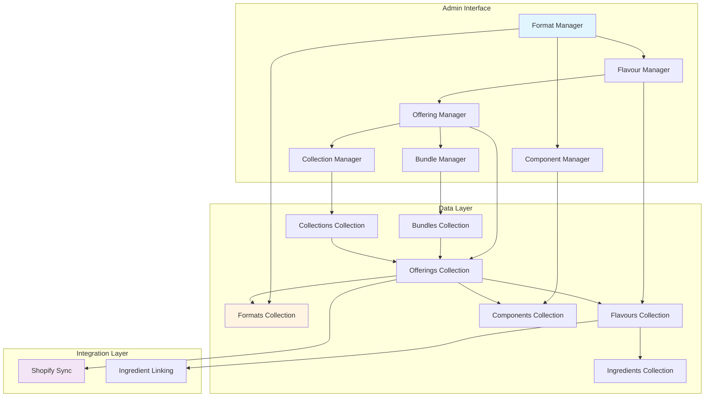
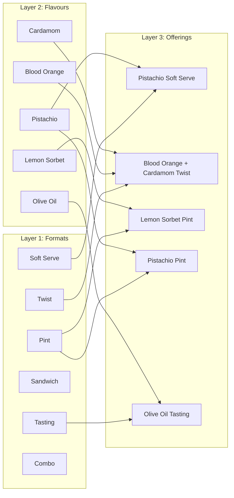
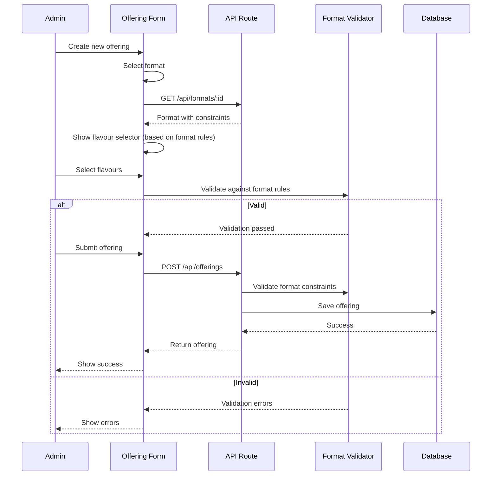
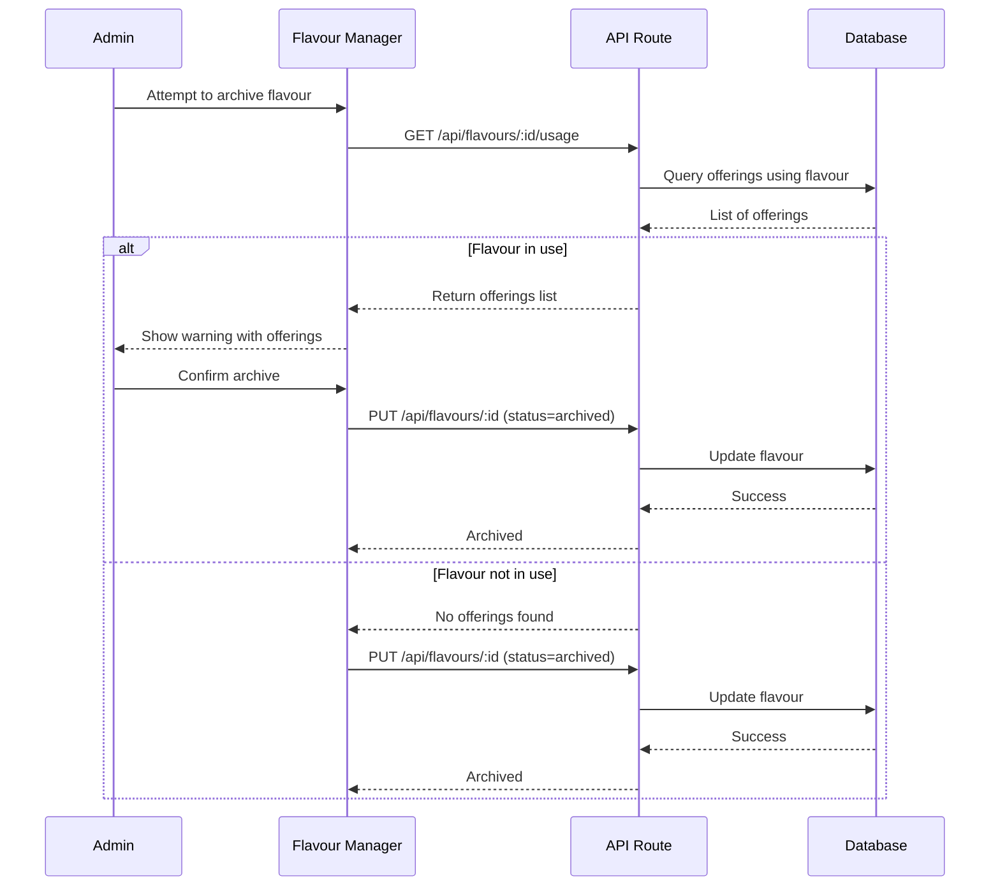
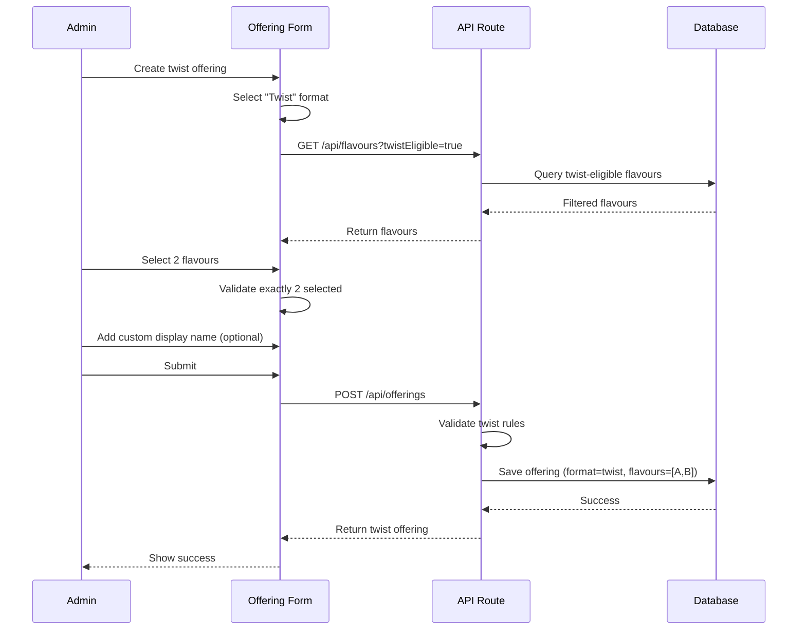

# Design: Three-Layer CMS Architecture

## Overview

This design document outlines the architecture and implementation strategy for restructuring the Janine CMS around a clean 3-layer model that separates product formats, flavours, and sellable offerings. This architecture eliminates content duplication, enables flexible menu management, and supports complex product relationships.

### Goals

1. **Separation of Concerns** - Cleanly separate format structure, flavour content, and sellable offerings
2. **Content Reusability** - Define flavours once, use in multiple formats without duplication
3. **Flexible Menu Management** - Easily create and modify weekly menus with twist combinations
4. **Complex Product Support** - Handle bundles, combos, tastings, and seasonal collections
5. **Data Integrity** - Maintain referential integrity and prevent orphaned data
6. **Backward Compatibility** - Preserve existing Shopify integrations and ingredient relationships

### Key Features

- Format templates defining product structure and constraints
- Reusable flavour entities with ingredient relationships
- Offering composition from formats and flavours
- Twist combinations without fake "combo flavours"
- Bundle and combo management with choice rules
- Seasonal collection grouping for editorial storytelling
- Component library for non-flavour items (focaccia, toppings, etc.)
- Format-specific validation and constraint enforcement
- Flavour usage tracking and dependency management
- Migration strategy from current single-entity model

## Architecture

### System Overview



### Three-Layer Model



### Data Flow

#### Offering Creation Flow



#### Flavour Usage Tracking Flow



#### Twist Combination Flow



## Components and Interfaces

### Core Collections

#### 1. Formats Collection

**Purpose:** Define the structural templates for all sellable items.

**Schema:**
```typescript
interface Format {
  id: string;                    // UUID
  name: string;                  // Display name (e.g., "Soft Serve", "Twist")
  slug: string;                  // URL-friendly identifier
  category: FormatCategory;      // Classification
  description: string;           // Admin description
  
  // Flavour requirements
  requiresFlavours: boolean;     // Does this format need flavours?
  minFlavours: number;           // Minimum flavour count (0 if not required)
  maxFlavours: number;           // Maximum flavour count
  allowMixedTypes: boolean;      // Can mix gelato + sorbet?
  
  // Configuration
  canIncludeAddOns: boolean;     // Supports toppings/add-ons?
  defaultSizes: string[];        // e.g., ["small", "medium", "large"]
  servingStyle: ServingStyle;    // How it's served
  menuSection: string;           // Where it appears on menu
  
  // Display
  image?: string;                // Format image URL
  icon?: string;                 // Icon for admin UI
  
  // Metadata
  createdAt: string;
  updatedAt: string;
}

type FormatCategory = 
  | 'frozen'      // Ice cream, sorbet, soft serve
  | 'food'        // Sandwiches, focaccia
  | 'experience'  // Tastings, pairings
  | 'bundle';     // Combos, multi-item

type ServingStyle = 
  | 'scoop'       // Hand-scooped
  | 'soft-serve'  // Soft serve machine
  | 'packaged'    // Pints, take-home
  | 'plated';     // Plated experience
```

**API Endpoints:**
- `GET /api/formats` - List all formats
- `GET /api/formats/:id` - Get format details
- `POST /api/formats` - Create format (admin only)
- `PUT /api/formats/:id` - Update format (admin only)
- `DELETE /api/formats/:id` - Delete format (admin only, checks usage)

**Validation Rules:**
- `name` must be unique
- `slug` must be unique and URL-safe
- `minFlavours` must be ≤ `maxFlavours`
- `maxFlavours` must be > 0 if `requiresFlavours` is true
- Cannot delete format if used in active offerings

#### 2. Flavours Collection (Enhanced)

**Purpose:** Define flavour entities that can be reused across multiple formats.

**Schema:**
```typescript
interface Flavour {
  id: string;                    // UUID
  name: string;                  // Flavour name
  slug: string;                  // URL-friendly identifier
  type: FlavourType;             // Classification
  baseStyle: BaseStyle;          // Base category
  
  // Content
  description: string;           // Full description
  shortDescription: string;      // Card copy
  story?: string;                // Flavour story/narrative
  tastingNotes?: string;         // Tasting notes
  
  // Ingredients (existing relationship)
  ingredients: FlavourIngredient[]; // From existing system
  keyNotes: string[];            // Flavor notes (e.g., "nutty", "floral")
  
  // Allergens & Dietary (calculated from ingredients)
  allergens: Allergen[];         // Auto-calculated
  dietaryTags: DietaryFlag[];    // Auto-calculated
  
  // Display
  colour: string;                // Hex color code
  image?: string;                // Flavour image URL
  
  // Availability
  season?: string;               // e.g., "Spring", "Summer"
  availabilityStatus: AvailabilityStatus;
  
  // Format eligibility flags
  canBeUsedInTwist: boolean;     // Eligible for twist combinations
  canBeSoldAsPint: boolean;      // Available as packaged pint
  canBeUsedInSandwich: boolean;  // Suitable for sandwich filling
  
  // Admin
  sortOrder: number;             // Display order
  featured: boolean;             // Highlight in admin
  
  // Shopify integration (existing)
  shopifyProductHandle?: string;
  shopifyProductId?: string;
  syncStatus: SyncStatus;
  lastSyncedAt?: string;
  syncError?: string;
  
  // Metadata
  createdAt: string;
  updatedAt: string;
}

type FlavourType = 
  | 'gelato'              // Dairy-based ice cream
  | 'sorbet'              // Fruit-based, dairy-free
  | 'special'             // Unique preparations
  | 'tasting-component';  // For tasting experiences

type BaseStyle = 
  | 'dairy'      // Milk/cream base
  | 'non-dairy'  // Alternative milk
  | 'fruit'      // Fruit base
  | 'cheese'     // Cheese-based
  | 'other';     // Unique bases

type AvailabilityStatus = 
  | 'active'     // Currently available
  | 'upcoming'   // Coming soon
  | 'archived';  // No longer available
```

**API Endpoints:**
- `GET /api/flavours` - List flavours (with filters)
- `GET /api/flavours/:id` - Get flavour details
- `GET /api/flavours/:id/usage` - Get offerings using this flavour
- `POST /api/flavours` - Create flavour
- `PUT /api/flavours/:id` - Update flavour
- `DELETE /api/flavours/:id` - Delete flavour (checks usage)

**Validation Rules:**
- `name` must be unique
- `slug` must be unique and URL-safe
- `colour` must be valid hex code
- Cannot delete if used in active offerings (warning for archived offerings)
- `allergens` and `dietaryTags` auto-calculated from ingredients

#### 3. Offerings Collection

**Purpose:** Define sellable menu items by combining formats with flavours.

**Schema:**
```typescript
interface Offering {
  id: string;                    // UUID
  internalName: string;          // Admin reference name
  publicName: string;            // Customer-facing name
  slug: string;                  // URL-friendly identifier
  status: OfferingStatus;        // Publication status
  
  // Relationships
  formatId: string;              // Reference to Format.id
  primaryFlavourIds: string[];   // Main flavour(s) - array for flexibility
  secondaryFlavourIds?: string[]; // Optional additional flavours
  componentIds?: string[];       // Optional components (for sandwiches, tastings)
  
  // Content
  description: string;           // Full description
  shortCardCopy: string;         // Brief card text
  image?: string;                // Offering-specific image (overrides flavour image)
  
  // Pricing
  price: number;                 // Base price in cents
  compareAtPrice?: number;       // Original price (for sales)
  
  // Availability
  availabilityStart?: string;    // ISO 8601 date
  availabilityEnd?: string;      // ISO 8601 date
  location?: string;             // Specific location if relevant
  
  // Tags & Classification
  tags: string[];                // e.g., ["seasonal", "weekly", "featured", "limited", "collab"]
  
  // Shopify Integration
  shopifyProductId?: string;     // Linked Shopify product GID
  shopifySKU?: string;           // SKU for inventory
  posMapping?: string;           // POS system identifier
  
  // Inventory (for packaged products like pints)
  inventoryTracked: boolean;     // Track inventory?
  inventoryQuantity?: number;    // Current stock
  batchCode?: string;            // Batch identifier
  restockDate?: string;          // Expected restock date
  shelfLifeNotes?: string;       // Storage/shelf life info
  
  // Ordering
  onlineOrderable: boolean;      // Available for online orders?
  pickupOnly: boolean;           // Pickup only (no delivery)?
  
  // Metadata
  createdAt: string;
  updatedAt: string;
}

type OfferingStatus = 
  | 'draft'       // Not published
  | 'scheduled'   // Scheduled for future
  | 'active'      // Currently available
  | 'sold-out'    // Temporarily unavailable
  | 'archived';   // No longer offered
```

**API Endpoints:**
- `GET /api/offerings` - List offerings (with filters)
- `GET /api/offerings/:id` - Get offering details
- `GET /api/offerings/:id/full` - Get offering with populated format and flavours
- `POST /api/offerings` - Create offering
- `PUT /api/offerings/:id` - Update offering
- `DELETE /api/offerings/:id` - Delete offering
- `POST /api/offerings/:id/validate` - Validate offering against format rules

**Validation Rules:**
- `formatId` must reference existing format
- `primaryFlavourIds` count must be within format's min/max range
- All flavour IDs must reference existing flavours
- Twist format must have exactly 2 primary flavours
- Twist flavours must have `canBeUsedInTwist: true`
- Pint flavours must have `canBeSoldAsPint: true`
- Sandwich flavours must have `canBeUsedInSandwich: true`
- `compareAtPrice` must be > `price` if provided
- `availabilityEnd` must be after `availabilityStart` if both provided
- `inventoryQuantity` required if `inventoryTracked` is true

#### 4. Bundles Collection

**Purpose:** Define combo offerings with choice rules.

**Schema:**
```typescript
interface Bundle {
  id: string;                    // UUID
  name: string;                  // Bundle name
  slug: string;                  // URL-friendly identifier
  description: string;           // Bundle description
  
  // Structure
  includedItems: BundleItem[];   // Items in the bundle
  choiceRules: ChoiceRule[];     // Customer choice constraints
  
  // Pricing
  bundlePrice: number;           // Bundle price in cents
  individualPriceSum?: number;   // Sum of individual prices (for comparison)
  
  // Availability
  availabilityStart?: string;    // ISO 8601 date
  availabilityEnd?: string;      // ISO 8601 date
  
  // Content
  upsellCopy?: string;           // Marketing copy
  image?: string;                // Bundle image
  
  // Integration
  shopifyProductId?: string;     // Linked Shopify product
  posMapping?: string;           // POS system identifier
  
  // Metadata
  createdAt: string;
  updatedAt: string;
}

interface BundleItem {
  type: 'offering' | 'component'; // What kind of item
  id: string;                     // Reference to offering or component
  quantity: number;               // How many included
  required: boolean;              // Must be included?
}

interface ChoiceRule {
  componentType: string;          // e.g., "soft-serve", "focaccia"
  minChoices: number;             // Minimum selections
  maxChoices: number;             // Maximum selections
  allowedTypes: string[];         // Allowed flavour types (e.g., ["gelato", "sorbet"])
  allowTwist: boolean;            // Allow twist combinations?
  premiumSurcharge?: number;      // Extra charge for premium options
}
```

**API Endpoints:**
- `GET /api/bundles` - List bundles
- `GET /api/bundles/:id` - Get bundle details
- `POST /api/bundles` - Create bundle
- `PUT /api/bundles/:id` - Update bundle
- `DELETE /api/bundles/:id` - Delete bundle
- `POST /api/bundles/:id/validate-choice` - Validate customer choice against rules

**Validation Rules:**
- `name` must be unique
- `slug` must be unique and URL-safe
- All `includedItems` IDs must reference existing offerings or components
- `choiceRules` min/max must be logical (min ≤ max)
- `bundlePrice` should be less than `individualPriceSum` (warning if not)

#### 5. Components Collection

**Purpose:** Define non-flavour items like focaccia, toppings, pairings.

**Schema:**
```typescript
interface Component {
  id: string;                    // UUID
  name: string;                  // Component name
  slug: string;                  // URL-friendly identifier
  type: ComponentType;           // Classification
  description: string;           // Description
  
  // Allergens & Dietary
  allergens: Allergen[];         // Allergen tags
  dietaryTags: DietaryFlag[];    // Dietary flags
  
  // Pricing
  price?: number;                // Price if sold separately
  
  // Display
  image?: string;                // Component image
  
  // Availability
  availabilityStatus: AvailabilityStatus;
  
  // Metadata
  createdAt: string;
  updatedAt: string;
}

type ComponentType = 
  | 'bread'      // Focaccia, brioche
  | 'cheese'     // Goat cheese, ricotta
  | 'topping'    // Crumbs, sprinkles
  | 'sauce'      // Jam, honey, olive oil
  | 'pairing';   // Wine, coffee, etc.
```

**API Endpoints:**
- `GET /api/components` - List components
- `GET /api/components/:id` - Get component details
- `POST /api/components` - Create component
- `PUT /api/components/:id` - Update component
- `DELETE /api/components/:id` - Delete component (checks usage)

**Validation Rules:**
- `name` must be unique
- `slug` must be unique and URL-safe
- Cannot delete if used in active offerings or bundles

#### 6. Seasonal Collections

**Purpose:** Group offerings for editorial storytelling and menu launches.

**Schema:**
```typescript
interface SeasonalCollection {
  id: string;                    // UUID
  name: string;                  // Collection name
  slug: string;                  // URL-friendly identifier
  description: string;           // Collection description
  
  // Content
  heroImage?: string;            // Hero image for collection page
  
  // Relationships
  offeringIds: string[];         // Offerings in this collection
  
  // Availability
  availabilityStart?: string;    // ISO 8601 date
  availabilityEnd?: string;      // ISO 8601 date
  
  // Display
  featured: boolean;             // Show on homepage?
  sortOrder: number;             // Display order
  
  // Metadata
  createdAt: string;
  updatedAt: string;
}
```

**API Endpoints:**
- `GET /api/collections` - List collections
- `GET /api/collections/:id` - Get collection details
- `GET /api/collections/:id/offerings` - Get collection with full offering details
- `POST /api/collections` - Create collection
- `PUT /api/collections/:id` - Update collection
- `DELETE /api/collections/:id` - Delete collection

**Validation Rules:**
- `name` must be unique
- `slug` must be unique and URL-safe
- All `offeringIds` must reference existing offerings
- `availabilityEnd` must be after `availabilityStart` if both provided

### Admin UI Components

#### 1. Format Manager

**Location:** `app/admin/formats/`

**Pages:**
- `page.tsx` - Format list with search and filters
- `create/page.tsx` - Create new format
- `[id]/page.tsx` - Edit format

**Components:**
- `FormatList.tsx` - Paginated format list
- `FormatCard.tsx` - Format card with icon and stats
- `FormatForm.tsx` - Format creation/editing form
- `FormatConstraints.tsx` - Flavour requirement configuration
- `FormatUsageIndicator.tsx` - Shows offerings using this format

**Key Features:**
- Visual format icons
- Constraint configuration UI
- Usage count display
- Delete protection for used formats

#### 2. Enhanced Flavour Manager

**Location:** `app/admin/flavours/` (existing, enhanced)

**New Features:**
- Format eligibility checkboxes (twist, pint, sandwich)
- Base style selector
- Availability status management
- Usage tracking display

**Components to Add:**
- `FormatEligibilitySelector.tsx` - Checkboxes for format eligibility
- `FlavourUsagePanel.tsx` - Shows offerings using this flavour
- `BaseStyleSelector.tsx` - Radio buttons for base style

#### 3. Offering Manager

**Location:** `app/admin/offerings/`

**Pages:**
- `page.tsx` - Offering list with filters
- `create/page.tsx` - Create new offering
- `[id]/page.tsx` - Edit offering

**Components:**
- `OfferingList.tsx` - Paginated offering list with status badges
- `OfferingCard.tsx` - Offering card with format and flavour info
- `OfferingForm.tsx` - Multi-step offering creation form
- `FormatSelector.tsx` - Format selection with constraint display
- `FlavourSelector.tsx` - Dynamic flavour selector based on format
- `TwistBuilder.tsx` - Specialized UI for twist combinations
- `InventoryPanel.tsx` - Inventory tracking for packaged products
- `AvailabilityScheduler.tsx` - Date range picker for availability
- `ShopifyLinkPanel.tsx` - Shopify product linking (reuse existing component)

**Key Features:**
- Format-driven UI (shows/hides fields based on format)
- Real-time validation against format constraints
- Visual twist combination builder
- Inventory management for pints
- Status workflow (draft → scheduled → active → sold-out → archived)
- Bulk status updates

#### 4. Bundle Manager

**Location:** `app/admin/bundles/`

**Pages:**
- `page.tsx` - Bundle list
- `create/page.tsx` - Create bundle
- `[id]/page.tsx` - Edit bundle

**Components:**
- `BundleList.tsx` - Bundle list with pricing comparison
- `BundleForm.tsx` - Bundle creation form
- `BundleItemSelector.tsx` - Select offerings/components for bundle
- `ChoiceRuleBuilder.tsx` - Configure customer choice rules
- `PricingCalculator.tsx` - Calculate bundle vs. individual pricing

**Key Features:**
- Drag-and-drop item ordering
- Choice rule configuration UI
- Pricing comparison display
- POS mapping configuration

#### 5. Component Manager

**Location:** `app/admin/components/`

**Pages:**
- `page.tsx` - Component list
- `create/page.tsx` - Create component
- `[id]/page.tsx` - Edit component

**Components:**
- `ComponentList.tsx` - Component list grouped by type
- `ComponentForm.tsx` - Component creation form
- `ComponentTypeSelector.tsx` - Type selection with icons
- `ComponentUsageIndicator.tsx` - Shows offerings/bundles using component

**Key Features:**
- Type-based filtering
- Allergen and dietary tag management
- Usage tracking
- Delete protection

#### 6. Collection Manager

**Location:** `app/admin/collections/`

**Pages:**
- `page.tsx` - Collection list
- `create/page.tsx` - Create collection
- `[id]/page.tsx` - Edit collection

**Components:**
- `CollectionList.tsx` - Collection list with featured indicator
- `CollectionForm.tsx` - Collection creation form
- `OfferingMultiSelector.tsx` - Select multiple offerings for collection
- `CollectionPreview.tsx` - Preview collection page layout

**Key Features:**
- Drag-and-drop offering ordering
- Featured collection toggle
- Availability scheduling
- Hero image upload

## Data Models

### Database Schema

```mermaid
erDiagram
    FORMAT {
        string id PK
        string name UK
        string slug UK
        string category
        boolean requiresFlavours
        int minFlavours
        int maxFlavours
        boolean allowMixedTypes
        boolean canIncludeAddOns
        json defaultSizes
        string servingStyle
        string menuSection
        string image
        string icon
        string createdAt
        string updatedAt
    }
    
    FLAVOUR {
        string id PK
        string name UK
        string slug UK
        string type
        string baseStyle
        string description
        string shortDescription
        string story
        string tastingNotes
        json ingredients
        json keyNotes
        json allergens
        json dietaryTags
        string colour
        string image
        string season
        string availabilityStatus
        boolean canBeUsedInTwist
        boolean canBeSoldAsPint
        boolean canBeUsedInSandwich
        int sortOrder
        boolean featured
        string shopifyProductHandle
        string shopifyProductId
        string syncStatus
        string lastSyncedAt
        string syncError
        string createdAt
        string updatedAt
    }
    
    OFFERING {
        string id PK
        string internalName
        string publicName
        string slug UK
        string status
        string formatId FK
        json primaryFlavourIds
        json secondaryFlavourIds
        json componentIds
        string description
        string shortCardCopy
        string image
        int price
        int compareAtPrice
        string availabilityStart
        string availabilityEnd
        string location
        json tags
        string shopifyProductId
        string shopifySKU
        string posMapping
        boolean inventoryTracked
        int inventoryQuantity
        string batchCode
        string restockDate
        string shelfLifeNotes
        boolean onlineOrderable
        boolean pickupOnly
        string createdAt
        string updatedAt
    }
    
    BUNDLE {
        string id PK
        string name UK
        string slug UK
        string description
        json includedItems
        json choiceRules
        int bundlePrice
        int individualPriceSum
        string availabilityStart
        string availabilityEnd
        string upsellCopy
        string image
        string shopifyProductId
        string posMapping
        string createdAt
        string updatedAt
    }
    
    COMPONENT {
        string id PK
        string name UK
        string slug UK
        string type
        string description
        json allergens
        json dietaryTags
        int price
        string image
        string availabilityStatus
        string createdAt
        string updatedAt
    }
    
    SEASONAL_COLLECTION {
        string id PK
        string name UK
        string slug UK
        string description
        string heroImage
        json offeringIds
        string availabilityStart
        string availabilityEnd
        boolean featured
        int sortOrder
        string createdAt
        string updatedAt
    }
    
    INGREDIENT {
        string id PK
        string name UK
        string latinName
        string category
        string origin
        json allergens
        json dietaryFlags
        boolean seasonal
        string image
        string description
        string createdAt
        string updatedAt
    }
    
    OFFERING ||--|| FORMAT : uses
    OFFERING }o--o{ FLAVOUR : contains
    OFFERING }o--o{ COMPONENT : includes
    BUNDLE }o--o{ OFFERING : includes
    BUNDLE }o--o{ COMPONENT : includes
    SEASONAL_COLLECTION }o--o{ OFFERING : groups
    FLAVOUR }o--o{ INGREDIENT : contains
```



### API Response Types

```typescript
// Offering with populated relationships
interface OfferingFull extends Offering {
  format: Format;
  primaryFlavours: Flavour[];
  secondaryFlavours?: Flavour[];
  components?: Component[];
}

// Flavour with usage information
interface FlavourWithUsage extends Flavour {
  usageCount: number;
  usedInOfferings: {
    id: string;
    name: string;
    formatName: string;
    status: OfferingStatus;
  }[];
}

// Format with usage information
interface FormatWithUsage extends Format {
  usageCount: number;
  activeOfferingsCount: number;
}

// Collection with populated offerings
interface CollectionFull extends SeasonalCollection {
  offerings: OfferingFull[];
}

// Validation error response
interface ValidationError {
  field: string;
  message: string;
  constraint?: string;
}

interface ValidationResponse {
  valid: boolean;
  errors: ValidationError[];
}
```

