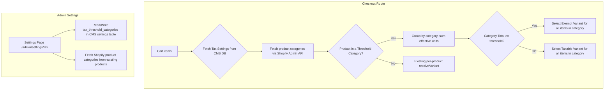

# Design Document: Category Tax Thresholds

## Overview

This feature extends the existing per-product variant resolution logic in `lib/tax/resolve-variant.ts` to support category-level quantity aggregation. Currently, each product independently evaluates its own cart quantity against its threshold. The new category-based path groups all cart items sharing a Shopify product category, sums their effective units (quantity × tax_unit_count), and applies the threshold check to the entire category total.

The implementation adds:
1. A new pure function `resolveCategoryVariants` alongside the existing `resolveVariant` — the existing function is untouched.
2. A new row in the CMS `settings` table (key: `tax_threshold_categories`) storing which categories are threshold-enabled and their thresholds.
3. A new admin settings page at `/admin/settings/tax` for managing threshold categories.
4. Modified checkout routes that call the new category resolver before falling back to per-product resolution.

The existing per-product tax behaviors (`always_taxable`, `always_exempt`, `quantity_threshold`) continue to work unchanged for products not in a threshold-enabled category.

## Architecture



The architecture modifies only the checkout routes and adds one new module (`lib/tax/resolve-category-variants.ts`). The existing `resolveVariant` function remains a pure function with no changes. The new `resolveCategoryVariants` is also a pure function that takes the full cart context and tax settings, returning variant resolutions for all items in threshold-enabled categories.

## Components and Interfaces

### New Module: `lib/tax/resolve-category-variants.ts`

Pure function that handles category-level variant resolution.

```typescript
/** A single cart item with its product metadata for category resolution */
interface CategoryCartItem {
  productId: string;
  shopifyProductId: string;
  defaultVariantId: string;
  exemptVariantId: string | null;
  quantity: number;
  taxUnitCount: number;       // From CMS products table (tax_unit_count column), default 1
  shopifyCategory: string | null;
}

/** Category threshold configuration from the CMS settings table */
interface ThresholdCategory {
  category: string;
  threshold: number;
}

/** Tax settings loaded from the CMS database */
interface TaxSettings {
  thresholdCategories: ThresholdCategory[];
}

/** Result for a single cart item after category resolution */
interface CategoryVariantResolution {
  productId: string;
  variantId: string;
  isExempt: boolean;
  effectiveUnits: number;
  categoryTotal: number;
  fallback: boolean;
}

/**
 * Resolves variants for all cart items using category-level aggregation.
 * Returns resolutions only for items in threshold-enabled categories.
 * Items not in any threshold category are excluded from the result
 * (the caller falls back to per-product resolution for those).
 */
function resolveCategoryVariants(
  items: CategoryCartItem[],
  settings: TaxSettings,
): CategoryVariantResolution[];
```

### Modified: Checkout Routes

The three checkout routes (`/api/checkout`, `/api/checkout/cake`, `/api/checkout/volume`) gain a new step before the existing per-product tax resolution loop:

1. Fetch the `tax_threshold_categories` setting from the CMS database via `lib/db/queries/settings.ts`.
2. Fetch each product's `productCategory` from Shopify Admin API (batched in a single query alongside existing variant lookups).
3. Call `resolveCategoryVariants` for all items.
4. For items resolved by category, use the category resolution result.
5. For remaining items, fall through to the existing per-product `resolveVariant` / `findExemptVariant` logic.

### New Module: `lib/tax/tax-settings.ts`

Functions for reading/writing tax threshold settings from the CMS database:

```typescript
import { getByKey, upsertMany } from '@/lib/db/queries/settings';

const TAX_SETTINGS_KEY = 'tax_threshold_categories';

/** Fetch tax settings from the CMS settings table */
async function fetchTaxSettings(): Promise<TaxSettings | null>;

/** Save tax settings to the CMS settings table */
async function saveTaxSettings(settings: TaxSettings): Promise<void>;

/** Parse and validate raw settings value from the database */
function parseTaxSettings(raw: unknown): TaxSettings | null;
```

Uses the existing `settings` table key-value pattern via `lib/db/queries/settings.ts`.

### New Module: `lib/shopify/queries/product-categories.ts`

GraphQL query to fetch product categories for a batch of product IDs:

```typescript
/** Fetch Shopify product categories for multiple products */
async function fetchProductCategories(
  shopifyProductIds: string[]
): Promise<Map<string, string | null>>;
```

Uses the Admin API `productCategory { productTaxonomyNode { name } }` field.

### New Page: `app/admin/settings/tax/page.tsx`

Client component that:
- Fetches the current tax threshold settings from the CMS database via an API route.
- Fetches distinct Shopify product categories from existing products via an API route.
- Displays a table of threshold-enabled categories with editable thresholds.
- Allows adding/removing categories via a select dropdown.
- Validates thresholds (positive integer >= 1) inline.
- Saves to the CMS database via an API route.

### New API Route: `app/api/admin/tax-settings/route.ts`

GET and PUT endpoints for reading/writing the tax threshold settings in the CMS database. Protected by admin auth.

### New API Route: `app/api/admin/product-categories/route.ts`

GET endpoint that queries Shopify Admin API for distinct product categories across all products. Protected by admin auth.

## Data Models

### Tax Settings (CMS Database)

A row in the existing `settings` table (key-value JSONB store):

| Field | Type | Description |
|---|---|---|
| `key` | text | `tax_threshold_categories` |
| `value` | jsonb | Array of `{ category, threshold }` objects |

Example `value`:
```json
[
  { "category": "Viennoiserie", "threshold": 6 },
  { "category": "Pâtisserie", "threshold": 6 }
]
```

This uses the existing `settings` table and `lib/db/queries/settings.ts` helpers (`getByKey`, `upsertMany`). No new database tables or migrations are needed. The settings page handles creating the row if it doesn't exist.

### Existing Product Fields (unchanged)

From the `products` table in the CMS database (Drizzle schema in `lib/db/schema.ts`):

| Field | Drizzle Column | Type | Description |
|---|---|---|---|
| `taxBehavior` | `tax_behavior` | text NOT NULL, default `'always_taxable'` | Tax treatment rule |
| `taxThreshold` | `tax_threshold` | integer NOT NULL, default `6` | Per-product threshold |
| `taxUnitCount` | `tax_unit_count` | integer NOT NULL, default `1` | How many single-serving units one cart line item represents (e.g., a box of 4 croissants = 4) |
| `shopifyTaxExemptVariantId` | `shopify_tax_exempt_variant_id` | text \| null | Exempt variant GID |

The `taxUnitCount` field is stored in the CMS `products` table, not as a Shopify metafield. It is set by the operator in the admin product edit page and read at checkout time by the variant resolver. This is the field that makes boxes and bundles work correctly for threshold calculations.

These fields continue to drive per-product resolution for items not in a threshold-enabled category.

### Shopify Product Category (read-only)

Retrieved via Admin API `product.productCategory.productTaxonomyNode.name`. This is the native Shopify product category assigned in Shopify Admin, not a CMS field. The system reads it at checkout time and on the settings page — it is never written by the app.

### Internal TypeScript Types

```typescript
interface ThresholdCategory {
  category: string;   // Shopify product category name
  threshold: number;  // Positive integer >= 1
}

interface TaxSettings {
  thresholdCategories: ThresholdCategory[];
}

interface CategoryCartItem {
  productId: string;
  shopifyProductId: string;
  defaultVariantId: string;
  exemptVariantId: string | null;
  quantity: number;
  taxUnitCount: number;
  shopifyCategory: string | null;
}

interface CategoryVariantResolution {
  productId: string;
  variantId: string;
  isExempt: boolean;
  effectiveUnits: number;
  categoryTotal: number;
  fallback: boolean;
}
```

### Effective Unit Calculation: Concrete Examples

The `taxUnitCount` field on each CMS product record captures how many single-serving tax units that product represents. The formula is: **Effective_Units = quantity × taxUnitCount**. The Category_Total is the sum of Effective_Units for all items in the same threshold-enabled category.

Assume category "Viennoiserie" with threshold = 6:

| Scenario | Cart Contents | Effective Units | Category Total | Tax Exempt? |
|---|---|---|---|---|
| Box of 4 + 2 singles | 1 × box of 4 croissants (`taxUnitCount=4`) + 2 × individual pastries (`taxUnitCount=1`) | (1×4) + (2×1) = 6 | 6 | Yes (≥ 6) |
| Box of 6 | 1 × box of 6 pastries (`taxUnitCount=6`) | 1×6 = 6 | 6 | Yes (≥ 6) |
| 2 boxes of 2 + 4 singles | 2 × box of 2 croissants (`taxUnitCount=2`) + 4 × individual pastries (`taxUnitCount=1`) | (2×2) + (4×1) = 8 | 8 | Yes (≥ 6) |
| 3 individual items | 3 × individual croissants (`taxUnitCount=1`) | 3×1 = 3 | 3 | No (< 6) |

Pre-bundled products (boxes) are not special-cased. The `taxUnitCount` field on the CMS product record is what makes them count correctly. A "box of 4" is just a product with `taxUnitCount = 4`.

## Correctness Properties

*A property is a characteristic or behavior that should hold true across all valid executions of a system — essentially, a formal statement about what the system should do. Properties serve as the bridge between human-readable specifications and machine-verifiable correctness guarantees.*

### Property 1: Category total uses effective units

*For any* set of cart items in the same threshold-enabled category, the computed Category_Total SHALL equal the sum of (quantity × taxUnitCount) for each item, not the sum of raw quantities.

The `taxUnitCount` value comes from the CMS `products` table (`tax_unit_count` column). For example:
- A box of 4 croissants has `taxUnitCount = 4`. Ordering 1 box: effective units = 1 × 4 = 4.
- An individual pastry has `taxUnitCount = 1`. Ordering 2: effective units = 2 × 1 = 2.
- Combined category total = 4 + 2 = 6. If threshold is 6 → exempt.

**Validates: Requirements 1.1, 7.1, 7.2**

### Property 2: Variant resolution follows threshold rule

*For any* threshold-enabled category with a configured threshold T, if the Category_Total >= T then every item in that category SHALL receive the exempt variant ID (or taxable with fallback=true if exempt is missing), and if the Category_Total < T then every item SHALL receive the taxable variant ID with isExempt=false.

**Validates: Requirements 1.2, 1.3**

### Property 3: Categories are counted independently

*For any* cart containing items in two or more distinct threshold-enabled categories, adding or removing items in one category SHALL not change the variant resolution of items in any other category.

**Validates: Requirements 1.4**

### Property 4: Non-threshold products are unaffected

*For any* product that does not belong to a threshold-enabled category (including products with no Shopify category), the category resolver SHALL not produce a resolution for that product, leaving it to the existing per-product `resolveVariant` logic. The per-product resolution for such items SHALL be identical to calling `resolveVariant` directly.

**Validates: Requirements 1.5, 6.1, 6.2**

### Property 5: Tax settings serialization round-trip

*For any* valid `TaxSettings` object (array of `{ category: string, threshold: positiveInt }`), serializing to JSON and deserializing back SHALL produce an equivalent object.

**Validates: Requirements 2.2**

### Property 6: Threshold validation accepts only positive integers

*For any* numeric input, the threshold validator SHALL accept the value if and only if it is an integer >= 1. Non-integers, zero, negative numbers, NaN, and Infinity SHALL be rejected.

**Validates: Requirements 4.6**

## Error Handling

| Scenario | Behavior | Severity |
|---|---|---|
| Tax settings record does not exist in CMS database | Treat all products as non-threshold; per-product behavior applies | Info log |
| Tax settings record has invalid/unparseable JSONB value | Treat all products as non-threshold; per-product behavior applies | Warning log |
| Threshold category entry has threshold < 1 | Ignore that entry; other valid entries still apply | Warning log |
| Product has no Shopify product category | Treat as non-threshold; per-product behavior applies | No log (normal case) |
| Product in threshold category has no exempt variant | Use taxable variant; set `fallback: true` | Warning log |
| Shopify Admin API call fails during category fetch | Treat all products as non-threshold; per-product behavior applies | Error log |
| CMS database query fails during settings fetch | Treat all products as non-threshold; per-product behavior applies | Error log |
| Settings page save fails | Display error toast; form remains editable with unsaved changes | Error toast |

All error handling follows the principle: **checkout never fails due to tax configuration issues**. Every error path falls back to the taxable variant, which is the safe default (customer pays tax; the operator can issue a refund if needed).

## Testing Strategy

### Property-Based Tests (fast-check, minimum 100 iterations each)

The pure resolution logic in `lib/tax/resolve-category-variants.ts` is the primary target for property-based testing. Each property test references its design document property.

| Test | Property | Description |
|---|---|---|
| `resolveCategoryVariants.prop.test.ts` | Property 1 | Generate random cart items with varying quantities and tax_unit_counts. Verify categoryTotal in results equals Σ(quantity × taxUnitCount). |
| `resolveCategoryVariants.prop.test.ts` | Property 2 | Generate random carts and thresholds. Verify all items in a category get exempt when total >= threshold, taxable when total < threshold. |
| `resolveCategoryVariants.prop.test.ts` | Property 3 | Generate multi-category carts. Modify one category's items and verify other categories' resolutions are unchanged. |
| `resolveCategoryVariants.prop.test.ts` | Property 4 | Generate carts with mixed threshold/non-threshold items. Verify non-threshold items are excluded from category resolution results. |
| `tax-settings.prop.test.ts` | Property 5 | Generate random TaxSettings, serialize to JSON, deserialize, verify deep equality. |
| `threshold-validation.prop.test.ts` | Property 6 | Generate random numbers (integers, floats, negatives, zero, NaN, Infinity). Verify validation function accepts only integers >= 1. |

Tag format: `Feature: category-tax-thresholds, Property N: <property text>`

### Unit Tests (vitest)

| Test | Covers | Description |
|---|---|---|
| Settings page CRUD | Req 4.1–4.5 | Render settings page with mock data; verify add, remove, modify, save operations. |
| Missing settings fallback | Req 2.4 | Call resolver with null settings; verify all items use per-product behavior. |
| Invalid JSON fallback | Req 5.2 | Pass malformed value to settings parser; verify it returns empty settings. |
| Missing exempt variant | Req 5.1 | Item in threshold category with null exempt variant; verify fallback=true. |
| Invalid threshold entry | Req 5.3 | Settings with threshold < 1; verify that entry is filtered out. |
| Null category products | Req 3.3 | Products with no Shopify category; verify they are treated as non-threshold. |

### Integration Tests

| Test | Covers | Description |
|---|---|---|
| Checkout with category thresholds | Req 1.1–1.5, 3.1 | End-to-end checkout with mocked Shopify API and CMS DB; verify correct variants in cart lines. |
| Settings API round-trip | Req 4.5, 2.1–2.2 | PUT settings via API route, GET them back, verify consistency with CMS database. |
| Backward compatibility | Req 6.3 | Existing checkout request format still produces valid cart. |
