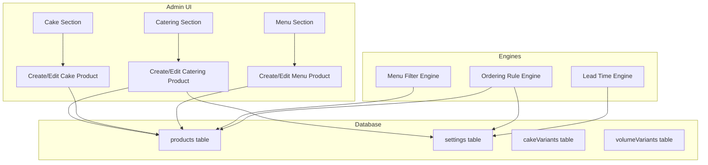
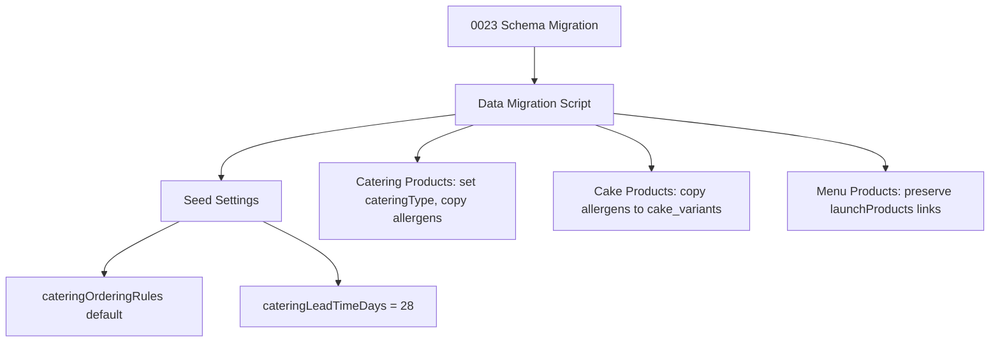

# Design Document: Catering Ordering Rules

## Overview

This design covers the overhaul of product management across the three ordering types (Catering, Cake, Menu) on the Rhubarbe platform. The core changes are:

1. **Direct product creation** within each type section, eliminating the "create generic product → enable for type" flow.
2. **Catering type grouping** (Brunch, Lunch, Dînatoire) with per-type ordering rules stored as configuration.
3. **Simplified allergen management** via direct assignment instead of ingredient-based computation.
4. **Catering-specific features**: end dates, dietary/temperature filtering, flavour descriptions, and lead time enforcement.
5. **Cross-cutting UX consistency**: Shopify-first for duplicated fields, hidden tasting notes, consistent translation and dirty-state save patterns.

The system is a Next.js app using Drizzle ORM with PostgreSQL. The existing `products` table is the central entity, with `cakeEnabled`/`volumeEnabled` flags and JSONB columns for flexible data. Configuration lives in the `settings` table as key-value JSONB rows. The admin UI uses `EditPageLayout` for dirty-state save, `TranslationFields` + `AiTranslateButton` for bilingual editing, and `DataTable`/`TableCard` for list views.

## Architecture

The feature extends the existing architecture rather than replacing it. The key architectural decisions:

### Product Type Ownership
Each admin section (Catering, Cake, Menu) owns its product lifecycle end-to-end. Products are created directly within a section with the appropriate type flag set at creation time. The existing `volumeEnabled` and `cakeEnabled` boolean flags on the `products` table continue to serve as the type discriminator. Menu products are identified by their presence in the `launchProducts` join table.

### Configuration-Driven Ordering Rules
Catering ordering rules (min quantity, quantity step, label per type) are stored in the `settings` table under the key `cateringOrderingRules`. This allows admins to adjust rules without code changes. The lead time is stored under `cateringLeadTimeDays`.

### Allergen Source of Truth Shift
Allergens move from computed (via `computeProductAllergens` aggregating from ingredients) to directly assigned. For catering products, allergens live at the product level. For cake products, allergens live on each `cakeVariant`. For menu products, allergens live at the product level or on `volumeVariants` depending on whether variants exist.

### Filter Engine
Catering menu filtering is a client-side operation. Products carry `dietaryTags` and `temperatureTags` arrays. The filter engine applies AND logic for dietary tags and simple match for temperature tags.



## Components and Interfaces

### Database Schema Changes

#### Products Table Extensions

New columns added to the `products` table:

| Column | Type | Default | Description |
|--------|------|---------|-------------|
| `catering_type` | `text` | `null` | One of `brunch`, `lunch`, `dinatoire`. Required when `volumeEnabled = true`. |
| `catering_description` | `jsonb<{ en: string; fr: string }>` | `null` | Bilingual flavour description for catering display. |
| `catering_flavour_name` | `jsonb<{ en: string; fr: string }>` | `null` | Bilingual flavour name override when display name differs from product name. |
| `catering_end_date` | `timestamp` | `null` | Optional end date after which the product is excluded from active catering menus. |
| `dietary_tags` | `jsonb<string[]>` | `null` | Array of dietary filter tags: `vegetarian`, `vegan`, `gluten-free`, `dairy-free`, `nut-free`. |
| `temperature_tags` | `jsonb<string[]>` | `null` | Array of temperature tags: `hot`, `cold`. |

The existing `allergens` JSONB column on `products` is repurposed as the direct allergen assignment field (it already exists but was previously computed). No new column needed for product-level allergens.

#### Cake Variants Table Extension

Add an `allergens` column to `cake_variants`:

| Column | Type | Default | Description |
|--------|------|---------|-------------|
| `allergens` | `jsonb<string[]>` | `null` | Direct allergen assignment per cake variant. |

#### Volume Variants Table Extension

Add an `allergens` column to `volume_variants`:

| Column | Type | Default | Description |
|--------|------|---------|-------------|
| `allergens` | `jsonb<string[]>` | `null` | Direct allergen assignment per volume/menu variant. |

### Settings Configuration

#### `cateringOrderingRules` (settings key)

```typescript
interface CateringOrderingRule {
  minQuantity: number;
  quantityStep: number;
  label: { en: string; fr: string };
}

type CateringOrderingRules = Record<string, CateringOrderingRule>;

// Default value:
const defaultRules: CateringOrderingRules = {
  brunch: { minQuantity: 12, quantityStep: 6, label: { en: 'Brunch', fr: 'Brunch' } },
  lunch: { minQuantity: 6, quantityStep: 1, label: { en: 'Lunch', fr: 'Lunch' } },
  dinatoire: { minQuantity: 3, quantityStep: 1, label: { en: 'Dînatoire', fr: 'Dînatoire' } },
};
```

#### `cateringLeadTimeDays` (settings key)

```typescript
// Stored as a single integer value in settings
// Default: 28 (4 weeks)
type CateringLeadTimeDays = number;
```

### API Routes

#### Catering Products API (`/api/volume-products`)

The existing volume-products API is extended (since "volume" is the internal name for catering):

- `GET /api/volume-products` — List catering products (existing, add `cateringType` grouping)
- `GET /api/volume-products?candidates=true` — List non-catering products (existing)
- `POST /api/volume-products` — Create catering product directly (new: accepts full product data, sets `volumeEnabled = true`)
- `GET /api/volume-products/[id]` — Get catering product detail (extend with new fields)
- `PUT /api/volume-products/[id]` — Update catering product (extend with new fields)

#### Catering Ordering Rules API (`/api/settings`)

Uses the existing settings API pattern:
- `GET /api/settings` — Returns all settings including `cateringOrderingRules` and `cateringLeadTimeDays`
- `PUT /api/settings` — Upserts settings including ordering rules

#### Ordering Validation API

- `POST /api/checkout/validate-catering` — Validates catering order against ordering rules and lead time

### Query Module: `lib/db/queries/volume-products.ts`

Extended functions:

```typescript
// New: Create a catering product directly
export async function createCateringProduct(data: {
  name: string;
  slug: string;
  cateringType: 'brunch' | 'lunch' | 'dinatoire';
  cateringDescription?: { en: string; fr: string } | null;
  cateringFlavourName?: { en: string; fr: string } | null;
  cateringEndDate?: string | null;
  allergens?: string[] | null;
  dietaryTags?: string[] | null;
  temperatureTags?: string[] | null;
}): Promise<Product>

// Extended: List with catering type grouping
export async function listVolumeProducts(): Promise<VolumeProduct[]>
// Now includes cateringType, cateringEndDate, dietaryTags, temperatureTags

// New: List active catering products for customer menu (excludes expired)
export async function listActiveCateringProducts(): Promise<CateringMenuProduct[]>
```

### Ordering Rule Engine: `lib/catering/ordering-rules.ts`

```typescript
interface OrderingRuleValidation {
  valid: boolean;
  errors: Array<{
    productId: string;
    productName: string;
    cateringType: string;
    quantity: number;
    rule: CateringOrderingRule;
    message: string;
  }>;
}

// Validate a catering order line item
export function validateCateringQuantity(
  quantity: number,
  cateringType: string,
  rules: CateringOrderingRules
): { valid: boolean; error?: string }

// Validate full catering order
export function validateCateringOrder(
  items: Array<{ productId: string; productName: string; cateringType: string; quantity: number }>,
  rules: CateringOrderingRules
): OrderingRuleValidation

// Compute earliest allowed date
export function getEarliestCateringDate(leadTimeDays: number): Date
```

### Menu Filter Engine: `lib/catering/menu-filter.ts`

```typescript
interface CateringMenuProduct {
  id: string;
  name: string;
  cateringType: string;
  dietaryTags: string[];
  temperatureTags: string[];
  // ... other display fields
}

interface MenuFilters {
  dietaryTags?: string[];
  temperatureTag?: string;
}

export function filterCateringMenu(
  products: CateringMenuProduct[],
  filters: MenuFilters
): CateringMenuProduct[]
```

### Allergen Derivation: `lib/product-allergens.ts`

The existing `computeProductAllergens` function is removed. Replaced with:

```typescript
// Derive dietary claims from a direct allergen set
export function deriveDietaryClaims(allergens: string[]): DietaryClaim[]
```

This is a pure function: given an allergen array, it returns the dietary claims (dairy-free, gluten-free, nut-free, vegan, vegetarian). The logic mirrors the existing `computeProductAllergens` output but without ingredient traversal.

### Admin UI Components

#### Catering Product Edit Page (`app/admin/volume-products/[id]/page.tsx`)

Extended with:
- Catering type selector (required dropdown: Brunch, Lunch, Dînatoire)
- Allergen multi-select (product-level)
- Dietary tags multi-select
- Temperature tags multi-select
- Catering end date picker
- Catering description (bilingual rich text via `TranslationFields`)
- Catering flavour name override (bilingual via `TranslationFields`)

#### Catering Product Create Page (`app/admin/volume-products/create/page.tsx`)

New page for direct product creation within the catering section. Uses `EditPageLayout` with:
- Product name input
- Catering type selector (required)
- All catering-specific fields from the edit page

#### Catering Ordering Rules Settings Section

New section in the Settings page (`app/admin/settings/page.tsx`) or a dedicated sub-page:
- Table of catering types with editable min quantity and quantity step
- Catering lead time days input
- Uses the existing settings save pattern

#### Sidebar Changes (`app/admin/components/AdminSidebar.tsx`)

- Remove the "Ingredients" nav item from the Products section
- Keep "Catering" and "Cake" nav items as-is

#### Hidden Elements

- Tasting notes field removed from all product edit forms
- Ingredient association controls removed from all product edit forms
- Tag/status editing controls hidden when product is Shopify-linked (show read-only instead)
- Ingredients page shows "Feature currently unavailable" message at direct URL access

## Data Models

### Catering Product (extended Product)

```typescript
interface CateringProduct {
  // Existing product fields
  id: string;
  name: string;
  slug: string;
  image: string | null;
  volumeEnabled: true; // Always true for catering products
  allergens: string[]; // Direct assignment (repurposed existing column)

  // New catering-specific fields
  cateringType: 'brunch' | 'lunch' | 'dinatoire';
  cateringDescription: { en: string; fr: string } | null;
  cateringFlavourName: { en: string; fr: string } | null;
  cateringEndDate: string | null; // ISO 8601
  dietaryTags: string[]; // ['vegetarian', 'vegan', 'gluten-free', 'dairy-free', 'nut-free']
  temperatureTags: string[]; // ['hot', 'cold']

  // Existing catering fields
  volumeDescription: { en: string; fr: string } | null;
  volumeInstructions: { en: string; fr: string } | null;
  volumeMinOrderQuantity: number | null;
  volumeUnitLabel: 'quantity' | 'people';
  maxAdvanceDays: number | null;
}
```

### Catering Ordering Rules Configuration

```typescript
interface CateringOrderingRule {
  minQuantity: number;   // Minimum quantity per flavour
  quantityStep: number;  // Increment step
  label: { en: string; fr: string }; // Display label
}

// Stored in settings table under key 'cateringOrderingRules'
type CateringOrderingRules = Record<string, CateringOrderingRule>;
```

### Catering Lead Time Configuration

```typescript
// Stored in settings table under key 'cateringLeadTimeDays'
// Default: 28
type CateringLeadTimeDays = number;
```

### Allergen Types (unchanged)

```typescript
type Allergen = 'dairy' | 'egg' | 'gluten' | 'tree-nuts' | 'peanuts' | 'sesame' | 'soy';

type DietaryClaim =
  | 'contains-dairy' | 'contains-egg' | 'contains-gluten' | 'contains-nuts'
  | 'dairy-free' | 'gluten-free' | 'nut-free'
  | 'vegan' | 'vegetarian';
```

## Data Migration

This section covers the migration strategy for existing products and configuration data. The migration is **purely additive** — new columns are added, existing data is never modified or deleted. Every existing field, related table, and configuration value is preserved exactly as-is.

### Guiding Principle: Nothing Is Lost

The migration adds new columns to support catering type grouping, dietary/temperature filtering, and per-variant allergens. **No existing columns are dropped, renamed, or have their values overwritten.** All existing product data, related tables, join tables, and order data remain intact and continue to function identically.

### Migration Overview

The migration is split into three phases executed in order:

1. **Schema migration** — DDL changes to add new columns only (Drizzle migration, reversible)
2. **Data migration** — Backfill new columns with defaults; copy allergens to variant tables (TypeScript script, idempotent)
3. **Settings seed** — Insert default `cateringOrderingRules` and `cateringLeadTimeDays` into the `settings` table



### Preserved Data Inventory — Complete Field-by-Field Reference

This section explicitly enumerates every existing field, table, and configuration that is preserved unchanged by the migration. The migration is additive only — these are never modified, dropped, or overwritten.

#### All Products (core fields — preserved as-is, no changes)

| Column | Preserved? | Notes |
|--------|-----------|-------|
| `name`, `slug`, `title`, `description` | ✅ Unchanged | Core identity fields |
| `category`, `price`, `currency` | ✅ Unchanged | |
| `image`, `serves`, `shortCardCopy` | ✅ Unchanged | Display fields |
| `status` | ✅ Unchanged | |
| `tags` (JSONB) | ✅ Unchanged | |
| `keyNotes` (JSONB) | ✅ Unchanged | |
| `variants` (JSONB) | ✅ Unchanged | |
| `translations` (JSONB) | ✅ Unchanged | |
| `allergens` (JSONB) | ✅ Unchanged | Existing values kept; column repurposed from computed to direct assignment but data is not modified |
| `tastingNotes` | ✅ Unchanged | Hidden from UI but column and data preserved |
| `legacyId` | ✅ Unchanged | |
| `inventoryTracked`, `availabilityMode`, `dateSelectionType`, `slotSelectionType`, `variantType` | ✅ Unchanged | Availability fields |
| `defaultPickupRequired`, `onlineOrderable`, `pickupOnly` | ✅ Unchanged | Pickup rules |
| `defaultMinQuantity`, `defaultQuantityStep`, `defaultMaxQuantity` | ✅ Unchanged | Default ordering rules |
| `shopifyProductId`, `shopifyProductHandle`, `syncStatus`, `lastSyncedAt`, `syncError` | ✅ Unchanged | Shopify sync fields |
| `taxBehavior`, `taxThreshold`, `taxUnitCount`, `shopifyTaxExemptVariantId` | ✅ Unchanged | Tax fields |
| `nextAvailableDate`, `servesPerUnit` | ✅ Unchanged | |
| `createdAt`, `updatedAt` | ✅ Unchanged | Timestamps |

#### Catering/Volume Products (`volumeEnabled = true`) — preserved as-is

| Column / Table | Preserved? | Notes |
|---------------|-----------|-------|
| `volumeEnabled` | ✅ Unchanged | Remains `true` for all existing catering products |
| `volumeDescription` (JSONB bilingual) | ✅ Unchanged | |
| `volumeInstructions` (JSONB bilingual) | ✅ Unchanged | |
| `volumeMinOrderQuantity` | ✅ Unchanged | |
| `volumeUnitLabel` | ✅ Unchanged | |
| `maxAdvanceDays` | ✅ Unchanged | |
| `volume_lead_time_tiers` table (minQuantity → leadTimeDays) | ✅ Unchanged | All rows preserved, no schema changes to this table |
| `volume_variants` table (label, shopifyVariantId, sortOrder, active, description) | ✅ Unchanged | All existing rows preserved; new `allergens` column added with `null` default |

#### Cake Products (`cakeEnabled = true`) — preserved as-is

| Column / Table | Preserved? | Notes |
|---------------|-----------|-------|
| `cakeEnabled` | ✅ Unchanged | Remains `true` for all existing cake products |
| `cakeDescription` (JSONB bilingual) | ✅ Unchanged | |
| `cakeInstructions` (JSONB bilingual) | ✅ Unchanged | |
| `cakeMinPeople` | ✅ Unchanged | |
| `cakeFlavourNotes` (JSONB bilingual) | ✅ Unchanged | |
| `cakeDeliveryAvailable` | ✅ Unchanged | |
| `cakeProductType` | ✅ Unchanged | Values: `cake-xxl`, `croquembouche`, `wedding-cake-tiered`, `wedding-cake-tasting`, or `null` |
| `cakeFlavourConfig` (JSONB array: handle, label, description, pricingTierGroup, sortOrder, active, endDate) | ✅ Unchanged | |
| `cakeTierDetailConfig` (JSONB array: sizeValue, layers, diameters, label) | ✅ Unchanged | |
| `cakeMaxFlavours` | ✅ Unchanged | |
| `maxAdvanceDays` | ✅ Unchanged | Shared column with catering |
| `cake_lead_time_tiers` table (minPeople → leadTimeDays, deliveryOnly) | ✅ Unchanged | All rows preserved, no schema changes to this table |
| `cake_pricing_tiers` table (minPeople → priceInCents, shopifyVariantId) | ✅ Unchanged | All rows preserved, no schema changes to this table |
| `cake_pricing_grid` table (sizeValue × flavourHandle → priceInCents, shopifyVariantId) | ✅ Unchanged | All rows preserved, no schema changes to this table |
| `cake_addon_links` table (parentProductId → addonProductId, sortOrder) | ✅ Unchanged | All rows preserved, no schema changes to this table |
| `cake_variants` table (label, shopifyVariantId, sortOrder, active, description) | ✅ Unchanged | All existing rows preserved; new `allergens` column added (populated from product-level allergens during data migration) |

#### Menu/Launch Products — preserved as-is

| Table / Column | Preserved? | Notes |
|---------------|-----------|-------|
| `launches` table (title, slug, introCopy, status, orderOpens, orderCloses, allowEarlyOrdering, pickupDate, pickupLocationId, pickupWindowStart, pickupWindowEnd, pickupInstructions, pickupSlotConfig, pickupSlots) | ✅ Unchanged | All rows preserved, no schema changes to this table |
| `launch_products` join table (launchId, productId, productName, sortOrder, minQuantityOverride, maxQuantityOverride, quantityStepOverride) | ✅ Unchanged | All rows preserved, no schema changes to this table |

#### Orders — completely untouched

| Table | Preserved? | Notes |
|-------|-----------|-------|
| `orders` table (all columns) | ✅ Unchanged | No schema changes, no data changes. All existing orders preserved exactly as-is. |
| `order_items` table (all columns) | ✅ Unchanged | No schema changes, no data changes. All existing order items preserved exactly as-is. |

#### Other Preserved Tables — no changes whatsoever

| Table | Preserved? | Notes |
|-------|-----------|-------|
| `pickup_locations` | ✅ Unchanged | |
| `ingredients` | ✅ Unchanged | Table and all data retained; UI hidden only |
| `product_ingredients` | ✅ Unchanged | Join table and all data retained; UI hidden only |
| `taxonomy_values` | ✅ Unchanged | |
| `users` | ✅ Unchanged | |
| `pages` | ✅ Unchanged | |
| `settings` | ✅ Unchanged | Existing rows preserved; new keys added only |
| `stories` | ✅ Unchanged | |
| `news` | ✅ Unchanged | |
| `requests` | ✅ Unchanged | |
| `email_templates` | ✅ Unchanged | |
| `email_logs` | ✅ Unchanged | |

### Phase 1: Schema Migration (Drizzle DDL)

A new Drizzle migration file `0023_add_catering_fields.sql` adds new columns only. All new columns are nullable or have defaults so existing rows are completely unaffected. **No existing columns are altered or dropped.**

```sql
-- Products table: new catering-specific columns (ADDITIVE ONLY)
ALTER TABLE "products" ADD COLUMN IF NOT EXISTS "catering_type" text;
ALTER TABLE "products" ADD COLUMN IF NOT EXISTS "catering_description" jsonb;
ALTER TABLE "products" ADD COLUMN IF NOT EXISTS "catering_flavour_name" jsonb;
ALTER TABLE "products" ADD COLUMN IF NOT EXISTS "catering_end_date" timestamp;
ALTER TABLE "products" ADD COLUMN IF NOT EXISTS "dietary_tags" jsonb;
ALTER TABLE "products" ADD COLUMN IF NOT EXISTS "temperature_tags" jsonb;

-- Cake variants table: allergens column for per-variant allergen assignment (ADDITIVE ONLY)
ALTER TABLE "cake_variants" ADD COLUMN IF NOT EXISTS "allergens" jsonb;

-- Volume variants table: allergens column for per-variant allergen assignment (ADDITIVE ONLY)
ALTER TABLE "volume_variants" ADD COLUMN IF NOT EXISTS "allergens" jsonb;

-- Index on catering_type for grouped queries
CREATE INDEX IF NOT EXISTS "products_catering_type_idx" ON "products" ("catering_type");
```

This migration is run via the standard `npm run db:migrate` command (uses `scripts/migrate.ts` and Drizzle Kit). No existing columns, indexes, or constraints are modified.

### Phase 2: Data Migration Script

A new script `scripts/run-migration-0023-data.ts` handles the data backfill. It is idempotent — safe to run multiple times.

#### 2a. Existing Catering Products (`volumeEnabled = true`)

Products with `volumeEnabled = true` are existing catering products. The migration only populates the **new** columns with defaults. All existing columns and related tables are untouched.

**Existing fields preserved without modification:**
- `volumeEnabled` — stays `true`
- `volumeDescription` (bilingual JSONB) — kept as-is
- `volumeInstructions` (bilingual JSONB) — kept as-is
- `volumeMinOrderQuantity` — kept as-is
- `volumeUnitLabel` — kept as-is
- `maxAdvanceDays` — kept as-is
- `allergens` (JSONB) — **kept as-is**; the column is repurposed from "computed" to "directly assigned" but the actual data values are not modified
- `defaultMinQuantity`, `defaultQuantityStep`, `defaultMaxQuantity` — kept as-is
- `shopifyProductId`, `shopifyProductHandle`, `syncStatus`, `lastSyncedAt`, `syncError` — kept as-is
- `taxBehavior`, `taxThreshold`, `taxUnitCount`, `shopifyTaxExemptVariantId` — kept as-is
- All core product fields (`name`, `slug`, `title`, `description`, `category`, `price`, `image`, `serves`, `shortCardCopy`, `tags`, `keyNotes`, `variants`, `translations`, `status`) — kept as-is

**Existing related tables preserved without modification:**
- `volume_lead_time_tiers` — all rows for each catering product kept as-is (minQuantity → leadTimeDays mapping)
- `volume_variants` — all existing rows kept as-is (label, shopifyVariantId, sortOrder, active, description); new `allergens` column defaults to `null`

**New columns populated with defaults:**

| New Field | Migration Rule |
|-----------|---------------|
| `catering_type` | Set to `null` (requires manual assignment by admin). The script logs a list of products needing assignment. |
| `catering_description` | Default to `null`. Admins populate via the new edit form. |
| `catering_flavour_name` | Default to `null`. Falls back to product `name` at display time. |
| `catering_end_date` | Default to `null` (no expiry). |
| `dietary_tags` | Default to `[]` (empty array). |
| `temperature_tags` | Default to `[]` (empty array). |

```typescript
// Pseudocode for catering product migration
const cateringProducts = await db.select().from(products).where(eq(products.volumeEnabled, true));

for (const product of cateringProducts) {
  await db.update(products).set({
    dietaryTags: product.dietaryTags ?? [],
    temperatureTags: product.temperatureTags ?? [],
    // All other existing columns are NOT included in the SET clause — they remain untouched
    updatedAt: new Date(),
  }).where(eq(products.id, product.id));
}

// Log products needing manual cateringType assignment
console.log(`⚠️  ${cateringProducts.length} catering products need manual cateringType assignment:`);
for (const p of cateringProducts) {
  console.log(`   - ${p.name} (${p.id})`);
}
```

**Decision: `cateringType` defaults to `null` rather than a guessed value.** Since assigning the wrong type would apply incorrect ordering rules (e.g., brunch min 12 vs dînatoire min 3), it's safer to require manual assignment. The admin list view will show a "Type required" badge on products with `cateringType = null`, and the ordering rule engine will reject orders for products without a type.

#### 2b. Existing Cake Products (`cakeEnabled = true`)

Cake products need allergen data copied from the product-level `allergens` JSONB column to each `cake_variant` row. All existing cake-specific fields and related tables are preserved without modification.

**Existing fields preserved without modification:**
- `cakeEnabled` — stays `true`
- `cakeDescription` (bilingual JSONB) — kept as-is
- `cakeInstructions` (bilingual JSONB) — kept as-is
- `cakeMinPeople` — kept as-is
- `cakeFlavourNotes` (bilingual JSONB) — kept as-is
- `cakeDeliveryAvailable` — kept as-is
- `cakeProductType` (`cake-xxl`, `croquembouche`, `wedding-cake-tiered`, `wedding-cake-tasting`, or `null`) — kept as-is
- `cakeFlavourConfig` (JSONB array: handle, label, description, pricingTierGroup, sortOrder, active, endDate) — kept as-is
- `cakeTierDetailConfig` (JSONB array: sizeValue, layers, diameters, label) — kept as-is
- `cakeMaxFlavours` — kept as-is
- `maxAdvanceDays` — kept as-is
- `allergens` (product-level JSONB) — **kept as-is** for backward compatibility during transition
- All core product fields and Shopify/tax fields — kept as-is (see All Products inventory above)

**Existing related tables preserved without modification:**
- `cake_lead_time_tiers` — all rows kept as-is (minPeople → leadTimeDays, deliveryOnly)
- `cake_pricing_tiers` — all rows kept as-is (minPeople → priceInCents, shopifyVariantId)
- `cake_pricing_grid` — all rows kept as-is (sizeValue × flavourHandle → priceInCents, shopifyVariantId)
- `cake_addon_links` — all rows kept as-is (parentProductId → addonProductId, sortOrder)
- `cake_variants` — all existing rows kept as-is (label, shopifyVariantId, sortOrder, active, description); new `allergens` column populated from product-level data

**Only change: new `allergens` column on `cake_variants` populated from parent product:**

| Field | Migration Rule |
|-------|---------------|
| `cake_variants.allergens` | Copy the parent product's `allergens` array to every variant of that product. |
| `products.allergens` | **Preserved as-is** for backward compatibility during transition. Can be cleaned up in a future migration once the variant-level data is confirmed correct. |

```typescript
// Pseudocode for cake allergen migration
const cakeProducts = await db.select().from(products).where(eq(products.cakeEnabled, true));

for (const product of cakeProducts) {
  const productAllergens = product.allergens ?? [];
  
  // Copy product-level allergens to the NEW allergens column on all variants of this product
  // Existing variant columns (label, shopifyVariantId, sortOrder, active, description) are NOT touched
  await db.update(cakeVariants).set({
    allergens: productAllergens,
  }).where(eq(cakeVariants.productId, product.id));
}

console.log(`✓ Migrated allergens for ${cakeProducts.length} cake products to their variants.`);
```

**Rationale:** Since the existing system stores allergens at the product level and the new model stores them per-variant (because each variant represents a different flavour), the safest migration is to copy the product-level allergens to all variants. Admins can then refine per-variant allergens through the edit UI. This avoids data loss and ensures all variants start with at least the known allergens.

#### 2c. Existing Menu/Launch Products (via `launchProducts`)

Menu products are identified by their presence in the `launchProducts` join table. These products require **no data migration** — they continue to work exactly as-is. No tables are modified, no rows are updated.

**Existing tables preserved without any modification:**
- `launches` table — all rows and all columns preserved as-is:
  - `title` (bilingual JSONB), `slug`, `introCopy` (bilingual JSONB), `status`
  - `orderOpens`, `orderCloses`, `allowEarlyOrdering`
  - `pickupDate`, `pickupLocationId`, `pickupWindowStart`, `pickupWindowEnd`, `pickupInstructions` (bilingual JSONB)
  - `pickupSlotConfig` (JSONB: startTime, endTime, intervalMinutes), `pickupSlots` (JSONB array)
- `launch_products` join table — all rows and all columns preserved as-is:
  - `launchId`, `productId`, `productName`, `sortOrder`
  - `minQuantityOverride`, `maxQuantityOverride`, `quantityStepOverride`

**Menu product behavior unchanged:**
- Menu products that have no variants use the existing product-level `allergens` column (already the correct level).
- Menu products that have `volumeVariants` will have the new `allergens` column available on `volume_variants`, defaulting to `null` until admins populate it.
- No type flag changes are needed — menu products are identified by their `launchProducts` linkage, not by a boolean flag.
- All launch ordering windows, pickup configurations, and slot assignments continue to function identically.

#### 2d. Transition from "Import Then Enable" to "Direct Creation"

The old flow was: create a generic product → enable it for a type (set `volumeEnabled = true` or `cakeEnabled = true`). The new flow creates products directly within a type section.

**Backward compatibility approach:**
- Existing products created via the old flow already have the correct type flags set. They continue to appear in their respective sections.
- The `listNonVolumeProducts()` and `listNonCakeProducts()` candidate-picker queries are removed from the UI but the functions are retained in the codebase (dead code) for one release cycle, then removed.
- The `POST /api/volume-products` endpoint is updated to accept full product creation data (name, slug, cateringType, etc.) and set `volumeEnabled = true` automatically. Existing products that were "imported" are unaffected.
- The `POST /api/cake-products` endpoint follows the same pattern for cake products.

### Phase 3: Settings Seed

The data migration script also seeds default configuration values into the `settings` table using the existing `upsertMany` pattern. This uses `ON CONFLICT DO NOTHING` semantics — if settings already exist (e.g., from a previous run or manual configuration), they are not overwritten.

```typescript
import * as settingsQueries from '@/lib/db/queries/settings';

// Seed cateringOrderingRules (only if not already set)
const existing = await settingsQueries.getByKey('cateringOrderingRules');
if (!existing) {
  await settingsQueries.upsertMany({
    cateringOrderingRules: {
      brunch: { minQuantity: 12, quantityStep: 6, label: { en: 'Brunch', fr: 'Brunch' } },
      lunch: { minQuantity: 6, quantityStep: 1, label: { en: 'Lunch', fr: 'Lunch' } },
      dinatoire: { minQuantity: 3, quantityStep: 1, label: { en: 'Dînatoire', fr: 'Dînatoire' } },
    },
  });
  console.log('✓ Seeded cateringOrderingRules defaults.');
}

// Seed cateringLeadTimeDays (only if not already set)
const existingLeadTime = await settingsQueries.getByKey('cateringLeadTimeDays');
if (!existingLeadTime) {
  await settingsQueries.upsertMany({
    cateringLeadTimeDays: 28,
  });
  console.log('✓ Seeded cateringLeadTimeDays default (28 days).');
}
```

### Backward Compatibility Considerations

| Concern | Mitigation |
|---------|-----------|
| Existing catering products missing `cateringType` | Ordering rule engine rejects orders for products with `null` cateringType. Admin list view shows "Type required" badge. Products remain visible and editable. All existing volume fields (`volumeDescription`, `volumeInstructions`, `volumeMinOrderQuantity`, `volumeUnitLabel`, `maxAdvanceDays`) are unaffected. |
| Existing catering lead time tiers | `volume_lead_time_tiers` table is completely untouched. All existing minQuantity → leadTimeDays mappings continue to work. |
| Existing catering variants | `volume_variants` table rows are untouched. New `allergens` column defaults to `null`. Existing label, shopifyVariantId, sortOrder, active, description values are preserved. |
| Existing cake products with product-level allergens | Product-level `allergens` column is preserved. Variant-level `allergens` is populated from the product-level data. Both levels coexist during transition. The UI reads from variant-level; the product-level serves as a fallback. |
| Existing cake configuration (flavours, tiers, pricing) | `cakeFlavourConfig`, `cakeTierDetailConfig`, `cakeMaxFlavours`, `cakeProductType`, `cakeMinPeople`, `cakeFlavourNotes`, `cakeDeliveryAvailable` — all preserved as-is. |
| Existing cake related tables | `cake_lead_time_tiers`, `cake_pricing_tiers`, `cake_pricing_grid`, `cake_addon_links`, `cake_variants` — all rows preserved. Only change is the new `allergens` column on `cake_variants`. |
| Existing menu products linked via `launchProducts` | No changes to the `launches` table, `launch_products` table, or any linkage. Menu products continue to work identically. All launch fields (title, slug, introCopy, ordering windows, pickup config, slots) are untouched. |
| Existing orders and order items | `orders` and `order_items` tables are completely untouched. No schema changes, no data changes. All historical order data is preserved exactly as-is. |
| Shopify sync fields | `shopifyProductId`, `shopifyProductHandle`, `syncStatus`, `lastSyncedAt`, `syncError` — all preserved on every product. |
| Tax fields | `taxBehavior`, `taxThreshold`, `taxUnitCount`, `shopifyTaxExemptVariantId` — all preserved on every product. |
| Old "import product then enable" flow removed from UI | Existing imported products are unaffected — they already have the correct type flags. Only the UI flow for importing is removed. |
| `computeProductAllergens` function removed | The function is deleted, but all allergen data has been migrated to direct assignment columns. No runtime dependency remains. |
| Ingredient tables retained | `ingredients` and `productIngredients` tables are kept in the schema. No data is deleted. The UI hides the feature but the data is preserved for potential future use. |
| Pickup locations | `pickup_locations` table is completely untouched. |
| Settings table | Existing settings rows are preserved. New keys (`cateringOrderingRules`, `cateringLeadTimeDays`) are inserted only if they don't already exist. |
| API consumers expecting old response shapes | The volume-products API returns the same fields as before plus new optional fields. No breaking changes to existing response shapes. |

### Migration Execution Order

```bash
# 1. Run schema migration (adds new columns)
npm run db:migrate

# 2. Run data migration + settings seed (backfills existing data)
npx tsx scripts/run-migration-0023-data.ts

# 3. Deploy updated application code
# (new UI, updated APIs, ordering rule engine)
```

The schema migration and data migration are separated so that the DDL changes can be applied independently (and rolled back via Drizzle if needed) before the data backfill runs. The data migration script is idempotent and can be re-run safely.
