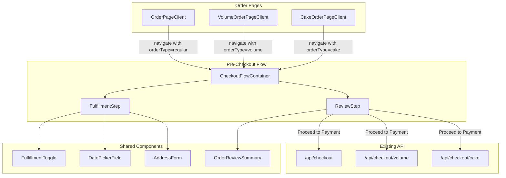
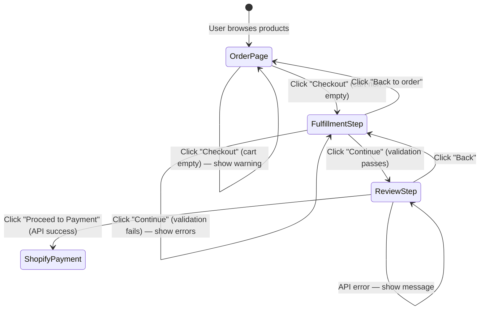

# Design Document: Hybrid Checkout

## Overview

The Hybrid Checkout feature introduces a multi-step pre-checkout flow between the existing order pages and Shopify's hosted payment. Instead of the current pattern where clicking "Checkout" immediately creates a Shopify cart and redirects, users will navigate through a Fulfillment Step (pickup/delivery selection, date, address) and a Review Step (order summary, confirmation) before the Shopify cart is created and the redirect occurs.

The design reuses the three existing checkout API routes (`/api/checkout`, `/api/checkout/volume`, `/api/checkout/cake`) without modification — the pre-checkout flow simply collects and validates all fulfillment data before calling them. Each order type's unique constraints (Regular: pickup-only with launch-based dates; Volume: pickup/delivery with `pickupOnly` flag and lead-time dates; Cake: pickup/delivery with `cakeDeliveryAvailable` flag and tier-based lead times) are enforced in the Fulfillment Step UI.

State is persisted to `localStorage` via the existing `usePersistedState` hook, ensuring data survives page refreshes and back-navigation. The flow is implemented as a single Next.js page per order type (`/order/checkout`, `/volume-order/checkout`, `/cake-order/checkout`) using a step state machine rather than separate routes, avoiding URL-based state management complexity.

## Architecture



The architecture follows a strategy pattern: `CheckoutFlowContainer` receives the `orderType` and delegates constraint logic to order-type-specific configuration objects. This avoids three separate checkout pages while keeping each order type's rules isolated and testable.

### Key Design Decisions

1. **Single page with step state machine vs. separate routes**: A single `/checkout` page with `step` state (`fulfillment` | `review`) avoids URL-based state sync issues and keeps all state in one component tree. The URL doesn't change between steps — this matches the existing confirmation pattern in `OrderPageClient`.

2. **Reuse existing checkout APIs unchanged**: The three checkout API routes already handle cart creation, tax resolution, and attribute mapping correctly. The pre-checkout flow simply collects the same data the inline carts currently collect, validates it, and passes it through. No API changes needed.

3. **Order-type config objects instead of conditionals**: Rather than scattering `if (orderType === 'volume')` throughout components, each order type provides a config object implementing a shared interface. This keeps the FulfillmentStep and ReviewStep generic.

4. **localStorage persistence via usePersistedState**: Checkout state (fulfillment type, date, address) is persisted under a dedicated key (`rhubarbe:checkout:state`). Cart items continue using their existing keys (`rhubarbe:order:cart`, `rhubarbe:volume:cart`, `rhubarbe:cake:cart`).

## Components and Interfaces

### CheckoutFlowContainer

The top-level component that manages step navigation and orchestrates the flow.

```typescript
interface CheckoutFlowProps {
  orderType: 'regular' | 'volume' | 'cake';
}

// Internal step state
type CheckoutStep = 'fulfillment' | 'review';
```

Responsibilities:
- Reads cart items from localStorage (using the appropriate key per order type)
- Guards against empty cart (redirects back to order page)
- Manages `currentStep` state
- Passes order-type config to child step components
- Persists checkout state to localStorage

### OrderTypeConfig

A strategy interface that encapsulates order-type-specific behavior:

```typescript
interface OrderTypeConfig {
  orderType: 'regular' | 'volume' | 'cake';

  // Fulfillment constraints
  supportsFulfillmentToggle: boolean;
  isDeliveryDisabled: (cartItems: CartItemUnion[]) => boolean;
  deliveryDisabledReason: (locale: string) => string;

  // Date constraints
  getEarliestDate: (cartItems: CartItemUnion[]) => Date;
  getDisabledPickupDays: () => number[];
  hasPresetDate: boolean; // Regular orders have launch-based dates

  // Checkout API
  checkoutEndpoint: string;
  buildCheckoutPayload: (
    cartItems: CartItemUnion[],
    fulfillment: FulfillmentState,
    locale: string,
  ) => Record<string, unknown>;

  // Review display
  getOrderSpecificFields: (
    cartItems: CartItemUnion[],
    fulfillment: FulfillmentState,
    locale: string,
  ) => Array<{ label: string; value: string }>;
}
```

Three implementations: `regularOrderConfig`, `volumeOrderConfig`, `cakeOrderConfig`.

### FulfillmentStep

Collects fulfillment method, date, and delivery address.

```typescript
interface FulfillmentStepProps {
  config: OrderTypeConfig;
  cartItems: CartItemUnion[];
  fulfillment: FulfillmentState;
  onFulfillmentChange: (update: Partial<FulfillmentState>) => void;
  onNext: () => void;
  locale: string;
}
```

Sub-components used:
- `FulfillmentToggle` — Pickup/Delivery toggle (reuses existing pattern from Volume/Cake pages). Hidden or locked for Regular orders and when delivery is disabled.
- `DatePickerField` — Existing component, configured with `minValue` from config's `getEarliestDate()` and `isDateUnavailable` from config's `getDisabledPickupDays()`.
- `AddressForm` — New component, shown only when fulfillment type is "delivery". Fields: street, city, province, postal code.
- Pickup slot selector — Shown only for Regular orders when the launch has pickup slots.

### AddressForm

New component for delivery address collection:

```typescript
interface AddressFormProps {
  address: DeliveryAddress;
  onChange: (address: DeliveryAddress) => void;
  errors: Partial<Record<keyof DeliveryAddress, string>>;
  locale: string;
}

interface DeliveryAddress {
  street: string;
  city: string;
  province: string;
  postalCode: string;
}
```

Validation: all four fields required when fulfillment type is "delivery". Validated on "Continue to Review" click.

### ReviewStep

Displays the complete order summary and triggers Shopify cart creation.

```typescript
interface ReviewStepProps {
  config: OrderTypeConfig;
  cartItems: CartItemUnion[];
  fulfillment: FulfillmentState;
  onBack: () => void;
  locale: string;
}
```

Sub-components:
- `OrderReviewSummary` — Renders cart items (name, variant, qty, line price), subtotal, fulfillment details, and order-type-specific fields (allergen note, event type, special instructions, etc.)
- "Back" button → returns to FulfillmentStep
- "Proceed to Payment" button → calls the appropriate checkout API, handles loading/error states, redirects to `checkoutUrl`

### FulfillmentToggle

Reusable pickup/delivery toggle (extracted from existing Volume and Cake inline carts):

```typescript
interface FulfillmentToggleProps {
  value: 'pickup' | 'delivery';
  onChange: (type: 'pickup' | 'delivery') => void;
  deliveryDisabled: boolean;
  deliveryDisabledMessage?: string;
  locale: string;
}
```


## Data Models

### FulfillmentState

The central state object persisted across steps:

```typescript
interface FulfillmentState {
  fulfillmentType: 'pickup' | 'delivery';
  date: string;                    // YYYY-MM-DD or '' if not selected
  pickupSlotId: string | null;     // Regular orders only
  pickupDay: string | null;        // Regular orders with multi-day windows
  address: DeliveryAddress;        // Populated only for delivery
  allergenNote: string;            // Volume orders only
  eventType: string;               // Cake orders only
  specialInstructions: string;     // Cake orders only
  numberOfPeople: number;          // Cake orders only
}

interface DeliveryAddress {
  street: string;
  city: string;
  province: string;
  postalCode: string;
}
```

### CartItemUnion

A normalized representation of cart items across all three order types:

```typescript
// Regular order cart item (from rhubarbe:order:cart)
interface RegularCartItem {
  productId: string;
  variantId: string | null;
  variantLabel: string | null;
  name: string;
  price: number;          // cents
  quantity: number;
  image: string | null;
  shopifyVariantId: string | null;
  allergens: string[];
}

// Volume order cart entry (from rhubarbe:volume:cart — Map<string, number>)
interface VolumeCartItem {
  variantId: string;
  variantLabel: string;
  productId: string;
  productName: string;
  shopifyProductId: string | null;
  shopifyVariantId: string;
  quantity: number;
  price: number;          // cents
  allergens: string[];
}

// Cake order (single product selection)
interface CakeCartItem {
  productId: string;
  productName: string;
  shopifyProductId: string | null;
  shopifyVariantId: string;
  numberOfPeople: number;
  calculatedPrice: number; // cents
  image: string | null;
  allergens: string[];
}

type CartItemUnion = RegularCartItem | VolumeCartItem | CakeCartItem;
```

### Persistence Keys

| Key | Type | Purpose |
|-----|------|---------|
| `rhubarbe:order:cart` | `RegularCartItem[]` | Regular order cart items |
| `rhubarbe:volume:cart` | `Map<string, number>` (serialized as entries) | Volume order variant quantities |
| `rhubarbe:cake:cart` | `Map<string, number>` (serialized as entries) | Cake order selection |
| `rhubarbe:checkout:state` | `FulfillmentState` | Pre-checkout fulfillment selections |
| `rhubarbe:order:launchId` | `string` | Active launch for regular orders |
| `rhubarbe:order:slotId` | `string` | Selected pickup slot |
| `rhubarbe:order:pickupDay` | `string` | Selected pickup day (multi-day) |

The `rhubarbe:checkout:state` key is new. It stores the fulfillment selections made during the pre-checkout flow. It is cleared when the user proceeds to Shopify payment or navigates back to the order page and modifies their cart.

### Cart Attribute Mapping (Existing — Unchanged)

The checkout APIs already map fulfillment data to Shopify cart attributes. The pre-checkout flow passes the same payload shapes:

| Order Type | Attributes |
|-----------|------------|
| Regular | Menu, Menu ID, Pickup Date, Pickup Location, Pickup Address, Pickup Slot |
| Volume | Order Type, Volume Product, Fulfillment Date, Fulfillment Type, Allergen Note |
| Cake | Order Type, Cake Product, Pickup Date, Fulfillment Type, Number of People, Event Type, Calculated Price, Special Instructions |

For delivery orders, the checkout APIs will be extended to include:
- `Delivery Street`, `Delivery City`, `Delivery Province`, `Delivery Postal Code` as additional cart attributes.

### Validation Rules

```typescript
interface ValidationResult {
  valid: boolean;
  errors: Record<string, string>;
}

// Fulfillment step validation
function validateFulfillmentStep(
  state: FulfillmentState,
  config: OrderTypeConfig,
  cartItems: CartItemUnion[],
): ValidationResult {
  // 1. Date must be selected
  // 2. Date must be >= earliest date from config
  // 3. Date must not be on a disabled pickup day
  // 4. If delivery: all address fields must be non-empty
  // 5. If regular + slots: slot must be selected
  // 6. If regular + multi-day: pickup day must be selected
}
```

### State Flow Diagram



