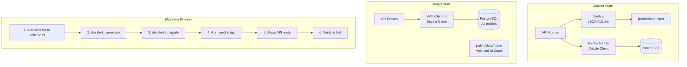

# Design: JSON to PostgreSQL Migration

## Overview

This design covers the incremental migration of ~15 JSON file entities to PostgreSQL using Drizzle ORM. Six entities already live in Postgres (products, launches, launch_products, pickup_locations, orders, order_items). The remaining entities — ingredients, taxonomies, users, pages, settings, stories, news, requests, and several operational/legacy files — need schema definitions, seed scripts, and API route swaps.

The migration follows an entity-group-at-a-time approach: define schema → generate Drizzle migration → seed data → swap API routes → verify. This keeps each step small, testable, and reversible.

### Key Decisions

- **UUID primary keys** for all new tables, consistent with existing schema. Original JSON IDs (slugs or timestamps) stored in a `legacy_id` text column where needed for backward compatibility.
- **`customJsonb`** for bilingual fields and complex nested data, matching the established pattern.
- **Products table expansion** rather than a new table — add missing columns to the existing `products` table via an ALTER migration.
- **Taxonomy normalization** — move from a single JSON blob to a `taxonomy_values` table with a `category` discriminator column.
- **Pages and settings** use jsonb content columns since their shapes are flexible and page-specific.
- **Incremental API swaps** — each route is updated independently; the JSON adapter (`lib/db.js`) is removed only after all routes are migrated.

### Migration Groups (in order)

1. **Taxonomies** — no dependencies, used by many entities
2. **Ingredients** — references taxonomy values
3. **Products expansion** — add missing columns, product_ingredients join table
4. **Users** — standalone, auth-critical
5. **Pages & Settings** — standalone CMS content
6. **Stories, News, Requests** — content entities
7. **Cleanup** — remove JSON adapter, archive JSON files

---

## Architecture



Each migration group follows the same 6-step process. The Drizzle client (`lib/db/client.ts`) and schema file (`lib/db/schema.ts`) are the single source of truth for database access.

### Seed Scripts

Seed scripts live in `lib/db/seeds/` and are run via a simple Node script (e.g., `npx tsx lib/db/seeds/seed-taxonomies.ts`). Each script:
1. Reads the corresponding JSON file from `public/data/`
2. Transforms data to match the Postgres schema (type coercion, UUID generation, field mapping)
3. Uses Drizzle `insert().onConflictDoNothing()` for idempotent seeding

---

## Components and Interfaces

### Schema Additions (`lib/db/schema.ts`)

New table definitions added to the existing schema file. No separate schema files — everything stays in one place for Drizzle-kit compatibility.

### Seed Scripts (`lib/db/seeds/`)

One file per entity group:
- `seed-taxonomies.ts`
- `seed-ingredients.ts`
- `seed-products-expand.ts`
- `seed-users.ts`
- `seed-pages-settings.ts`
- `seed-stories-news-requests.ts`

### API Route Changes

Each API route file is updated in-place. The import changes from `import { db } from '@/lib/db'` to `import { db } from '@/lib/db/client'` and the read/write calls change to Drizzle queries.

Example transformation for a typical GET route:

```typescript
// Before
const data = await db.read('ingredients.json');
return NextResponse.json(data || []);

// After
const data = await db.select().from(ingredients).orderBy(ingredients.name);
return NextResponse.json(data);
```

### Helper Functions

For entities with complex query patterns (ingredients with filtering, taxonomies with category grouping), we create thin query helpers in `lib/db/queries/` to keep API routes clean:

- `lib/db/queries/ingredients.ts` — filtered list, by-id lookup
- `lib/db/queries/taxonomies.ts` — by-category, CRUD operations
- `lib/db/queries/users.ts` — by-username, by-email lookups (replaces `lib/users.ts`)

---

## Data Models

### New Tables

#### `taxonomy_values`
| Column | Type | Notes |
|--------|------|-------|
| id | uuid PK | defaultRandom() |
| category | text NOT NULL | e.g. 'flavourTypes', 'allergens' |
| label | text NOT NULL | Display label |
| value | text NOT NULL | Programmatic value/slug |
| description | text | Optional description |
| sort_order | integer NOT NULL | Default 0 |
| archived | boolean NOT NULL | Default false |
| created_at | timestamp | defaultNow() |
| updated_at | timestamp | defaultNow() |

Indexes: `category`, unique on `(category, value)`.

#### `ingredients`
| Column | Type | Notes |
|--------|------|-------|
| id | uuid PK | defaultRandom() |
| legacy_id | text | Original JSON id (slug or timestamp) |
| name | text NOT NULL | |
| latin_name | text | |
| category | text | Taxonomy category value |
| taxonomy_category | text | Maps to taxonomy_values |
| origin | text | |
| description | text | |
| story | text | |
| image | text | |
| image_alt | text | |
| allergens | jsonb | string array |
| roles | jsonb | string array |
| descriptors | jsonb | string array |
| tasting_notes | jsonb | string array |
| texture | jsonb | string array |
| process | jsonb | string array |
| attributes | jsonb | string array |
| used_as | jsonb | string array |
| available_months | jsonb | number array |
| seasonal | boolean NOT NULL | Default false |
| animal_derived | boolean | Default false |
| vegetarian | boolean | Default true |
| is_organic | boolean | Default false |
| source_name | text | |
| source_type | text | |
| supplier | text | |
| farm | text | |
| status | text | 'active' default |
| created_at | timestamp | |
| updated_at | timestamp | |

Indexes: `legacy_id`, `name`, `category`.

#### `users`
| Column | Type | Notes |
|--------|------|-------|
| id | uuid PK | defaultRandom() |
| legacy_id | text | Original hex ID |
| name | text NOT NULL | |
| email | text NOT NULL UNIQUE | |
| username | text NOT NULL UNIQUE | |
| password_hash | text NOT NULL | |
| salt | text NOT NULL | |
| role | text NOT NULL | 'super_admin', 'admin', 'editor' |
| active | boolean NOT NULL | Default true |
| created_at | timestamp | |
| updated_at | timestamp | |

#### `pages`
| Column | Type | Notes |
|--------|------|-------|
| id | uuid PK | defaultRandom() |
| page_name | text NOT NULL UNIQUE | 'home', 'about', etc. |
| content | jsonb NOT NULL | Flexible page content |
| updated_at | timestamp | |

#### `settings`
| Column | Type | Notes |
|--------|------|-------|
| id | uuid PK | defaultRandom() |
| key | text NOT NULL UNIQUE | Setting key |
| value | jsonb NOT NULL | Setting value |
| updated_at | timestamp | |

#### `stories`
| Column | Type | Notes |
|--------|------|-------|
| id | uuid PK | defaultRandom() |
| legacy_id | text | |
| slug | text UNIQUE | |
| title | customJsonb<{en,fr}> | Bilingual |
| subtitle | customJsonb<{en,fr}> | |
| content | customJsonb | Story blocks |
| category | text | Taxonomy ref |
| tags | jsonb | string array |
| cover_image | text | |
| status | text | 'draft', 'published' |
| published_at | timestamp | |
| created_at | timestamp | |
| updated_at | timestamp | |

#### `news`
| Column | Type | Notes |
|--------|------|-------|
| id | uuid PK | defaultRandom() |
| legacy_id | text | Original numeric ID |
| title | text | |
| content | jsonb | Flexible content |
| created_at | timestamp | |
| updated_at | timestamp | |

#### `requests`
| Column | Type | Notes |
|--------|------|-------|
| id | uuid PK | defaultRandom() |
| legacy_id | text | Original numeric ID |
| name | text NOT NULL | |
| email | text NOT NULL | |
| phone | text | |
| date | text | Requested date |
| time | text | Requested time |
| guests | text | |
| event_type | text | |
| delivery | text | |
| address | text | |
| notes | text | |
| type | text NOT NULL | 'traiteur', 'gateaux' |
| status | text NOT NULL | 'new', 'read', 'archived' |
| created_at | timestamp | |

### Products Table Expansion

Add these columns to the existing `products` table:

| Column | Type | Notes |
|--------|------|-------|
| legacy_id | text | Original JSON slug ID |
| description | text | |
| category | text | Product category |
| price | integer | In cents |
| currency | text | Default 'CAD' |
| image | text | |
| serves | text | |
| allergens | jsonb | string array |
| tags | jsonb | string array |
| key_notes | jsonb | string array |
| tasting_notes | text | |
| status | text | 'active', 'archived' |
| title | text | Display title |
| short_card_copy | text | |
| inventory_tracked | boolean | Default false |
| availability_mode | text | |
| date_selection_type | text | |
| slot_selection_type | text | |
| variants | jsonb | Variant array |
| variant_type | text | |
| sync_status | text | |
| last_synced_at | timestamp | |
| sync_error | text | |

#### `product_ingredients` (join table)
| Column | Type | Notes |
|--------|------|-------|
| id | uuid PK | |
| product_id | uuid FK | → products.id |
| ingredient_id | uuid FK | → ingredients.id |
| display_order | integer | Default 0 |
| quantity | text | |
| notes | text | |


---

## Correctness Properties

*A property is a characteristic or behavior that should hold true across all valid executions of a system — essentially, a formal statement about what the system should do. Properties serve as the bridge between human-readable specifications and machine-verifiable correctness guarantees.*

### Property 1: Seed data round-trip

*For any* valid JSON entity record (ingredient, taxonomy value, page, setting, story, news item, request, or product), seeding it into PostgreSQL and then querying it back should produce a record with equivalent field values — including the original ID preserved in the `legacy_id` column, all jsonb arrays, bilingual fields, and variant data.

**Validates: Requirements 2.1, 2.2, 6.2, 9.1, 9.2, 10.3**

### Property 2: Credential preservation

*For any* user record migrated from `users.json`, the `password_hash` and `salt` values stored in PostgreSQL must be byte-identical to the original JSON values, such that `verifyPassword(migratedUser, originalPassword)` returns the same result as `verifyPassword(jsonUser, originalPassword)`.

**Validates: Requirements 8.3**

### Property 3: API response shape invariant

*For any* entity stored in PostgreSQL after migration, the JSON response returned by the corresponding API GET endpoint must contain all fields that were present in the pre-migration JSON response, with the same types and nesting structure.

**Validates: Requirements 3.3**

### Property 4: Taxonomy category filtering

*For any* taxonomy category string, querying `taxonomy_values` filtered by that category should return only rows where `category` equals the given string, and the result set should match exactly the values that were in the original JSON taxonomy object under that category key.

**Validates: Requirements 7.2**

### Property 5: Ingredient filter equivalence

*For any* combination of filter parameters (category, allergen, seasonal), the set of ingredients returned by the Postgres-backed API route should be identical to the set that would be returned by applying the same filters in-memory on the original JSON array.

**Validates: Requirements 10.2**

### Property 6: Product-ingredient relational integrity

*For any* product that had an `ingredients` array in the JSON data, after migration the `product_ingredients` join table should contain exactly one row per ingredient reference, with the correct `ingredient_id` (resolved from `legacy_id`), `display_order`, `quantity`, and `notes` matching the original JSON.

**Validates: Requirements 6.3**

---

## Error Handling

### Seed Script Errors

- **Duplicate keys**: Use `onConflictDoNothing()` for idempotent seeding. Log skipped records.
- **Missing references**: If a product references an ingredient ID that doesn't exist, log a warning and skip the `product_ingredients` row. Don't fail the entire seed.
- **Type coercion failures**: JSON data has inconsistent types (e.g., some IDs are numbers, some are strings). Seed scripts normalize all IDs to strings before insertion.
- **Empty/null fields**: Default to empty strings or null as appropriate. Never fail on missing optional fields.

### API Route Errors

- **Database connection failures**: Return 500 with a generic error message. The existing error handling pattern in API routes already does this.
- **Not found**: Return 404 for single-entity lookups (by ID or slug). Use the same pattern as existing Postgres-backed routes.
- **Validation errors**: Return 400 with field-level error messages for create/update operations.

### Migration Rollback

- JSON files in `public/data/` are preserved as backups throughout the migration.
- If a migration group fails, the API route can be reverted to the JSON adapter by changing the import back.
- Drizzle migrations can be rolled back by reverting the migration SQL file and re-running.

---

## Testing Strategy

### Dual Testing Approach

Both unit tests and property-based tests are used. Unit tests cover specific examples and edge cases. Property tests verify universal invariants across generated inputs.

### Property-Based Testing

- **Library**: `fast-check` (already compatible with the Vitest test runner used in this project)
- **Minimum iterations**: 100 per property test
- **Tag format**: Each test is annotated with a comment referencing the design property:
  ```
  // Feature: json-to-postgres-migration, Property N: <property text>
  ```
- Each correctness property above maps to exactly one property-based test

### Unit Tests

Unit tests focus on:
- **Seed script edge cases**: Empty JSON files, records with missing optional fields, duplicate IDs
- **API response shape**: Specific known records verified field-by-field
- **Taxonomy CRUD**: Create, update, delete, reorder operations
- **User auth flow**: Login with migrated credentials

### Test Structure

```
tests/
  db/
    seeds/
      seed-taxonomies.test.ts
      seed-ingredients.test.ts
      seed-products.test.ts
      seed-users.test.ts
      seed-pages-settings.test.ts
      seed-stories-news-requests.test.ts
    properties/
      seed-roundtrip.property.test.ts
      credential-preservation.property.test.ts
      api-response-shape.property.test.ts
      taxonomy-filtering.property.test.ts
      ingredient-filtering.property.test.ts
      product-ingredients.property.test.ts
```

### Test Database

Tests run against a separate `rhubarbe_test` database (already configured in `lib/db/client.ts`). Each test suite sets up and tears down its own data using transactions or truncation.
