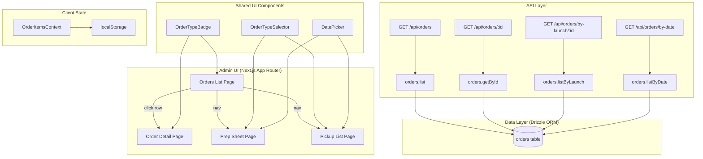

# Design Document: Order Platform Expansion

## Overview

This design extends the existing admin order management system to provide differentiated views, details, and operational tools for three order types: launch, catering (volume), and cake. The current system already has the `orderType` discriminator in the DB schema and basic filtering on the orders list page. This expansion adds:

1. Order type badges on the orders table
2. Dynamic table columns based on selected order type filter
3. Order-type-specific detail page sections
4. Catering and cake modes for the prep sheet (date-based aggregation)
5. Catering and cake modes for the pickup/fulfillment list (date-based)
6. API enhancements to return order-type-specific fields
7. Verification of localStorage cart persistence across all three order types

The design preserves all existing launch-based workflows and adds parallel date-based workflows for catering and cake orders.

## Architecture



### Key Design Decisions

1. **Reuse existing pages, don't create new routes.** The prep sheet and pickup list pages gain an order type selector that switches between launch mode (existing) and date-based mode (new). This avoids route proliferation and keeps the admin nav simple.

2. **New query function `listByDate` for date-based aggregation.** Launch orders use `listByLaunch(launchId)`. Catering and cake orders use a new `listByDate(date, orderType)` that filters by `fulfillmentDate` and `orderType`.

3. **New API endpoint `GET /api/orders/by-date`.** Accepts `date` and `orderType` query params. Returns orders with items, mirroring the shape of `by-launch`.

4. **Parse `specialInstructions` JSON for cake metadata.** Cake orders store `numberOfPeople` and `eventType` inside the `specialInstructions` text field as a JSON string. The detail API parses this and returns structured fields. This avoids schema migration.

5. **Shared `OrderTypeBadge` component.** A small component mapping order type to color and label, reused across the orders list and detail pages.

## Components and Interfaces

### New Shared Components

#### `OrderTypeBadge`
A presentational component that renders a colored badge for the order type.

```typescript
interface OrderTypeBadgeProps {
  orderType: 'launch' | 'volume' | 'cake';
}
// Renders: Badge with color mapping:
//   launch  → "Launch"   (blue)
//   volume  → "Catering" (purple)
//   cake    → "Cake"     (pink)
```

Location: `app/admin/components/OrderTypeBadge.tsx`

#### `OrderTypeSelector`
A tab/select component for switching between Launch, Catering, and Cake modes on prep sheet and pickup list pages.

```typescript
interface OrderTypeSelectorProps {
  value: 'launch' | 'volume' | 'cake';
  onChange: (type: 'launch' | 'volume' | 'cake') => void;
}
```

Location: `app/admin/components/OrderTypeSelector.tsx`

### Modified Pages

#### `app/admin/orders/page.tsx` (Orders List)
- Add `OrderTypeBadge` to each table row
- Conditionally render columns based on `orderTypeFilter`:
  - `all` / `launch`: order #, customer, date, pickup, type badge, status, total
  - `volume`: order #, customer, date, fulfillment date, fulfillment type, total qty, allergen notes, status, total
  - `cake`: order #, customer, date, pickup date, # people, event type, total qty, status, total

#### `app/admin/orders/[id]/page.tsx` (Order Detail)
- Add `OrderTypeBadge` next to status badge in header
- Add `orderType`, `fulfillmentDate`, `allergenNotes`, `launchTitle` to `OrderDetail` interface
- Add parsed cake metadata: `numberOfPeople`, `eventType`
- Conditionally render sections:
  - Launch: launch/menu title, pickup date, location, time slot (existing)
  - Volume: fulfillment date, fulfillment type, allergen notes (highlighted)
  - Cake: pickup date, # people, event type, special instructions (highlighted)

#### `app/admin/orders/prep-sheet/page.tsx`
- Add `OrderTypeSelector` at top
- When "Launch" selected: existing launch/menu selector + workflow (unchanged)
- When "Catering" selected: date picker → fetch via `/api/orders/by-date?date=X&orderType=volume` → aggregate quantities, show allergen notes per order
- When "Cake" selected: date picker → fetch via `/api/orders/by-date?date=X&orderType=cake` → aggregate quantities, show event type + # people per order
- CSV export and print for all modes

#### `app/admin/orders/pickup-list/page.tsx`
- Add `OrderTypeSelector` at top
- When "Launch" selected: existing launch/menu selector + QR scan (unchanged)
- When "Catering" or "Cake" selected: date picker → fetch orders → group by order type → show fulfillment type (volume) or event type + # people (cake) → mark fulfilled button

### Modified API Routes

#### `GET /api/orders` (list)
- Already returns `orderType`, `fulfillmentDate`, `allergenNotes`
- Add `launchTitle` to the response shape for launch orders

#### `GET /api/orders/:id` (detail)
- Add `orderType`, `fulfillmentDate`, `allergenNotes`, `launchTitle` to response
- For cake orders: parse `specialInstructions` as JSON to extract `numberOfPeople` and `eventType`

#### `GET /api/orders/by-date` (new endpoint)
- Query params: `date` (ISO date string), `orderType` ('volume' | 'cake')
- Returns orders with items matching the fulfillment date and order type
- Response shape mirrors `/api/orders/by-launch/:id`

### Modified Data Queries

#### `lib/db/queries/orders.ts`
- Add `listByDate(date: string, orderType: string)` function
- Filters `orders` table by `fulfillmentDate` (date match) and `orderType`
- Returns orders with items, same shape as `listByLaunch`
- Update `list()` to include `launchTitle` in response
- Update `getById()` to include `orderType`, `fulfillmentDate`, `allergenNotes`, `launchTitle`, and parsed cake metadata

## Data Models

### Existing Schema (no changes needed)

The `orders` table already has the required fields:

```
orders.orderType      — text, default 'launch' ('launch' | 'volume' | 'cake')
orders.fulfillmentDate — timestamp, nullable
orders.allergenNotes   — text, nullable
orders.specialInstructions — text, nullable (JSON for cake: {numberOfPeople, eventType})
orders.launchTitle     — text, nullable
```

### Cake Special Instructions JSON Shape

Cake orders encode metadata in `specialInstructions` as:

```json
{
  "numberOfPeople": 12,
  "eventType": "birthday",
  "text": "Nut-free, special decoration requested"
}
```

The API detail endpoint parses this and returns:
```typescript
interface CakeOrderMetadata {
  numberOfPeople: number | null;
  eventType: string | null;
  specialInstructionsText: string | null;
}
```

### API Response Shapes

#### Orders List Item (enhanced)
```typescript
interface OrderListItem {
  id: string;
  orderNumber: string;
  customerName: string;
  orderDate: string;
  pickupDate: string | null;
  pickupLocation: string | null;
  status: string;
  totalAmount: number;
  orderType: string;
  fulfillmentDate: string | null;
  allergenNotes: string | null;
  totalQuantity: number;
  launchTitle: string | null;  // NEW
}
```

#### Order Detail (enhanced)
```typescript
interface OrderDetail {
  // ... existing fields ...
  orderType: string;              // NEW
  fulfillmentDate: string | null; // NEW
  allergenNotes: string | null;   // NEW
  launchTitle: string | null;     // NEW
  // Cake-specific parsed fields
  numberOfPeople: number | null;  // NEW (parsed from specialInstructions)
  eventType: string | null;       // NEW (parsed from specialInstructions)
}
```

#### By-Date Response (new, mirrors by-launch)
```typescript
interface OrderWithItems {
  id: string;
  orderNumber: string;
  customerName: string;
  customerEmail: string;
  customerPhone: string;
  specialInstructions: string | null;
  status: string;
  orderType: string;
  fulfillmentDate: string | null;
  allergenNotes: string | null;
  items: OrderItem[];
}
```


## Correctness Properties

*A property is a characteristic or behavior that should hold true across all valid executions of a system — essentially, a formal statement about what the system should do. Properties serve as the bridge between human-readable specifications and machine-verifiable correctness guarantees.*

### Property 1: Cart persistence round trip

*For any* order type (launch, volume, cake) and any valid cart data in the corresponding format (objects with `quantity` for launch, `[variantId, quantity]` tuples for volume/cake), writing the data to the correct localStorage key and then calling the corresponding read function should return a quantity sum equal to the sum of all quantities in the original data.

**Validates: Requirements 1.1, 1.2, 1.3, 1.4**

### Property 2: Malformed localStorage fallback

*For any* arbitrary string that is not valid cart JSON (including empty strings, random text, malformed JSON, and null), calling any of the three cart read functions (`readOrderCount`, `readVolumeCount`, `readCakeCount`) should return 0 and not throw an error.

**Validates: Requirements 1.6**

### Property 3: Badge color uniqueness

*For any* two distinct order type values from the set {'launch', 'volume', 'cake'}, the `OrderTypeBadge` color mapping function should return different colors, ensuring visual distinguishability.

**Validates: Requirements 2.2**

### Property 4: Prep sheet quantity aggregation

*For any* set of orders (of a single order type) with associated items, the prep sheet aggregation function should produce entries where each product's `totalQuantity` equals the sum of that product's quantities across all input orders.

**Validates: Requirements 5.2, 6.2**

### Property 5: Prep sheet metadata preservation

*For any* set of orders containing metadata (allergen notes for volume orders, event type and number of people for cake orders), the prep sheet output should include all non-null metadata values from the input orders.

**Validates: Requirements 5.3, 6.3**

### Property 6: CSV export round trip

*For any* valid prep sheet data (product name, total quantity, notes), generating a CSV string and then parsing it back should produce rows containing all original product names and quantities.

**Validates: Requirements 5.4, 6.4**

### Property 7: Order grouping by type

*For any* list of orders containing a mix of order types, grouping by `orderType` should produce groups where every order in a group has the same `orderType` value, and no order appears in more than one group.

**Validates: Requirements 7.3**

### Property 8: Fulfill order status transition

*For any* order with a non-fulfilled, non-cancelled status, calling the fulfill/update status function with 'fulfilled' should result in the order's status being 'fulfilled'.

**Validates: Requirements 7.6**

### Property 9: API response shape completeness

*For any* order returned by the list endpoint, the response object should contain the fields `orderType`, `fulfillmentDate`, `allergenNotes`, and `launchTitle`.

**Validates: Requirements 8.1, 8.4**

### Property 10: Cake metadata parsing round trip

*For any* cake order whose `specialInstructions` contains a valid JSON object with `numberOfPeople` (number) and `eventType` (string), the detail endpoint's parsing logic should extract and return those exact values.

**Validates: Requirements 8.2**

### Property 11: API orderType filter invariant

*For any* `orderType` filter value passed to the orders list endpoint, every order in the response should have an `orderType` field equal to the filter value.

**Validates: Requirements 8.3**

## Error Handling

### localStorage Errors
- If `localStorage.getItem` throws (e.g., storage disabled, quota exceeded), catch and return 0 for the affected cart count. The existing try/catch pattern in `OrderItemsContext` already handles this.
- If `JSON.parse` throws on malformed data, catch and return 0.

### API Errors
- If `/api/orders/by-date` receives an invalid date string, return 400 with `{ error: 'Invalid date' }`.
- If `/api/orders/by-date` receives an invalid `orderType`, return 400 with `{ error: 'Invalid orderType' }`.
- If the detail endpoint fails to parse `specialInstructions` as JSON for a cake order, return `numberOfPeople: null` and `eventType: null` rather than failing the entire request.
- All existing error handling patterns (try/catch with 500 responses) remain unchanged.

### UI Error States
- Prep sheet and pickup list show toast errors on fetch failure (existing pattern).
- Date picker validates that a date is selected before fetching.
- Empty states show appropriate messages ("No orders for this date").

## Testing Strategy

### Dual Testing Approach

This feature uses both unit tests and property-based tests for comprehensive coverage.

- **Unit tests**: Verify specific examples, edge cases, integration points, and UI rendering conditions.
- **Property-based tests**: Verify universal properties across randomly generated inputs.

### Property-Based Testing Configuration

- **Library**: [fast-check](https://github.com/dubzzz/fast-check) (JavaScript/TypeScript PBT library)
- **Minimum iterations**: 100 per property test
- **Tag format**: `Feature: order-platform-expansion, Property {number}: {property_text}`
- Each correctness property above MUST be implemented by a single property-based test

### Unit Test Focus Areas

- Order type badge renders correct color/label for each type (specific examples)
- Table columns change correctly when filter switches (integration)
- Detail page renders correct sections per order type (integration)
- Prep sheet mode switching between launch/catering/cake (integration)
- Pickup list mode switching and fulfill button behavior (integration)
- API endpoint returns 400 for invalid date/orderType params (error conditions)
- CSV export produces valid CSV with correct headers (specific example)

### Property Test Focus Areas

Each of the 11 correctness properties maps to one property-based test:

1. Cart read functions return correct sums for randomly generated valid cart data
2. Cart read functions return 0 for randomly generated invalid localStorage strings
3. Badge color mapping produces unique colors for all order type pairs
4. Prep aggregation sums match manual computation for random order sets
5. Prep output contains all metadata from random input orders
6. CSV generation/parsing round trip preserves data for random prep entries
7. Grouping function partitions random order lists correctly by type
8. Status update to 'fulfilled' succeeds for random non-terminal orders
9. List API response contains required fields for random order data
10. Cake metadata parsing extracts correct values from random valid JSON
11. OrderType filter returns only matching orders from random mixed sets
