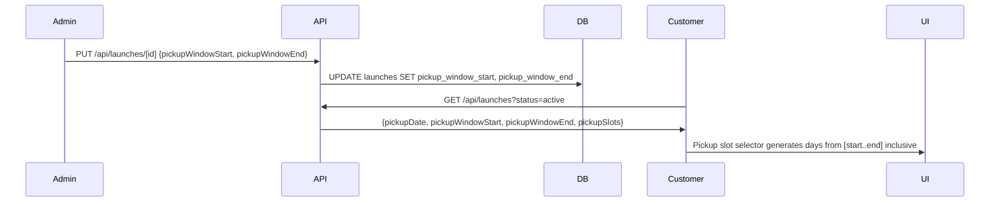

# Design Document: Ordering System Updates

## Overview

Incremental changes across three existing order flows (Menu Order, Catering/Volume, Cake Order) to add missing product fields, improve sidebar cart UX, extend the launch data model for seasonal menus, and ensure consistent display of serving information. All changes build on the existing Next.js 14 App Router + Drizzle ORM + PostgreSQL + Shopify stack.

No new order flows, no new tables (except schema column additions), no architectural changes.

## Architecture

The existing architecture remains unchanged:

```
Storefront Pages ──► /api/storefront/* (public) ──► Drizzle queries ──► PostgreSQL
Admin Pages ──────► /api/* (auth-protected) ──────► Drizzle queries ──► PostgreSQL
                                                                    └──► Shopify Admin API
```

Changes are localized to:
1. **Schema** — new columns on `products`, `launches`, `volumeVariants`, `cakeVariants` tables
2. **API routes** — updated storefront and admin endpoints to read/write new fields
3. **Frontend** — updated React components in `app/order/`, `app/volume-order/`, `app/cake-order/`, and `app/admin/`

## Components and Interfaces

### Schema Changes (Drizzle / PostgreSQL)

#### `products` table — new columns

| Column | Type | Default | Purpose |
|---|---|---|---|
| `nextAvailableDate` | `timestamp` | `null` | Req 2: next availability for sold-out products |
| `servesPerUnit` | `integer` | `null` | Req 7: serves-per-unit for catering serving estimate |
| `cakeFlavourNotes` | `jsonb<{en,fr}>` | `null` | Req 9: bilingual flavour notes teaser for cake cards |
| `cakeDeliveryAvailable` | `boolean` | `true` | Req 11: whether delivery is offered for this cake |

Note: `serves` (text) and `cakeDescription` (jsonb) already exist — no changes needed for Req 1, 9.1, 12.

#### `launches` table — new columns

| Column | Type | Default | Purpose |
|---|---|---|---|
| `pickupWindowStart` | `timestamp` | `null` | Req 3: start of multi-day pickup window |
| `pickupWindowEnd` | `timestamp` | `null` | Req 3: end of multi-day pickup window |

Existing `pickupDate` is kept for backward compatibility. When `pickupWindowStart`/`pickupWindowEnd` are both set, the launch uses a multi-day window. When null, `pickupDate` is used as today.

#### `volumeVariants` table — new column

| Column | Type | Default | Purpose |
|---|---|---|---|
| `description` | `jsonb<{en,fr}>` | `null` | Req 5, 6: bilingual description for cocktail dînatoire / lunch box variants |

#### `cakeVariants` table — new column

| Column | Type | Default | Purpose |
|---|---|---|---|
| `description` | `jsonb<{en,fr}>` | `null` | Future parity with volume variants |

### API Route Changes

#### Storefront (public, no auth)

| Endpoint | Change | Requirements |
|---|---|---|
| `GET /api/storefront/volume-products` | Include `servesPerUnit` from products, include `description` from volumeVariants | Req 5, 6, 7 |
| `GET /api/storefront/cake-products` | Include `cakeFlavourNotes`, `cakeDeliveryAvailable`, `serves` from products | Req 9, 11, 12 |
| `GET /api/launches` | Include `pickupWindowStart`, `pickupWindowEnd` in response | Req 3 |

#### Admin (auth-protected)

| Endpoint | Change | Requirements |
|---|---|---|
| `PUT /api/products/[id]` | Accept `nextAvailableDate`, `servesPerUnit` | Req 2, 7 |
| `PUT /api/cake-products/[id]` | Accept `cakeFlavourNotes`, `cakeDeliveryAvailable` | Req 9, 11 |
| `PUT /api/volume-products/[id]` | Accept variant `description` in setVolumeVariants | Req 5, 6 |
| `PUT /api/launches/[id]` | Accept `pickupWindowStart`, `pickupWindowEnd` | Req 3 |

### Frontend Component Changes

#### Menu Order — `app/order/OrderPageClient.tsx`

- **ProductCard**: Show `serves` label below product name when non-null (Req 1, 12)
- **ProductCard**: Show "Next available: date" below sold-out overlay when `nextAvailableDate` is set (Req 2)
- **Sidebar area**: Show pickup date and order cut-off reminder from launch data (Req 4)
- **Sidebar area**: Show selected date confirmation line (Req 13)

#### Volume/Catering Order — `app/volume-order/VolumeOrderPageClient.tsx`

- **VolumeProductCard**: Show variant `description` below variant label (Req 5, 6)
- **VolumeInlineCart**: Calculate and display "Serves approx. X people" from `servesPerUnit × quantity` (Req 7)
- **DatePickerField**: Disable Sundays via `isDateUnavailable` prop, add explanatory note (Req 8)
- **VolumeInlineCart**: Show selected date confirmation line (Req 13)

#### Cake Order — `app/cake-order/CakeOrderPageClient.tsx`

- **CakeProductCard**: Show `cakeFlavourNotes` as teaser on grid card (Req 9)
- **CakeProductCard**: Show `serves` label consistently with menu order (Req 12)
- **Pricing tier display**: Highlight active tier row based on headcount (Req 10)
- **Sidebar**: Add Pickup/Delivery toggle matching volume order pattern (Req 11)
- **Sidebar**: Show address input when delivery selected (Req 11)
- **Sidebar**: Show selected date confirmation line (Req 13)

#### Admin Pages

- **Product edit** (`app/admin/products/[id]`): Add `nextAvailableDate` date picker, `servesPerUnit` number input
- **Volume product edit** (`app/admin/volume-products/[id]`): Add variant description fields in VariantEditor
- **Cake product edit** (`app/admin/cake-products/[id]`): Add `cakeFlavourNotes` bilingual fields, `cakeDeliveryAvailable` toggle
- **Launch/menu edit** (`app/admin/menus/[id]`): Add `pickupWindowStart`/`pickupWindowEnd` date pickers, conditionally shown

### Key Data Flows

#### Multi-Day Pickup Window (Req 3)



#### Catering Serves Estimate (Req 7)

```
Cart items with quantities → sum(qty × product.servesPerUnit) → display in sidebar
```

Computed client-side in `VolumeInlineCart`. No API call needed — `servesPerUnit` is included in the storefront product payload.

#### Cake Delivery Toggle (Req 11)

Mirrors the existing `VolumeInlineCart` pickup/delivery toggle. When delivery is selected and `cakeDeliveryAvailable` is false for the selected cake, a warning message is shown and checkout is blocked.

## Data Models

### Product (extended)

```typescript
// New fields added to products table
nextAvailableDate: timestamp | null    // Req 2
servesPerUnit: integer | null          // Req 7
cakeFlavourNotes: {en: string, fr: string} | null  // Req 9
cakeDeliveryAvailable: boolean (default true)       // Req 11
```

### Launch (extended)

```typescript
// New fields added to launches table
pickupWindowStart: timestamp | null    // Req 3
pickupWindowEnd: timestamp | null      // Req 3
// Existing pickupDate remains as fallback for single-day launches
```

### VolumeVariant (extended)

```typescript
// New field added to volume_variants table
description: {en: string, fr: string} | null  // Req 5, 6
```

### CakeVariant (extended)

```typescript
// New field added to cake_variants table
description: {en: string, fr: string} | null  // Future parity
```

### Storefront Volume Product Response (extended)

```typescript
interface VolumeProduct {
  // ... existing fields ...
  servesPerUnit: number | null;        // NEW: Req 7
  variants: Array<{
    // ... existing fields ...
    description: {en: string, fr: string} | null;  // NEW: Req 5, 6
  }>;
}
```

### Storefront Cake Product Response (extended)

```typescript
interface CakeProduct {
  // ... existing fields ...
  cakeFlavourNotes: {en: string, fr: string} | null;  // NEW: Req 9
  cakeDeliveryAvailable: boolean;                       // NEW: Req 11
  serves: string | null;                                // NEW in response: Req 12
}
```


## Correctness Properties

*A property is a characteristic or behavior that should hold true across all valid executions of a system — essentially, a formal statement about what the system should do. Properties serve as the bridge between human-readable specifications and machine-verifiable correctness guarantees.*

### Property 1: Serves label presence matches serves field presence

*For any* product (menu, seasonal, or cake) and any locale, the rendered product card contains a "Serves X" label if and only if the product's `serves` field is non-null and non-empty.

**Validates: Requirements 1.1, 1.2, 12.1, 12.3**

### Property 2: Next-available date display is conditional on sold-out status and date presence

*For any* product and any `nextAvailableDate` value, the "Next available" text is rendered if and only if the product is sold out AND `nextAvailableDate` is non-null. When the product is in stock, the next-available text is never rendered regardless of the date value.

**Validates: Requirements 2.2, 2.3, 2.4**

### Property 3: Pickup window generates correct inclusive date range

*For any* two dates where `pickupWindowStart <= pickupWindowEnd`, the generated list of selectable pickup days contains exactly every calendar date from start to end inclusive, with no duplicates and no dates outside the range. When both window fields are null, the generated list contains only the single `pickupDate`.

**Validates: Requirements 3.2, 3.3**

### Property 4: Order cut-off reminder formatting

*For any* launch with an `orderCloses` timestamp and an `orderOpens` timestamp, the sidebar displays a cut-off reminder derived from `orderCloses` when the current time is after `orderOpens`, and displays the opening date when the current time is before `orderOpens`.

**Validates: Requirements 4.2, 4.3**

### Property 5: Volume variant description display matches field presence

*For any* volume variant (cocktail dînatoire or lunch box) and any locale, the rendered variant row contains the localized description text if and only if the variant's `description` field is non-null and the localized string is non-empty.

**Validates: Requirements 5.2, 5.3, 6.2, 6.3**

### Property 6: Catering serves estimate equals sum of quantity times servesPerUnit

*For any* set of catering cart items where each item has a quantity ≥ 0 and a `servesPerUnit` ≥ 0, the displayed serves estimate equals `Σ(quantity × servesPerUnit)`. When this sum is 0, the estimate is omitted.

**Validates: Requirements 7.2, 7.3**

### Property 7: Sundays are always unavailable in catering date picker

*For any* date, the `isDateUnavailable` function returns true if and only if the date falls on a Sunday (day of week === 0).

**Validates: Requirements 8.1, 8.3**

### Property 8: Active pricing tier is the highest-minPeople tier not exceeding headcount

*For any* non-empty list of pricing tiers sorted by `minPeople` and any headcount ≥ 1, the active tier is the one with the largest `minPeople` value that is ≤ the headcount, and the displayed estimated total equals that tier's `priceInCents`.

**Validates: Requirements 10.1, 10.2**

### Property 9: Cake delivery blocked when cakeDeliveryAvailable is false

*For any* cake product where `cakeDeliveryAvailable` is false and fulfillment type is "delivery", the checkout action is disabled and a warning message is displayed.

**Validates: Requirements 11.3**

### Property 10: Address field visibility matches delivery selection

*For any* fulfillment type selection in the cake order sidebar, the address input field is visible if and only if the fulfillment type is "delivery".

**Validates: Requirements 11.2, 11.4**

### Property 11: Date confirmation line reflects selected date

*For any* selected fulfillment date (pickup or delivery) in any order flow, the sidebar contains a confirmation line displaying the formatted version of that date. When no date is selected, the confirmation line is absent.

**Validates: Requirements 13.1, 13.2**

### Property 12: New field persistence round-trip

*For any* valid product update containing `nextAvailableDate`, `servesPerUnit`, `cakeFlavourNotes`, or `cakeDeliveryAvailable`, and for any valid launch update containing `pickupWindowStart`/`pickupWindowEnd`, and for any valid volume variant update containing `description`: writing the value via the admin API and then reading it back via the corresponding GET endpoint returns the same value.

**Validates: Requirements 2.1, 3.1, 5.1, 6.1, 7.1, 9.2**

## Error Handling

| Scenario | Handling |
|---|---|
| `pickupWindowEnd` < `pickupWindowStart` | API returns 400 with validation error; admin form shows inline error |
| `servesPerUnit` is negative or non-integer | API returns 400; admin form validates client-side |
| `nextAvailableDate` is in the past | Allowed (admin may set historical dates intentionally); storefront still displays it |
| Cake delivery selected but `cakeDeliveryAvailable` is false | Checkout button disabled; inline warning shown; no API call made |
| Sunday selected via keyboard in catering date picker | React Aria DatePicker's `isDateUnavailable` prevents selection; previous valid date retained |
| Launch has both `pickupDate` and window fields set | Window fields take precedence; `pickupDate` used as fallback display only |
| Volume variant `description` missing locale key | Falls back to other locale, then empty string (existing `tr()` helper pattern) |

## Testing Strategy

### Unit Tests

Focus on specific examples and edge cases:
- Pickup window generation with same-day start/end (single day)
- Pickup window generation with null window fields (fallback to pickupDate)
- Serves estimate with zero quantities
- Serves estimate with null servesPerUnit (treated as 0)
- Active pricing tier with headcount below all tiers (no active tier)
- Active pricing tier with headcount exactly matching a tier boundary
- Sunday check for edge dates (Saturday 23:59 vs Sunday 00:00)
- Bilingual field fallback when one locale is empty

### Property-Based Tests

Use `fast-check` as the property-based testing library (already compatible with the project's Vitest setup).

Each property test runs a minimum of 100 iterations and is tagged with its design property reference.

| Test | Property | Tag |
|---|---|---|
| Serves label rendering | Property 1 | `Feature: ordering-system-updates, Property 1: Serves label presence matches serves field presence` |
| Next-available conditional display | Property 2 | `Feature: ordering-system-updates, Property 2: Next-available date display conditional` |
| Pickup window date generation | Property 3 | `Feature: ordering-system-updates, Property 3: Pickup window generates correct inclusive date range` |
| Cut-off reminder logic | Property 4 | `Feature: ordering-system-updates, Property 4: Order cut-off reminder formatting` |
| Volume variant description display | Property 5 | `Feature: ordering-system-updates, Property 5: Volume variant description display` |
| Catering serves estimate | Property 6 | `Feature: ordering-system-updates, Property 6: Catering serves estimate computation` |
| Sunday unavailability | Property 7 | `Feature: ordering-system-updates, Property 7: Sundays are always unavailable` |
| Active pricing tier lookup | Property 8 | `Feature: ordering-system-updates, Property 8: Active pricing tier lookup` |
| Cake delivery blocking | Property 9 | `Feature: ordering-system-updates, Property 9: Cake delivery blocked when unavailable` |
| Address field visibility | Property 10 | `Feature: ordering-system-updates, Property 10: Address field visibility` |
| Date confirmation display | Property 11 | `Feature: ordering-system-updates, Property 11: Date confirmation line` |
| Field persistence round-trip | Property 12 | `Feature: ordering-system-updates, Property 12: New field persistence round-trip` |

Property tests should focus on the pure logic functions extracted from components (e.g., `generatePickupDays()`, `calculateServesEstimate()`, `getActivePricingTier()`, `isSundayUnavailable()`). UI rendering properties (1, 2, 5, 10, 11) can be tested via component render tests with generated inputs using `@testing-library/react`.
