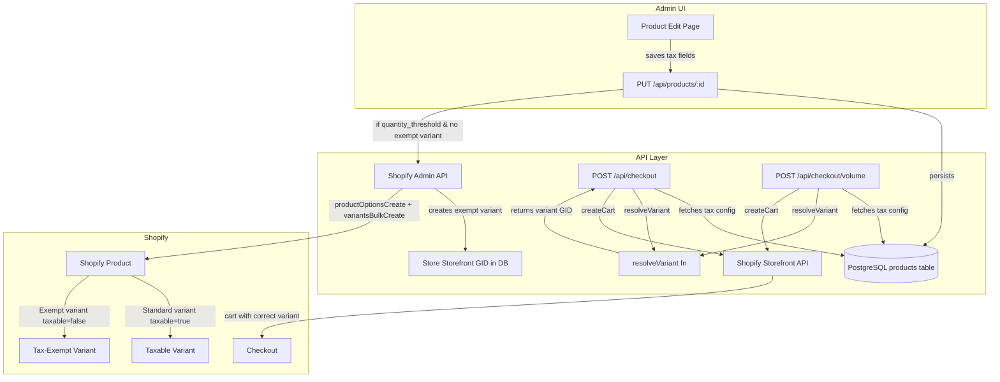

# Design Document: Quebec Tax Variant Switcher

## Overview

Quebec tax law requires quantity-based tax treatment for bakery/food items. Products sold in quantities ≤5 are fully taxable (GST 5% + QST 9.975%), while ≥6 identical items are tax-exempt. Some products are always taxable or always exempt regardless of quantity.

Since Rhubarbe runs on a non-Plus Shopify plan (no Shopify Functions or Cart Transform), we implement tax control via a **dual-variant strategy**: each threshold-eligible product has two Shopify variants at the same price — one taxable (default) and one tax-exempt. At checkout time, a pure function (`resolveVariant`) selects the correct variant based on the product's tax configuration and the effective unit count in the cart.

### Key Design Decisions

1. **Pure variant resolution function** — All tax/variant logic lives in a single, stateless `resolveVariant()` function in `lib/tax/resolve-variant.ts`. Both checkout routes call it. This makes the logic trivially testable and deterministic.

2. **Schema-level defaults** — New columns default to `always_taxable` / threshold 6 / unit count 1, so existing products require zero migration effort beyond the DDL.

3. **Lazy Shopify variant creation** — The tax-exempt variant is created in Shopify only when an admin saves a product with `quantity_threshold` behavior and the exempt variant doesn't exist yet. No batch migration needed.

4. **No Shopify variant deletion** — When tax behavior changes away from `quantity_threshold`, the exempt variant GID is retained in the DB. The Shopify variant is left in place for manual cleanup, avoiding accidental data loss.

5. **Storefront API variant ID** — The checkout routes use Storefront API GIDs (not Admin GIDs) for cart lines. The exempt variant creation flow must convert the Admin GID to a Storefront GID before storing it, or store the Admin GID and convert at checkout time. We store the **Storefront API GID** directly since that's what `createCart()` consumes.

## Architecture



### Data Flow

1. Admin configures tax behavior on product edit page → saved to `products` table
2. If `quantity_threshold` and no exempt variant exists → Shopify Admin API creates one → GID stored in DB
3. Customer adds items to cart → checkout API fetches tax config for each product
4. `resolveVariant()` computes effective units and returns the correct Shopify variant GID
5. Cart is created via Storefront API with the resolved variant GIDs

## Components and Interfaces

### 1. `lib/tax/resolve-variant.ts` — Variant Resolution Function

A pure, stateless function with no side effects or database access.

```typescript
interface TaxConfig {
  taxBehavior: 'always_taxable' | 'always_exempt' | 'quantity_threshold';
  taxThreshold: number;
  taxUnitCount: number;
  shopifyTaxExemptVariantId: string | null;
}

interface VariantResolution {
  variantId: string;       // The Shopify Storefront variant GID to use
  isExempt: boolean;       // Whether the exempt variant was selected
  effectiveUnits: number;  // Computed effective units (for logging/debugging)
  fallback: boolean;       // True if we fell back to taxable due to missing exempt variant
}

function resolveVariant(
  taxConfig: TaxConfig,
  cartQuantity: number,
  defaultVariantId: string,  // The product's default (taxable) Shopify variant GID
): VariantResolution
```

**Logic:**
- `always_taxable` → return `defaultVariantId`, `isExempt: false`
- `always_exempt` → return `shopifyTaxExemptVariantId` if non-null, else fallback to `defaultVariantId` with warning
- `quantity_threshold` → compute `effectiveUnits = cartQuantity × taxUnitCount`
  - If `effectiveUnits >= taxThreshold` and `shopifyTaxExemptVariantId` is non-null → return exempt variant
  - If `effectiveUnits >= taxThreshold` but exempt variant is null → fallback to taxable with `fallback: true`
  - If `effectiveUnits < taxThreshold` → return taxable variant

### 2. `lib/tax/create-exempt-variant.ts` — Shopify Exempt Variant Creator

Uses the existing `shopifyAdminFetch` from `lib/shopify/admin.ts`.

```typescript
interface CreateExemptVariantResult {
  storefrontVariantId: string;  // Storefront API GID for cart operations
  adminVariantId: string;       // Admin API GID for future updates
}

async function createTaxExemptVariant(
  shopifyProductId: string,  // Admin API product GID
  currentPrice: string,      // e.g. "12.50"
): Promise<CreateExemptVariantResult>
```

**Steps:**
1. Call `productOptionsCreate` to add a "Tax Mode" option with values ["Standard", "Exempt"] using `LEAVE_AS_IS` strategy (same pattern as `createProduct` in `admin.ts`)
2. Call `productVariantsBulkCreate` to create the "Exempt" variant at the same price
3. Call `productVariantUpdate` to set `taxable: false` on the new variant
4. Convert the Admin GID to a Storefront GID (base64 encode `gid://shopify/ProductVariant/{numericId}`)
5. Return both GIDs

### 3. `lib/tax/sync-exempt-variant-price.ts` — Price Sync

```typescript
async function syncExemptVariantPrice(
  shopifyProductId: string,
  exemptVariantAdminId: string,
  newPrice: string,
): Promise<void>
```

Called during the existing product sync flow in `PUT /api/products/[id]` when the product has a non-null `shopifyTaxExemptVariantId`.

### 4. Schema Migration

New columns on the `products` table (added via Drizzle migration):

```sql
ALTER TABLE products
  ADD COLUMN tax_behavior text NOT NULL DEFAULT 'always_taxable',
  ADD COLUMN tax_threshold integer NOT NULL DEFAULT 6,
  ADD COLUMN tax_unit_count integer NOT NULL DEFAULT 1,
  ADD COLUMN shopify_tax_exempt_variant_id text;
```

### 5. Admin UI — "Tax & Shipping" Section

A new section on the product edit page (`app/admin/products/[id]/page.tsx`), placed in the right column below the Shopify integration card. Contains:

- **Tax Behavior** dropdown: "Always taxable" / "Always exempt" / "Quantity threshold"
- **Tax Threshold** integer input (visible only when `quantity_threshold`)
- **Tax Unit Count** integer input (visible only when `quantity_threshold`)
- **Tax-Exempt Variant** read-only text showing the stored GID or "Not linked" (visible only when `quantity_threshold`)
- **Pickup Only** toggle (moved from its current location into this section)

Follows existing admin UI patterns: white card with header, `border-gray-200`, Untitled UI `Input`/`Select`/`Checkbox` components.

### 6. Checkout API Modifications

#### `/api/checkout/route.ts`
- After resolving Shopify variant IDs, fetch tax config for all products in a single DB query
- For each cart line, call `resolveVariant()` to determine the correct variant GID
- Replace the `merchandiseId` in the cart line with the resolved variant
- Log any fallback warnings

#### `/api/checkout/volume/route.ts`
- Same pattern: fetch tax config, call `resolveVariant()` per item
- Volume items already have `quantity` — use that as `cartQuantity`

### 7. Product Query Updates

#### `lib/db/queries/products.ts`
- `getById` already returns `select()` from `products` — the new columns will be included automatically since Drizzle returns all columns
- `list` — same, new columns included automatically
- Add `getTaxConfigByIds(productIds: string[])` — batch query returning tax fields for multiple products in one call

```typescript
async function getTaxConfigByIds(productIds: string[]): Promise<Map<string, TaxConfig>>
```

## Data Models

### Products Table (Updated)

| Column | Type | Default | Description |
|--------|------|---------|-------------|
| `tax_behavior` | `text NOT NULL` | `'always_taxable'` | One of: `always_taxable`, `always_exempt`, `quantity_threshold` |
| `tax_threshold` | `integer NOT NULL` | `6` | Minimum effective units for tax exemption |
| `tax_unit_count` | `integer NOT NULL` | `1` | How many real units one cart line item represents |
| `shopify_tax_exempt_variant_id` | `text` | `null` | Storefront API GID of the tax-exempt Shopify variant |

### VariantResolution (Runtime Type)

```typescript
interface VariantResolution {
  variantId: string;
  isExempt: boolean;
  effectiveUnits: number;
  fallback: boolean;
}
```

### TaxConfig (Runtime Type)

```typescript
interface TaxConfig {
  taxBehavior: 'always_taxable' | 'always_exempt' | 'quantity_threshold';
  taxThreshold: number;
  taxUnitCount: number;
  shopifyTaxExemptVariantId: string | null;
}
```

